两次相同的程序执行没有任何联系，因为程序一旦结束，则jvm也结束，jvm所占的存储释放，下一次运行时的jvm重新申请存储，和上一次的存储没有关系

###### String

- 都是final类，不允许继承；

- String长度不可变，StringBuffer、StringBuilder长度可变；

- StringBuffer是线程安全的，StringBuilder不是线程安全的

  StringBuilder比StringBuffer性能更好。

- java的printf带有格式化输出的功能，这个功能会将%当作占位符，所以不能用其直接输出带有%号的字符串，而是要用%%（print和println不受此干扰，可直接输出%）

  ```java
  String ret = "恭喜小主在春节收集烟花活动中获得第%s名,获取%s档次奖励！";
  String.format(ret,"1","2");
  ```

- byte[]没有重写Object的toString方法，因此使用byte[]的toString返回的字符串，仅仅是byte[]的类签名，而不是对应的值。（toString不可靠）

  改为使用new String(byte[])构造方法，将byte[]转换为字符串，得到的就会是一个根据字节数组内容构造的字符串。 

###### java规范

domain：定义javabean。

dao：对于数据库的操作，都放到dao层，也就是dao里面通常是对数据库的增、删、改、查等操作。 

service：完成相应的业务逻辑处理，调用dao层。

servlet：完成界面请求、对界面进行跳转等等。servlet调用service层。

###### 强制类型转换

java中没有继承关系的对象不能进行转换，只能使用valueof之类的封装方法进行转换

###### instanceof ######

instanceof 是一个运算符，前一个操作数通常是一个引用类型变量，后一个操作数通常是一个类(也可以是接口，接口可以被类实现) ，它用于判断前面的对象是否是后面的类，或者其子类、实现类的实例 。如果是 ，则返回 true ，否则返回 false

在使用instanceof 运算符时需要注意instanceof 算符前面操作数的编译时类型要么与后面的类相同，要么与后面的类具有父子继承关系，否则会引起编译错误

##### 序列化 #####

- 对象的类名、实例变量(包括基本类型、数组、对其他对象的引用)都会被序列化
- 被static修饰的，被transient关键字修饰的，以及方法不会被序列化。
- 采用反序列恢复Java对象时，必须提供该Java对象所属类的class文件，否则将会引发ClassNotFoundException

为了让某个类是可序列化的，该类必须实现如下两个接口之一。

- Serializable，java有默认实现
- Extemalizable，完全自主实现

调用ObjectOutputStream对象的writeObject()方法输出可序列化对

调用ObjetInputStream对象的readObject()方法读取流中的对象，该方法返回Object类型Java对象

###### Serializable ######

- 不通过构造器来初始化Java对象

- 一个可序列化类有多个父类时(包括直接父类和间接父类)，这些父类要么有无参数的构造器，要么也是可序列化的一一否则反序列化时将抛出InvalidClassException异常

  如果父类是不可序列化的，只是带有无参数的构造器，则该父类中定义的成员变值不会序列化到进制流中（调用无参构造器生成对象）

- 当程序序列化一个可变对象时，只有第一次使用writeObject()方法输出时才会将该对象转换成字节序列并输出

  当程序再次调用writeObject()方法时，程序只是输出前面的序列化编号，即使后面该对象的实例变量值己被改变，改变的实例变量值也不会被输出如下程序所示

  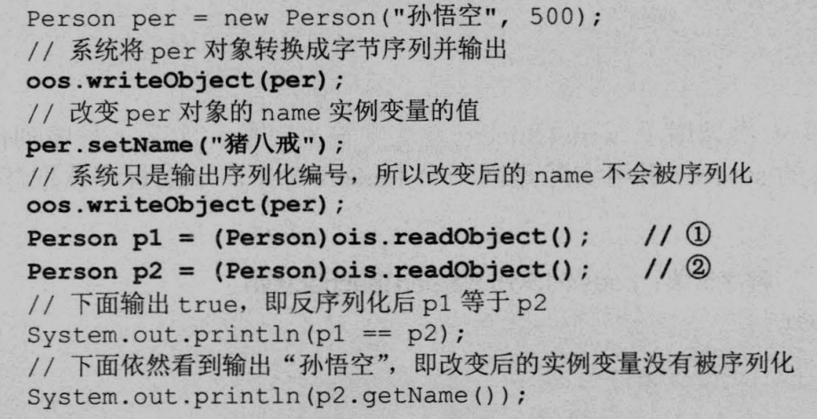

- 重写序列化方法

  private void writeObject(java.io.ObjectOutputStream out)throws IOException 

  private void readObect(java.io ObjectInputStream in)throws IOException, ClassNotFoundExccption; 

  private void readObjectNoDataOthrows ObjectStreamException; 

  

  Object writeReplace() throws ObjectStreamException ; Java 的序列化机制在序列化某个对象之前，会先调用该对象的 writeReplace 方法，如果该方法返回另一个 Java 对象，则系统转为序列化此java对象，调用该对象的WriteObject()方法来保存该对象的状态。

  Object readResolve() throws ObjectStreamException; 方法会紧接着 readObject()之后被调用，该方法的返回值将会代替原来反序列化的对象，而原来readObjectO反序列化的对象将会被立即丢弃

###### Extemalizable ######

- 使用Extemalizable机制反序列化对象时，程序会先使用public的无参构造器创建实例，然后才执行readExternal()方法进行反序列化，因此实现Extemalizable序列化类必须提供public的无参数构造器

- 接口中提供两个完全的空方法

  readExternal(ObjectInput in) 

  writeExternal(ObjectOutput out)，

  由程序员自主控制序列化

#### IO ####

File类操作文件和目录，但不能直接访问文件内容

Java 程序支持将斜线当成平台无关的路径分隔符。

使用处理流包装底层流节点之后，关闭资源时只需要关闭最上层的处理流

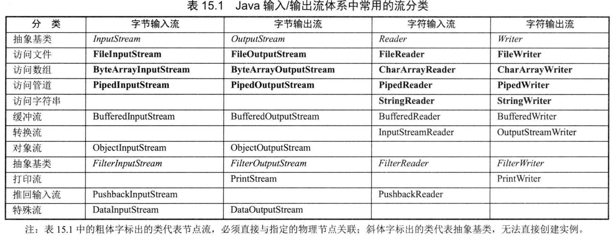

​	序列化功能：一旦将一个序列化对象写入到其他地方，再次向其中写入相同对象的时候java会进行识别，不在写入对象。所以在一个序列化对象已经写入到其他地方，更改这个对象然后在写入对象是不会被写入的，所以对象也不会被更改

##### BIO #####

每一个网络连接都分配给一个线程，线程切换浪费时间，可以用线程池进行缓解，但是新连接会被延迟

##### NIO #####

- NIO的三个重要组件：Buffer、Channel、Selector。
- Buffer是用于容纳数据的缓冲区，Channel是与IO设备之间的连接，类似于流。
- 数据可以从Channel读到Buffer中，也可以从Buffer 写到Channel中。
- nio中的selector对应linux中的select或poll或epoll，用来监听事件（有连接了，有数据了等等），将不同的事件分发给处理这些事件的通道。channel就是对socket的封装，可以在selector对象上进行注册，不同的channel可以注册不同的事件类型。
- 通过选择器selector，一个线程可以查询多个通道的io事件的就绪操作。与bio相比减少了多线程上下文切换的时间。select/epoll的优势并不是对于单个连接能处理得更快，而是能处理更多的连接
- nio有空轮询bug：就是即使是关注的select轮询事件返回数量为0，NIO照样不断的从select本应该阻塞的`Selector.select()/Selector.select(timeout)`中wake up出来

#### java集合 ####

- 集合类全部位于java.util包下，java.util.concurrent包下还有一些多线程支持的集合类
- 集合里只能保存对象
- HashSet，TreeSet，ArrayList，ArrayDeque，LinkedList，HashMap，TreeMap都是线程不安全的
- 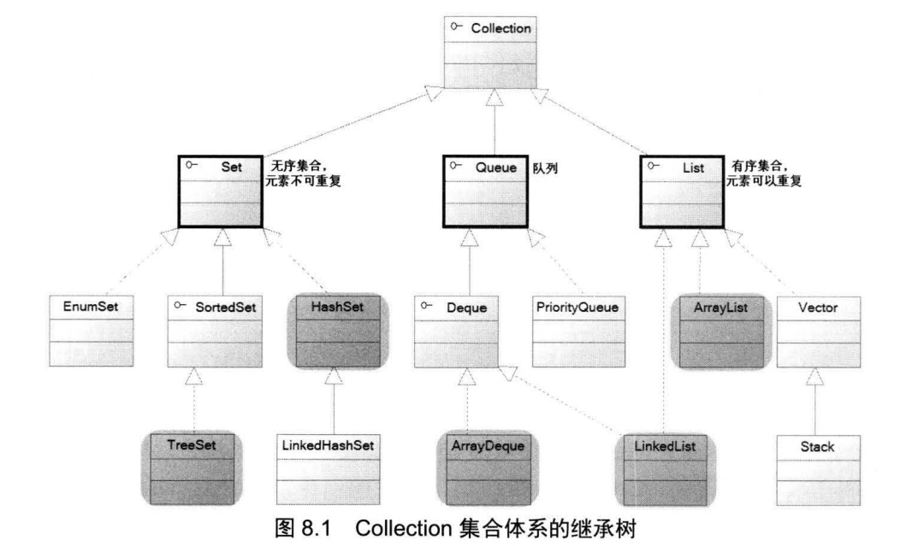
- 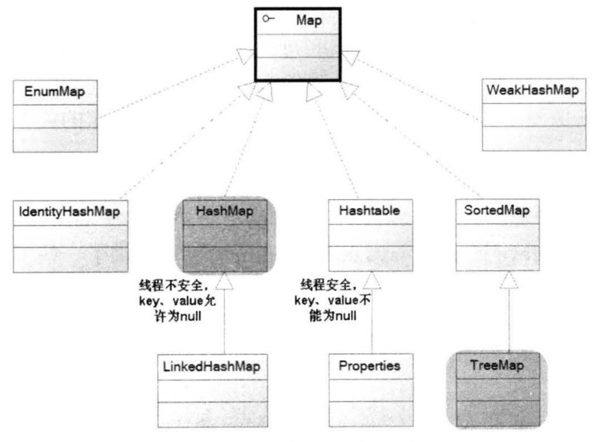
- 不带泛型的集合类可以装载任何东西

##### collection #####

###### 遍历 ######

- Iterable接口是Collection接口的父接口，所以Collection对象可以使用其中的forEach(Consumer aciton)默认方法进行遍历

  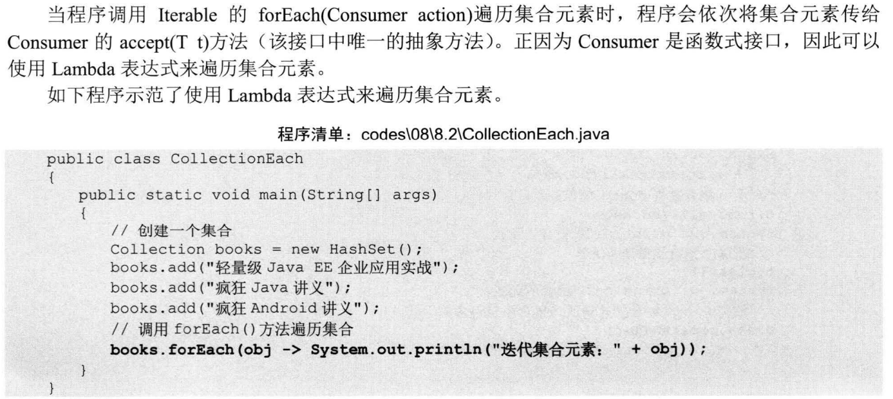

- Iterator接口用来遍历集合（由Collection对象的collection.iterator()方法生成）

  - 修改通过Iterator对象的.next()方法的得到的集合对象对原集合对象没有影响（.next()方法只复制值）（未对引用类型对象进行试验）

  - 在通过Iterator对象遍历集合时，不能调用集合的remove方法，只能调用Iterator对象的remove方法（会删除上一次的.next()方法看到的值）

    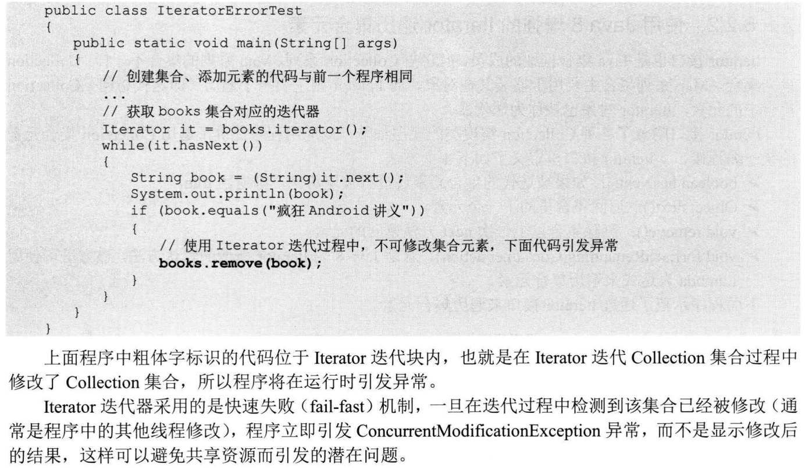

- 使用Iterator新增的方法进行遍历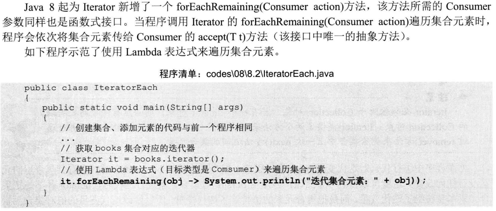

- 使用foreach循环进行遍历

###### hashSet ######

HashSet 集合判断两个元素相等的标准是两个对象通过equals方法比较相等，并且两个对象的 hashCode方法返回值也相等。

###### TreeSet ######

判断相等的条件是通过compareTo()方法是否判断相等

###### enumSet ######

EnumSet中的所有元素都必须是指定枚举类型的枚举值，该枚举类型在创建 EnumSet显式或隐式地指定。 EnumSet的集合元素也是有序的， EnumSet以枚举值Enum类内的**定义顺序**来决定集合元素的顺序。

###### List ######

List判断两个集合相等的标准是两个元素的equal()方法比较相等

###### Deque ######

双端队列

##### Map #####

Properties是Hashtable的子类，Properities类中的key和value都是String类型的

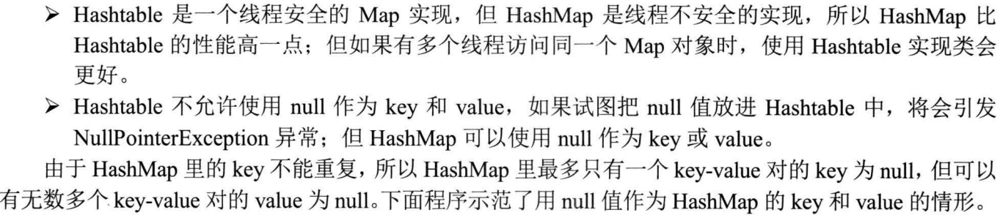

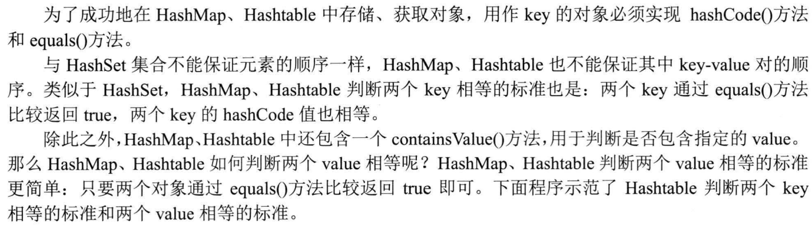

###### IdentityHashMap ######

当两个对象的key相等时（key1==key2）时认为两个key相同

##### concurrent #####

线程安全集合类可以分为三大类：

- 遗留的线程安全集合：Hashtable ， Vector

- 使用 Collections 装饰的线程安全集合，如：

  - Collections.synchronizedCollection
  - Collections.synchronizedList
  - Collections.synchronizedMap
  - Collections.synchronizedSet
  - Collections.synchronizedNavigableMap
  - Collections.synchronizedNavigableSet
  - Collections.synchronizedSortedMap
  - Collections.synchronizedSortedSet

- java.util.concurrent.*

  java.util.concurrent.* 下的线程安全集合类，可以发现它们有规律，里面包含三类关键词：Blocking、CopyOnWrite、Concurrent
  Blocking 大部分实现基于锁，并提供用来阻塞的方法
  CopyOnWrite 之类容器修改开销相对较重
  Concurrent 类型的容器内部很多操作使用 cas 优化，一般可以提供较高吞吐量，存在弱一致性问题
  

###### CopyOnWriteArrayList ######

CopyOnWrite容器即写时复制的容器。通俗的理解是当我们往一个容器添加元素的时候，不直接往当前容器添加，而是先将当前容器进行Copy，复制出一个新的容器，然后新的容器里添加元素，添加完元素之后，再将原容器的引用指向新的容器。这样做的好处是我们可以对CopyOnWrite容器进行并发的读，而不需要加锁（在添加的时候是需要加锁的），因为当前容器不会添加任何元素。所以CopyOnWrite容器也是一种读写分离的思想，读和写不同的容器。

CopyOnWrite并发容器用于读多写少的并发场景。比如白名单，黑名单，商品类目的访问和更新场景

注意事项

-  减少扩容开销。根据实际需要，初始化CopyOnWriteMap的大小，避免写时CopyOnWriteMap扩容的开销。
-  使用批量添加。因为每次添加，容器每次都会进行复制，所以减少添加次数，可以减少容器的复制次数。如使用上面代码里的addBlackList方法。

问题

- 内存占用问题。
- 数据一致性问题。CopyOnWrite容器只能保证数据的最终一致性，不能保证数据的实时一致性。所以如果你希望写入的的数据，马上能读到，请不要使用CopyOnWrite容器。

#### java语法 ####

- 类中有变量，方法，构造器，初始化块，内部类
- 方法中才能执行操作，类中不能直接写面向过程的操作。
- 名词约定：`类成员：类中所有的东西（主要是方法和field），实例方法和类方法，静态方法和非静态方法，变量同理。`

###### 一些误区 ######

- 逻辑运算符就像是运算符，会返回一个结果

- 在if 子句后面加一个分号是一种常见错误。

  ```java
  if (radius >= 0);
  {
  area = radius*radius*PI;
  System.out.println("The area for the circle of radius " +radius + " is " + area);
  }
  ```

  这个错误很难发现，因为它既不是编译错误也不是运行错误，而是一 个逻辑错误。 使用下行风格时经常会犯这种错误。

###### 访问权限  ######

- protected和private不能修饰外部类，外部类只能用public和默认访问(默认访问权限为包内)
- protected修饰的类成员在同一个包下也可访问
- this和super是属于对象范畴的东西，类方法无法使用实例方法和实例变量，所以既不能使用this，也不能使用super。((静态方法无法访问非静态成员)

###### 重载 ######

同一个类中可以有多个名称相同的方法，但这些方法的**参数类型不同、个数不同、顺序不同**

函数的返回值不同不能构成重载：单纯的调用方法无法分辨是调用哪一个方法

比如有两个方法：

```java
void fun(){}
int fun(){return 1;}
```

像这样的调用：fun();

这时候Java**编译器就不能判断调用的是哪一个fun()了**

###### 初始化块 ######

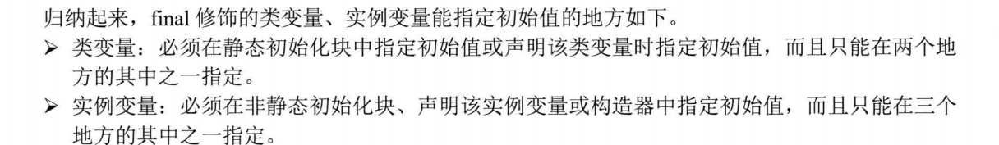

##### 枚举类 #####

有些类的对象的数量及其对应的属性是有限而固定的，比如季节类，它只有4个对象，再比如行星类，目前只有9个对象。为了更好的实现这种类（可以自己使用静态工厂模式设计枚举类），java提供了枚举类（对静态工厂模式的封装）。

java中的枚举类：enum关键字

- 枚举类的所有实例必须在枚举类的第1行显式列出（强制使用public static final修饰），各个枚举值使用`，`分割，以`；`结束，否则这个枚举类永远都不能产生实例
- 枚举类的构造器强制使用private修饰

- 为每个枚举值单独设置类成员属性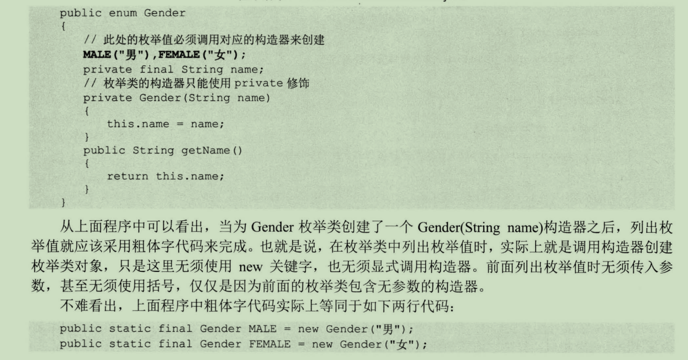
- 实现接口的枚举类既可以让所有的枚举值共同实现抽象方法，也可以为每个枚举值单独实现抽象方法。
- 不能显式继承父类（已经默认继承java.lang.Enum类），可以实现一个或多个接口
- 非抽象的枚举类使用final修饰，不能派生子类
- 使用枚举对象：枚举类名.枚举值

##### 继承：extend #####

寻找变量顺序

- 查找当前方法中是否有相应名称的局部变量
- 查找当前类中是否包含相应名称的成员变量
- 查找父类中是否包含相应名称的成员变量

重点是重名问题，不重名一切都没问题。

重名时为了区分通常用super和this

- private修饰的方法和变量不会继承给子类
- final修饰的类不能被继承，final修饰的方法不能被重名。

| 继承时的重名问题 |           方法           |    变量    |
| :--------------: | :----------------------: | :--------: |
|     重名条件     | 方法名相同，参数列表相同 | 变量名相同 |
|     其他条件     |       一同两小一大       |     无     |
|     多态访问     |   实例方法有，类方法无   |     无     |

- 一同两小一大

  一同：两个方法必须同时是类方法或者实例方法

  两小：子类方法返回值类型应比父类方法返回值类型更小或相等，子类方法声明抛出的异常类应比父类方法声明抛出的异常类更小或相等

  一大：是子类方法的访问权限应比父类方法的访问权限更大或相等。

- 多态访问：只有实例方法可以使用多态，类方法和变量重名不能使用多态。

  直接访问：访问到直接变量的方法和变量

  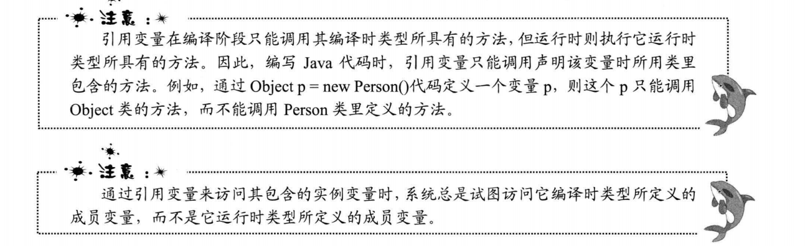

- 为什么继承时重写方法访问控制符要同或大？为了不破坏多态的特性？

  java中的多态机制是：子类的实例可以赋值给父类的引用，通过调用父类的方法就可以直接调用到子类实例中的方法。
  本来父类的方法是public的，此时如果有其他类调用了父类的该方法，而子类实例中的方法是private的，private只允许在该类内部使用，会导致调用失败。

- 继承时用子类对象赋值给父类对象，对象初始化的时候，子类的构造器也会执行

##### abstract #####

被子类覆盖的实例方法可以使用多态，为了更完美的多态，出现了abstract关键字。

抽象类的一得一失：抽象类相比于普通类多拥有一个抽象方法，但是不能够用来new对象。

- abstract既然是为了多态，则方法应该能被继承，所以与final关键字冲突，与private冲突（感觉protected和default修饰也没什么用）；

  类方法不能使用多态，所以只能修饰实例方法（内部类除外，内部类其实也是类）（修饰类感觉没什么卵用），

  大多数情况下与public配对，形成public abstract

- abstract抽象方法只是不能够创建实例，但是里面的静态方法也可以直接被调用，所以可以使用abstract修饰类，用static修饰方法（显示出静态方法的面向过程性质）,同样可以使用类名来访问该方法。但abstract和static不能够一起用来修饰方法（用abstract修饰的方法没有方法体，abstract只能在继承实现方法之后才能调用，用static表示这个方法可以使用类名访问）。

- 一个抽象类可以没有抽象方法（并且继承之后可以new对象），但有抽象方法的类一定是抽象类（并且不能直接new对象）

##### interface #####

interface的实现根据使用的需求而定，语法规定的变动可能会比较大

java9的：变量只有public static final，方法（实例方法等同于default方法）有static和非static，public和private

- 接口只能继承接口，接口支持多继承
- 接口里没有构造器和初始化块
- 接口内的成员除了私有方法（java9添加）其他都默认用public修饰

- 接口内部的变量只能用static final修饰，内部类使用public static
- 接口内部的方法只能用static，abstract（可省略），default（接口中的实例方法）三个中的其中一个修饰（java9添加了私有方法，私有方法可以用static修饰）。

接口可以用来声明对象（不能生成对象），这个对象必须是其实现类的对象，接口声明的对象同样可以使用多态。

##### 接口与抽象类 #####

- interface是一种公共标准，它的作用是标识实现此接口的类拥有这个接口，从而可以进行一定的操作或者拥有了某些能力（接口定义的操作），所以接口中的变量都是用public static final修饰，方法都是用abstract修饰（另外两个不体现接口的性质），体现了接口提供一种标识性(让别人知道我能干某些事)操作的特性，而不是用来进行组成类的一部分（用来继承或组合）。而抽象类是一个实现类的中间实现过程，其作用是用来定义一个类的组成和框架，是一个类的半成品。
- 其中的抽象类的抽象方法是面向一类有继承关系的对象而工作的，他们的抽象方法实现是有关联的，接口的抽象方法是反而是用来提供屏蔽多个类具体性质的接口标准方法。
- 从例子来说，从如何构成对象来说，并不需要一个对象有排序的这种行为，所以在描述对象的抽象类时（假设有）不需要排序这个方法。但在想要对这个对象进行排序的时候，那就需要这个对象提供一个比较方法，这个方法就用接口来实现，如果在构建这个类时就实现就比较的鸡肋。
- 两个概念是一个设计问题，一个行为或能力是与某一个对象密切相关的，那当然是要设计成一个类的成员变量。但一个行为或能力不是只有某一类对象有关，则设计成接口。

##### 内部类 #####

**类是用来生成对象的**

访问静态内部类的非静态成员需要new静态内部类对象

内部类和外部类互有特权，拥有全部的访问权限

| 不能拥有静态成员                                             | 可以拥有静态成员                                             |
| ------------------------------------------------------------ | ------------------------------------------------------------ |
| 可以直接访问外部类的任意变量和方法                           | 可以直接访问外部类的静态成员，通过创建外部类实例的方法调用外部类的非静态属性和方法 |
| 外部类的静态方法不能直接**new 内部类名（）**，因为实际上是使用了**this.new 内部类名（）**，而静态方法没有this参数 | 外部类的静态和非静态方法都可以访问                           |

- 内部类使得多重继承的解决方案变得更加完整，因为每个内部类都能独立地继承一个（接口的)实现，所以无论外部类是否已经继承了某个（接口的)实现，对于内部类都没有影响。


##### 匿名类 #####

可以在{}中执行一个正常继承父类的普通类的所有行为（调用默认方法，重写父类方法，实现抽象方法：如果是继承的抽象类的话）。


只能是继承父类和实现接口二选一

- 匿名类不能有构造函数（匿名类没有名字，但可以继承父类的构造函数，接受与父类的构造函数一样的参数），必须实现所有抽象方法（因为会立刻生成匿名类对象，而没有实现抽象方法的类不能生成对象）

##### lambda表达式 #####

- 简化匿名类（用于生成只有一个虚函数的接口对象，同时也只能实现只有一个虚函数的接口，这也是和匿名类最大的不同）

  与匿名类的另一个不同是，匿名类可以在实现时调用接口的默认方法，而lambda表达式不能调用

- 因为只有一个虚函数，所以只要写出符合虚函数的形参列表加一个实体代码就可以让编译器确定虚函数的实体

- 语法：(形参)->{实体代码}

  - 形参列表只有一个参数，可以省略()
  - 实体代码只有一行，可以省略｛｝
  - 实体代码只有一条return语句，可以直接省略return写返回值

- lambda表达式的结果是对象，可以用来赋值（赋值给对应的接口对象）

  - 但表达式的目标类型必须是明确的函数式接口对象

    Object obj=()->{System.out.println(“test”); }; //无法通过

    Object obj=(Runnable)()->{System.out.println(“test”); }; //可以通过

##### 异常 #####

- try块部分负责运行代码，可以附带多个catch块

  - try块中定义的变量是局部变量，在catch块中不能访问
  - 如果在try语句块中抛出了一个在catch子句中声明的异常类， 那么程序将跳过try语句块的其余代码，执行 catch 子句中的代码；
  - 如果在try语句块中没有抛出任何异常， 那么程序将跳过 catch子句；

- catch块在代码运行出错时捕获异常对象（任何代码都会出现异常，catch块代码也不例外）

  - 程序匹配catch块时由上到下匹配，一旦执行其中一个catch块就不会执行其他catch块了

  - 可以用`|`分割多种异常，同时捕获他们

    `catch (IOException | NumberFormatException e)`

    捕获多种类型的异常时，异常变量有隐式的 final 修饰，因此程序不能对异常变量重新赋值。

- finally块

  - 除非在try块，catch块中直接使用了退出虚拟机的方法。否则，无论在 try 块，catch块中执怎样的代码， 出现怎样的情况，finall块总会被执行

  - finally块的return问题

    当运行到try或catch中的return或者throw语句时（return和throw是java里的强行跳转语句），编译器识别出程序要进行跳转了，所以此时编译器**首先要去**finally语句块中执行其中的所有语句，之后才会回到try块或者catch块中执行return或者throw语句。所以在finally块中写return语句或者throw语句将会直接跳转走，不再执行try或catch块。
    
  - 函数返回值是在 finally 执行前确定的，不管finally 中的代码怎么样，返回的值都不会改变，仍然是之前保存的值

- throw：throw可以主动抛出**异常实例**，同样由catch块处理或由throws交给调用者处理

  每次只能抛出一个异常对象

  在catch中抛出一个异常对原有异常进行包装时，可以使用throwable对象的initCause(原有异常) 方法保存原有异常，使用这种包装技术，可以抛出系统的高级异常，又不会丢失原始异常的细节。

- throws：throws只能用在方法签名中（跟在方法签名之后），表示如果出现异常自己不处理，交给调用者处理

  可以抛出多个异常，用`，`号分割

###### 异常分类 ######

java已经对异常对象做了分类，异常类之间有着明确的继承关系，在捕获异常时应该先捕获小异常，再捕获大异常

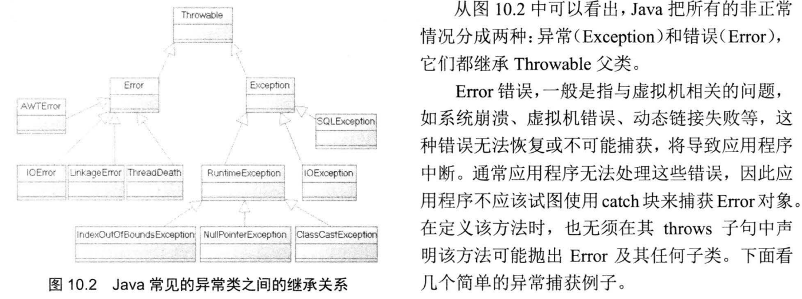

- checked异常（不属于runtime异常类的都是checked异常）必须有try-catch块处理，或者由throws交由调用者处理，而runtime异常则不需要捕获或抛出。

###### 自定义异常 ######

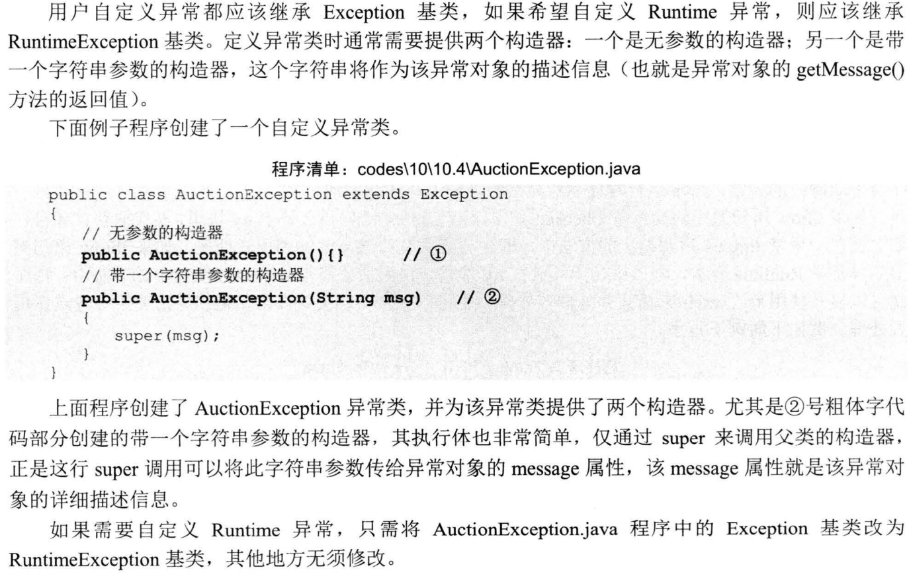

###### 断言

```
public static void main(String[] args) {
    double x = Math.abs(-123.45);
    assert x >= 0;
    System.out.println(x);
}
```

- 语句`assert x >= 0;`即为断言，断言条件`x >= 0`预期为`true`。如果计算结果为`false`，则断言失败，抛出`AssertionError`。
- 使用`assert`语句时，还可以添加一个可选的断言消息：`assert x >= 0 : "x must >= 0";`
- 这样，断言失败的时候，`AssertionError`会带上消息`x must >= 0`，更加便于调试。

- Java断言的特点是：断言失败时会抛出`AssertionError`，导致程序结束退出。
- JVM默认关闭断言指令，即遇到`assert`语句就自动忽略了，不执行。
- 要执行`assert`语句，必须给Java虚拟机传递`-enableassertions`（可简写为`-ea`）参数启用断言。`java -ea Main.java`
- 还可以有选择地对特定地类启用断言，命令行参数是：`-ea:com.itranswarp.sample.Main`，表示只对`com.itranswarp.sample.Main`这个类启用断言。
- 或者对特定地包启用断言，命令行参数是：`-ea:com.itranswarp.sample...`（注意结尾有3个`.`），表示对`com.itranswarp.sample`这个包启动断言。

##### 泛型 #####

定义类和方法时使用语法：<T>传递一个类型参数，谓之泛型。

- 泛型只能使用引用类型

- 父类使用泛型，子类要么去指定具体类型参数，要么继续使用泛型

- 可以使用 ？在定义类对象时来初始化类的类型参数，但无法在代码中使用类中所有需要传递类型参数的方法，无法在代码中给用类型参数进行定义的参数赋值。即类型参数不确定时无法赋值。

  因为泛型函数不存在初始化问题（类型根据传入的参数自动识别），所以不存在用？来初始化泛型函数的情况存在。

- 即使使用实际泛型类对象的父类的类型参数来定义泛型类对象，实参也不能赋值给形参，说明这两个泛型类没有继承关系：List《Object》 test=new ArrayList《String》是错误的。

- 对于参数值是未知类型的容器类，只能读取其中元素，不能向其中添加元素

  因为其类型是未知，所以编译器无法识别添加元素的类型和容器的类型是否兼容，唯一的例外是 null。

- List<?>表示这 个 list 内的每个元素的类型都相同，但是这种类型具体是什么我们却不知道。

  List<Object>表示元素可以是任何类型的对象

- | title    | 类                                                           | 函数                                                         |
  | -------- | :----------------------------------------------------------- | ------------------------------------------------------------ |
  | 定义时   | 《T》与《T extends 父类》                                    | 《T》与《T extends 父类》                                    |
  | 形参定义 | 定义类对象时可以用《?》表示接收任何类型的泛型类:List《?》=ArrayList《String》还可以在定义类对象时使用《? extends 父类》进行类型参数限制（但这个参数限制也要在定义时的参数限制之内） | 函数调用时直接传递实参，所以是隐式赋值并自动进行类型判断，也就不能用？表示可以接收任何类型的参数（函数定义时的T本就表示可以接收任何参数）：public《T》void Test（T temp）{} |
  | 实际参数 | 必须是实际参数且要符合extends父类（如果有要求的话）          | 必须是实际参数且要符合extends父类（如果有要求的话）          |

##### 	网络 #####

在Java中，提供了两个类用于实现TCP通信程序：

1. 客户端：`java.net.Socket` 类表示。创建`Socket`对象，向服务端发出连接请求，服务端响应请求，两者建立连接开始通信。
2. 服务端：`java.net.ServerSocket` 类表示。创建`ServerSocket`对象，监听相应的端口，使用accept方法会一直阻塞直到接收到客户端的一个连接，返回一个客户端的socket对象
4. OutputStream和InputStream从客户端的socket对象中获取，客户端和服务端的内容都在socket中取或放
5. 需要一个标志位来告诉客户端或服务器端信息已经发送完毕