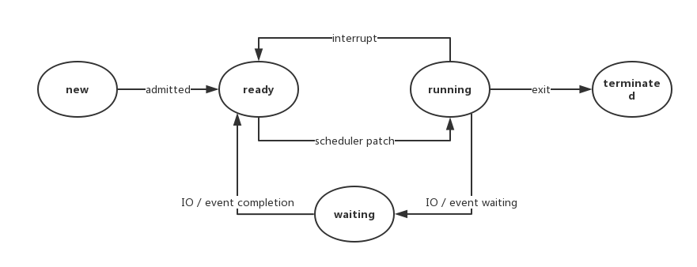
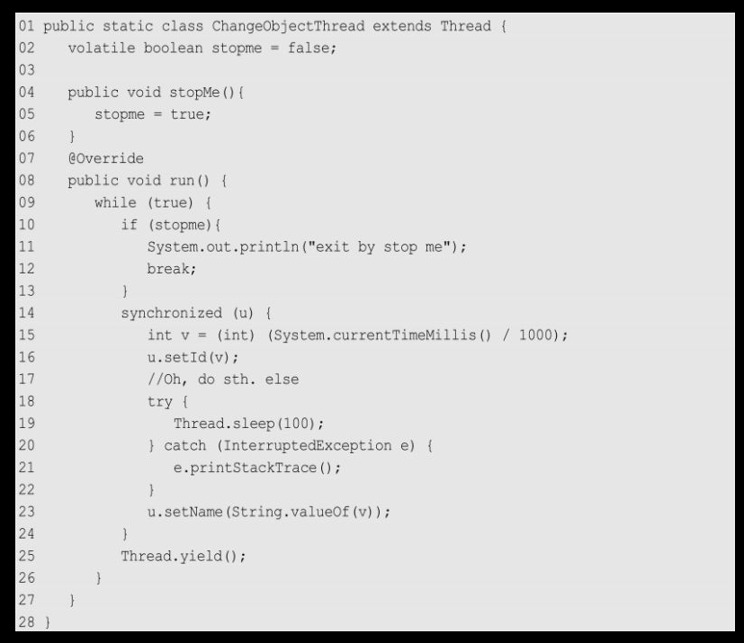
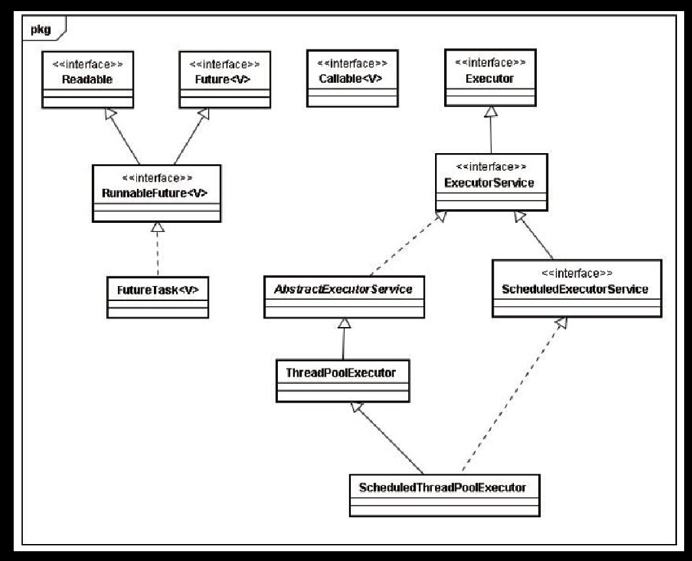

| 线程              | 进程                           |
| ----------------- | ------------------------------ |
| CPU分配的基本单位 | 操作系统进⾏资源分配的基本单位 |
| 共享地址空间      | 独立的地址空间                 |
| 切换开销小        | 切换开销大（需要切换上下文）   |

###### join

```java
public final synchronized void join(long millis)
｛
    while (isAlive()) {        //调用join方法线程是运行时状态
          wait(0);             //进入等待
     }
｝
wait(0)是什么意思呢，其实wait()方法就是调用了wait(0)方法实现的，wait(0)就是让其一直等待。
```

###### double-checked ######

- 饿汉：直接创建
- 懒汉：等到需要才创建

```java
final class Singleton
{
    private Singleton() { }
    private static Singleton INSTANCE = null;
    public static Singleton getInstance() 
    {
        if(INSTANCE == null) 
        { // t2
            // 首次访问会同步，而之后的使用没有 synchronized
            synchronized(Singleton.class)
            {
                if (INSTANCE == null) 
                { 
                    // t1
                    INSTANCE = new Singleton();
                }
            }
        }
        return INSTANCE;
    }
}
```

上述写法看似解决了问题，但是有个很大的隐患。实例化对象的那行代码，实际上可以分解成以下三个步骤：

1. 分配内存空间
2. 初始化对象
3. 将对象指向刚分配的内存空间

但是有些编译器为了性能的原因，可能会将第二步和第三步进行**重排序**，顺序就成了：

1. 分配内存空间
2. 将对象指向刚分配的内存空间
3. 初始化对象

现在考虑重排序后，两个线程发生了以下调用：

|      |                                 |                                                 |
| :--- | :------------------------------ | :---------------------------------------------- |
| Time | Thread A                        | Thread B                                        |
| T1   | 检查到`uniqueSingleton`为空     |                                                 |
| T2   | 获取锁                          |                                                 |
| T3   | 再次检查到`uniqueSingleton`为空 |                                                 |
| T4   | 为`uniqueSingleton`分配内存空间 |                                                 |
| T5   | 将`uniqueSingleton`指向内存空间 |                                                 |
| T6   |                                 | 检查到`uniqueSingleton`不为空                   |
| T7   |                                 | 访问`uniqueSingleton`（此时对象还未完成初始化） |
| T8   | 初始化`uniqueSingleton`         |                                                 |

在这种情况下，T7时刻线程B对`uniqueSingleton`的访问，访问的是一个**初始化未完成**的对象。

为了解决上述问题，需要在`uniqueSingleton`前加入关键字`volatile`。使用了volatile关键字后，重排序被禁止，所有的写（write）操作都将发生在读（read）操作之前。

###### CAS （compare and swap） ######

CAS操作包含三个操作数——内存位置（V）、预期原值（A）和新值(B)。如果内存位置的值与预期原值相匹配，那么处理器会自动将该位置值更新为新值。否则，处理器不做任何操作

###### Start和run ######

直接执行run方法会以普通方法进行执行，而不是新开一个线程

###### ThreadLocal ######


###### 减少线程切换开销 ######

- 无锁并发：通过某种策略（比如hash分隔任务）使得每个线程不共享资源，避免锁的使用。
- CAS：是比锁更轻量级的线程同步方式
- 使用最小线程：避免创建不需要的线程，避免线程一直处于等待状态
- 协程：单线程实现多任务调度，单线程维持多任务切换

###### BlockingQueue ######


##### java内存模型 #####

###### JMM ######


从图中可以看出：

1. 所有的共享变量都存在主内存中。
2. 每个线程都保存了一份该线程使用到的共享变量的副本。
3. 如果线程A与线程B之间要通信的话，必须经历下面2个步骤：
   1. 线程A将本地内存A中更新过的共享变量刷新到主内存中去。
   2. 线程B到主内存中去读取线程A之前已经更新过的共享变量。

###### happens-before ######

happens-before关系的定义如下：

1. 如果一个操作happens-before另一个操作，那么第一个操作的执行结果将对第二个操作可见，而且第一个操作的执行顺序排在第二个操作之前。
2. 两个操作之间存在happens-before关系，并不意味着Java平台的具体实现必须要按照happens-before关系指定的顺序来执行。如果重排序之后的执行结果，与按happens-before关系来执行的结果一致，那么JMM也允许这样的重排序。

在Java中，有以下天然的happens-before关系：

- 程序顺序规则：一个线程中的每一个操作，happens-before于该线程中的任意后续操作。
- 监视器锁规则：对一个锁的解锁，happens-before于随后对这个锁的加锁。
- volatile变量规则：对一个 volatile 域的写,happens-before 于任意后续对这个 volatile 域的读。（先写后读）
- 传递性：如果A happens-before B，且B happens-before C，那么A happens-before C。
- start规则：如果线程A执行操作ThreadB.start()启动线程B，那么A线程的ThreadB.start（）操作happens-before于线程B中的任意操作、
- join规则：如果线程A执行操作ThreadB.join（）并成功返回，那么线程B中的任意操作happens-before于线程A从ThreadB.join()操作成功返回。

###### Volatile ######

volatile 的底层实现原理是内存屏障，Memory Barrier（Memory Fence） 

- 对 volatile 变量的写指令**后**会加入写屏障（写屏障（sfence）保证在该屏障之前的，对共享变量的改动，都同步到主存当中。写屏障会确保指令重排序时，不会将写屏障之前的代码排在写屏障之后）
- 对 volatile 变量的读指令**前**会加入读屏障（读屏障（lfence）保证在该屏障之后，对共享变量的读取，加载的是主存中最新数据。读屏障会确保指令重排序时，不会将读屏障之后的代码排在读屏障之前）

**内存可见性**：程序不再从JMM中的本地内存对volatile变量进行操作，而是直接对主内存中的volatile变量进行操作

- 当一个线程对`volatile`修饰的变量进行**写操作之后**时，JMM会立即把该线程对应的本地内存中的共享变量的值刷新到主内存；（实质上是线程 A 向接下来要读变量 x 的线程发出了其对共享变量修改的消息）
- 当一个线程对`volatile`修饰的变量进行**读操作之前**时，JMM会把立即该线程对应的本地内存置为无效，从主内存中读取共享变量的值。（实质上是线程 B 接收了某个线程发出的对共享变量修改的消息）

Volatile并不能保证原子性

- 写屏障仅仅是保证之后的读能够读到最新的结果，但不能保证读跑到它前面去
- 而有序性的保证也只是保证了本线程内相关代码不被重排序


##### 线程状态 #####

###### 线程状态转换 ######




###### 线程等待原因 ######

- 时间片用尽，进入ready状态

- blocked

- waiting

  调用如下3个方法会使线程进入等待状态：

  - Object.wait()：使当前线程处于等待状态直到另一个线程唤醒它；
  - Thread.join()：等待线程执行完毕，底层调用的是Object实例的wait方法；
  - LockSupport.park()：除非获得调用许可，否则禁用当前线程进行线程调度。  

- TIMED_WAITING

  调用如下方法会使线程进入超时等待状态：

  - Thread.sleep(long millis)：使当前线程睡眠指定时间；
  - Object.wait(long timeout)：线程休眠指定时间，等待期间可以通过notify()/notifyAll()唤醒；
  - Thread.join(long millis)：等待当前线程最多执行millis毫秒，如果millis为0，则会一直执行；
  - LockSupport.parkNanos(long nanos)： 除非获得调用许可，否则禁用当前线程进行线程调度指定时间；
  - LockSupport.parkUntil(long deadline)：同上，也是禁止线程进行调度指定时间；

  

###### 等待方法细节 ######

| wait                       | sleep                     |
| -------------------------- | ------------------------- |
| Object类的方法             | Thread 类的静态本地方法   |
| 释放cpu资源，同时释放锁    | 释放cpu资源，但是不释放锁 |
| 必须放在同步块或同步方法中 | 可以在任意位置            |
| 可以指定时间，也可以不指定 | 必须指定时间              |


- yield()指的是当前线程愿意让出对当前处理器的占用。这里需要注意的是，就算当前线程调用了yield()方法，程序在调度的时候，也还有可能继续运行这个线程的；

- join释放cpu资源，但是不释放锁

###### 终止线程方法 ######

- stop方法

  被终止的线程简单地将锁释放，有可能会引起不必要的错误

- 人工变量通知方法

  

- java内置的中断标志（只设置一个中断标志位）

  线程中断相关的三个方法

  - t.interrupt()方法是一个实例方法。它通知目标线程中断，也就是设置中断标志位。
  - t.isInterrupted()方法也是实例方法，它判断当前线程是否被中断（通过检查中断标志位）。
  - 最后的静态方法Thread.interrupted()也可用来判断当前线程的中断状态，但同时**会清除当前线程的中断标志位状态**。

  与人工变量通知方法一样，如果希望thread在中断后退出，就必须为它增加相应的中断处理代码

  

  这看起来与前面增加stopme标记的手法非常相似，但是中断的功能更为强劲。**如果在循环体中，出现了类似于wait()方法或者sleep()方法这样的操作，则只能通过中断来识别了**

  线程在sleep()休眠时，如果此时线程收到中断信号，会抛出一个InterruptedException中断异常，**并清除中断标记**。

  InterruptedException不是运行时异常，也就是说程序必须捕获并且处理它。

###### 废弃方法 ######

线程的暂停、恢复、停止对应的就是 suspend、resume 和 stop/destroy。 

suspend 会使当前线程进入阻塞状态并不释放占有的资源，容易引起死锁； 

stop 在结束一个线程时不会去释放占用的资源。它会直接终止 run 方法的调用，并且会抛出一个 ThreadDeath 错误。 

destroy 只是抛出一个 NoSuchMethodError。 

suspend 和 resume 已被 wait、notify 取代。

##### 线程与线程组 #####

###### 守护线程 ######


守护线程应该永远不去访问固有资源，如文件、数据库，因为它会在任何时候甚至在一个操作的中间发生中断（运行的线程都是守护线程java虚拟机就会退出，而java虚拟机退出的时候finally块中的代码并不一定会执行）。

###### 线程组 ######

ThreadGroup tg=new ThreadGroup("the name of 线程组");

- 每个Thread必然存在于一个ThreadGroup中，Thread不能独立于ThreadGroup存在。

- 执行main()方法线程的名字是main

- 如果在new Thread时没有显式指定，那么默认将父线程（当前执行new Thread的线程）线程组设置为自己的线程组。 
- activeCount()方法可以获得活动线程的总数，但由于线程是动态的，因此这个值只是一个估计值，无法精确；
- list()方法可以打印这个线程组中所有的线程信息，对调试有一定帮助。

###### 线程创建方式 ######

- 继承Thread类并重写run的方法

  优点

  方便传参，你可以在子类里面添加成员变量，通过set方法设置参数或者通过构造函数进行传递，

  在run（）方法内获取当前线程直接使用this就可以了，无须使用Thread.currentThread（）方法；

  缺点

  Java不支持多继承，如果继承了Thread类，那么就不能再继承其他类。

  另外任务与代码没有分离，当多个不同的类执行一样的任务时需要多份任务代码

- 实现Runnable接口的run方法

  优点

  改掉了Thread的缺点

  缺点

  只能使用主线程里面被声明为final的变量

- 实现Callable接口（有返回值的runnable），使用FutureTask类（相当于Thread）

  `FutureTask`是实现的`RunnableFuture`接口的，而`RunnableFuture`接口同时继承了`Runnable`接口和`Future`接口

  

  优点：在runnable接口的基础上拥有返回值，可以抛出异常

###### run方法异常 ######

**在 Runnable 的 run 方法中不能抛出异常**

（语法上可以在thread.run()那里捕获异常，但是捕获异常的主线程线程可能先于抛出异常的线程结束，也可能与抛出异常的进程同时结束，导致catch不到异常），如果某个异常没有被捕获，则会导致线程终止

解决方法

- 实现 Thread.UncaughtExceptionHandler 接口，然后使用setUncaughtExceptionHandler 方法为任何一个线程安装一个处理器
- 也可以使用Thread.setDefaultUncaughtExceptionHandler方法为所有线程安装一个默认的处理器
- 如果不为独立的线程安装处理器，此时的处理器就是该线程的 ThreadGroup 对象。ThreadGroup 类实现了 Thread.UncaughtExceptionHandler 接口，它的 uncaughtException 方法做如下操作：
  - 如果该线程组有父线程组，那么父线程组的 uncaughtException 方法被调用
  - 否则，如果 Thread.getDefaultExceptionHandler 方法返回一个非空的处理器，则调用该处理器
  - 否则，如果 Throwable 是 ThreadDeath 的一个实例（ThreadDeath 对象由 stop 方法产生， 而该方法已过时），什么都不做
  - 否则，线程的名字以及 Throwable 的栈踪迹被输出到 System.err 上
- 如果是由线程池 ThreadPoolExecutor 执行任务，只有通过 execute 提交的任务，才能将它抛出的异常交给 UncaughtExceptionHandler，而通过 submit 提交的任务，无论是抛出的 未检测异常还是已检查异常，都将被认为是任务返回状态的一部分。如果一个由 submit 提 交的任务由于抛出了异常而结束，那么这个异常将被 Future.get 封装在 ExecutionException 中重新抛出

##### 锁 #####

###### monitor

每一个对象关联一个monitor


###### synchronized关键字 ######

**synchronized关键字是基于对象的**，Java中的每一个对象都可以作为一个锁，锁住的也仅仅是对象。

synchronize以线程对象作为关键字的时候，在线程运行结束的时候会notify在线程上等待的其他线程

synchronized是可重入的

多个线程在请求锁的阻塞过程中无法被中断

何时释放锁

- 获取锁的线程执行完了该代码块
- 线程执行发生异常，此时JVM会让线程自动释放锁

```java
// 关键字在实例方法上，锁为当前实例，其他线程不能调用该对象的其他锁定代码块，该对象非同步方法和静态方法不受影响
public synchronized void instanceLock() {
    // code
}

// 关键字在静态方法上，锁为当前Class对象，这个类的其他静态同步方法也被锁住，静态非同步方法和实例方法不受影响
public static synchronized void classLock() {
    // code
}

// 关键字在代码块上，锁为括号里面的对象，如果是对象是this相当于第一种写法，如果对象是class对象相当于第二种写法，
public void blockLock() {
    Object o = new Object();
    synchronized (o) {
        // code
    }
}。
```

###### synchronized四种锁状态 ######

每个Java对象都有对象头，对象头的内容如下表：

| 长度     | 内容                   | 说明                         |
| -------- | ---------------------- | ---------------------------- |
| 32/64bit | Mark Word              | 存储对象的hashCode或锁信息等 |
| 32/64bit | Class Metadata Address | 存储到对象类型数据的指针     |
| 32/64bit | Array length           | 数组的长度（如果是数组）     |

Mark Word的格式：

| 锁状态   | 29 bit 或 61 bit             | 1 bit 是否是偏向锁？       | 2 bit 锁标志位 |
| -------- | ---------------------------- | -------------------------- | -------------- |
| 无锁     | 对象hashcode，对象分代年龄   | 0                          | 01             |
| 偏向锁   | 线程ID                       | 1                          | 01             |
| 轻量级锁 | 指向栈中锁记录的指针         | 此时这一位不用于标识偏向锁 | 00             |
| 重量级锁 | 指向互斥量（重量级锁）的指针 | 此时这一位不用于标识偏向锁 | 10             |

- 偏向锁

  **偏向锁的获取：**

  第一次使用 CAS 将线程 ID 设置到对象的 Mark Word 头，之后发现这个线程 ID 是自己的就表示没有竞争，不用重新 CAS。以后只要不发生竞争，这个对象就归该线程所有

  偏向锁会偏向于第一个访问锁的线程，如果在接下来的运行过程中，该锁没有被其他的线程访问，则持有偏向锁的线程将永远不需要触发同步。

  **偏向锁的撤销或升级**

  当其他线程尝试竞争偏向锁时， 需要等待全局安全点（在这个时间点上没有正在执行的字节码）。

  首先暂停拥有偏向锁的线程，然后检查持有偏向锁的线程是否活着，如果线程不处于活动状态，则将对象头设置成无锁状态；

  如果线程仍然活着，拥有偏向锁的栈方法会被执行，遍历偏向对象的锁记录，栈中的锁记录和对象头的Mark Word要么重新偏向于其他线程，要么恢复到无锁或者标记对象不适合作为偏向锁，最后唤醒暂停的线程。

- 轻量级锁

  **轻量级锁的获取和升级：**

  每个线程都的栈帧都会包含一个锁记录的结构，内部可以存储锁定对象的Mark Word

  然后线程尝试使用CAS将对象头中的MarkWord替换为指向锁记录的指针。如果成功，当前线程获得锁，如果失败，则自旋重试。重试一定次数后膨胀为重量级锁（修改MarkWord，将object改为指向重量级锁的指针），阻塞当前线程。

  自旋也不是一直进行下去的，如果自旋到一定程度（和JVM、操作系统相关），依然没有获取到锁，称为自旋失败，那么这个线程会阻塞。同时这个锁就会升级成重量级锁。

  **轻量级锁的释放：**

  在释放锁时，当前线程会使用CAS操作将Mark Word的内容复制回锁对象的Mark  Word里面。如果没有发生竞争，那么这个复制的操作会成功。如果有其他线程因为自旋多次导致轻量级锁升级成了重量级锁，那么CAS操作会失败，此时会释放锁并唤醒被阻塞的线程。

- 重量级锁

  重量级锁依赖于操作系统的互斥量（mutex） 实现的，而操作系统中线程间状态的转换需要相对比较长的时间，所以重量级锁效率很低，但被阻塞的线程不会消耗CPU。

| 锁       | 优点                                                         | 缺点                                             | 适用场景                             |
| -------- | :----------------------------------------------------------- | ------------------------------------------------ | ------------------------------------ |
| 偏向锁   | 加锁和解锁不需要额外的消耗，和执行非同步方法比仅存在纳秒级的差距。 | 如果线程间存在锁竞争，会带来额外的锁撤销的消耗。 | 适用于只有一个线程访问同步块场景。   |
| 轻量级锁 | 竞争的线程不会阻塞，提高了程序的响应速度。                   | 如果始终得不到锁竞争的线程使用自旋会消耗CPU。    | 追求响应时间。同步块执行速度非常快。 |
| 重量级锁 | 线程竞争不使用自旋，不会消耗CPU。                            | 线程阻塞，响应时间缓慢。                         | 追求吞吐量。同步块执行时间较长。     |

###### AQS ######

特点：

- 用 state 属性来表示资源的状态（分独占模式和共享模式），子类需要定义如何维护这个状态，控制如何获取
  锁和释放锁
  - getState - 获取 state 状态
  - setState - 设置 state 状态
  - compareAndSetState - cas 机制设置 state 状态
- 提供了基于 FIFO 的等待队列，类似于 Monitor 的 EntryList
- 条件变量来实现等待、唤醒机制，支持多个条件变量，类似于 Monitor 的 WaitSet

子类主要实现这样一些方法（默认抛出 UnsupportedOperationException）

- tryAcquire
- tryRelease
- tryAcquireShared
- tryReleaseShared
- isHeldExclusively

在抽象方法的实现过程中免不了要对同步状态进行更改，这时就需要使用同步器提供的3个方法（getState()、setState(int newState)和compareAndSetState(int expect,int update)）来进行操作，因为它们能够保证状态的改变是安全的。

同步器依赖内部的同步队列（一个FIFO双向队列）来完成同步状态的管理，当前线程获取同步状态失败时，同步器会将当前线程以及等待状态等信息构造成为一个节点（Node）并将其加入同步队列，同时会阻塞当前线程，当同步状态释放时，会把首节点中的线程唤醒，使其再次尝试获取同步状态。

###### Lock接口 ######

ReentrantLock为实现类，底层为aqs

如果采用Lock，必须主动去释放锁，并且**在发生异常时，不会自动释放锁**。因此**一般来说，使用Lock必须在try{}catch{}块中进行，并且将释放锁的操作放在finally块中进行**，以保证锁一定被被释放，防止死锁的发生

- 可中断：如果要求被中断线程不能参与锁的竞争操作，则此时应该使用lock中的Interruptibly方法，一旦检测到中断请求，立即返回不再参与锁的竞争并且取消锁获取操作（即finally中的cancelAcquire操作）。
- 可定时：tryLock(time) 
- 申请锁时可轮询：tryLock()
- 可公平：公平锁与非公平锁
  - 公平锁：多个线程按照申请锁的顺序去获得锁，**线程会直接进入队列去排队**，永远都是队列的第一位才能得到锁。
    - 优点：所有的线程都能得到资源，不会饿死在队列中。
    - 缺点：吞吐量会下降很多，队列里面除了第一个线程，其他的线程都会阻塞，cpu唤醒阻塞线程的开销会很大。
  - 非公平锁：多个线程去获取锁的时候，**会直接去尝试获取**，获取不到，再去进入等待队列，如果能获取到，就直接获取到锁。
    - 优点：可以减少CPU唤醒线程的开销，整体的吞吐效率会高点，CPU也不必取唤醒所有线程，会减少唤起线程的数量。
    - 缺点：你们可能也发现了，这样可能导致队列中间的线程一直获取不到锁或者长时间获取不到锁，导致饿死
- 绑定多个条件：一个锁可以对应多个条件，而synchronized锁只能对应一个条件
- 非块结构：加锁与解锁不是块结构的

###### 等待通知模式 ######

wait被notify唤醒之后，wait上面的代码都不会再运行（如果是for循环则已经执行的循环不会再执行）

- wait和notify

  ```java
  wait和notify的等待通知模式
  等待方： 
  synchronized(obj)
  { 
      while(条件不满足) //wait之前的代码不会被执行，所以要用无限
      {				//循环不断校验 
          obj.wait(); 
      }
      消费; 
  }
  通知方： 
  synchonized(obj)
  { 
      改变条件; 
      obj.notifyAll(); 
  }
  ```

- Condition和Lock

  要创建一个 Condition，可以在相关联的 Lock 上调用 Lock.newCondition 方法。

  Condition 对象继承了相关的 Lock 对象的公平性，对于公平的锁，线程会按照 FIFO 顺序从 Condition.await 中释放。


###### LockSupport ######

LockSupport锁住的是线程，synchronized 锁住的是对象

LockSupport 定义了一组公共静态方法

- park
  - park 对于中断只会设置中断标志位，不会抛出 InterruptedException。
  - LockSupport 是可不重入的，如果一个线程连续 2 次调用 LockSupport.park()，那么该线程一定会一直阻塞下去 
- unpark
  - unpark 函数可以先于 park 调用。比如线程 B 调用 unpark 函数，给线程 A 发了一个“许可”， 那么当线程 A 调用 park 时，它发现已经有“许可”了，那么它会马上再继续运行。

###### 锁的优化 ######

自旋锁，适应性自旋锁，锁消除，锁粗化

##### 线程池 #####

###### 工作流程


###### 新建 ######

我们可以通过ThreadPoolExecutor来创建一个线程池。

new  ThreadPoolExecutor(参数如下);

1. corePoolSize（线程池的基本大小）：当提交一个任务到线程池时，线程池会创建一个线程来执行任务，即使其他空闲的基本线程能够执行新任务也会创建线程，等到需要执行的任务数大于线程池基本大小时就不再创建。如果调用了线程池的prestartAllCoreThreads()方法，线程池会提前创建并启动所有基本线程。

2. runnableTaskQueue（任务队列）：用于保存等待执行的任务的阻塞队列。可以选择以下几个阻塞队列。

   - ArrayBlockingQueue：是一个基于数组结构的有界阻塞队列，此队列按FIFO（先进先出）原则对元素进行排序。
   - LinkedBlockingQueue：一个基于链表结构的阻塞队列，此队列按FIFO排序元素，吞吐量通常要高于ArrayBlockingQueue。静态工厂方法Executors.newFixedThreadPool()使用了这个队列。
   - SynchronousQueue：一个不存储元素的阻塞队列。每个插入操作必须等到另一个线程调用移除操作，否则插入操作一直处于阻塞状态，吞吐量通常要高于Linked-BlockingQueue，静态工厂方法Executors.newCachedThreadPool使用了这个队列。
   - PriorityBlockingQueue：一个具有优先级的无限阻塞队列

3. maximumPoolSize（线程池最大数量）：线程池允许创建的最大线程数。如果队列满了，并且已创建的线程数小于最大线程数，则线程池会再创建新的**救急线程**（救急线程有存活时间）执行任务。值得注意的是，如果使用了无界的任务队列这个参数就没什么效果。

4. ThreadFactory：用于设置创建线程的工厂，可以通过线程工厂给每个创建出来的线程设置更有意义的名字。

5. RejectedExecutionHandler（饱和策略）：当队列和线程池都满了，说明线程池处于饱和状态，那么必须采取一种策略处理提交的新任务。这个策略默认情况下是AbortPolicy，表示无法处理新任务时抛出异常。在JDK 1.5中Java线程池框架提供了以下4种策略。

   - AbortPolicy：直接抛出异常。
   - CallerRunsPolicy：只用调用者所在线程来运行任务。
   - DiscardOldestPolicy：丢弃队列里最近的一个任务，并执行当前任务。
   - DiscardPolicy：不处理，丢弃掉。

   也可以根据应用场景需要来实现RejectedExecutionHandler接口自定义策略。如记录日志或持久化存储不能处理的任务。

6. keepAliveTime（线程活动保持时间）：线程池的工作线程空闲后，保持存活的时间。所以，如果任务很多，并且每个任务执行的时间比较短，可以调大时间，提高线程的利用率。

7. TimeUnit（线程活动保持时间的单位）：可选的单位有天（DAYS）、小时（HOURS）、分钟（MINUTES）、毫秒（MILLISECONDS）、微秒（MICROSECONDS，千分之一毫秒）和纳秒（NANOSECONDS，千分之一微秒）。

###### 使用 ######

可以使用两个方法向线程池提交任务，分别为execute()和submit()方法。

execute()方法用于提交不需要返回值的任务，所以无法判断任务是否被线程池执行成功。execute()方法输入的任务是一个Runnable类的实例。

submit()方法用于提交需要返回值的任务。线程池会返回一个future类型的对象，通过这个future对象可以判断任务是否执行成功，并且可以通过future的get()方法来获取返回值，get()方法会阻塞当前线程直到任务完成，而使用get（long timeout，TimeUnit unit）方法则会阻塞当前线程一段时间后立即返回，这时候有可能任务没有执行完。

###### 关闭 ######

可以通过调用线程池的shutdown或shutdownNow方法来关闭线程池。它们的原理是遍历线程池中的工作线程，然后逐个调用线程的interrupt方法来中断线程，所以无法响应中断的任务可能永远无法终止。但是它们存在一定的区别，

shutdownNow首先将线程池的状态设置成STOP，然后尝试停止所有的正在执行或暂停任务的线程，并返回等待执行任务的列表，

而shutdown只是将线程池的状态设置成SHUTDOWN状态，然后中断所有没有正在执行任务的线程。

只要调用了这两个关闭方法中的任意一个，isShutdown方法就会返回true。当所有的任务都已关闭后，才表示线程池关闭成功，这时调用isTerminaed方法会返回true。至于应该调用哪一种方法来关闭线程池，应该由提交到线程池的任务特性决定，通常调用shutdown方法来关闭线程池，如果任务不一定要执行完，则可以调用shutdownNow方法。

###### 监控 ######

- taskCount：线程池需要执行的任务数量。
- completedTaskCount：线程池在运行过程中已完成的任务数量，小于或等于taskCount。
- largestPoolSize：线程池里曾经创建过的最大线程数量。通过这个数据可以知道线程池是否曾经满过。如该数值等于线程池的最大大小，则表示线程池曾经满过。
- getPoolSize：线程池的线程数量。如果线程池不销毁的话，线程池里的线程不会自动销毁，所以这个大小只增不减。
- getActiveCount：获取活动的线程数。
- 通过扩展线程池进行监控。可以通过继承线程池来自定义线程池，重写线程池的beforeExecute、afterExecute和terminated方法，也可以在任务执行前、执行后和线程池关闭前执行一些代码来进行监控。例如，监控任务的平均执行时间、最大执行时间和最小执行时间等。这几个方法在线程池里是空方法。

#### Executor框架 ####

###### 框架成员 ######

- 任务。包括被执行任务需要实现的接口：Runnable接口或Callable接口。都可以被ThreadPoolExecutor或Scheduled-ThreadPoolExecutor执行。
- 任务的执行。包括任务执行机制的核心接口Executor，以及继承自Executor的ExecutorService接口。Executor框架有两个关键类实现了ExecutorService接口（ThreadPoolExecutor和ScheduledThreadPoolExecutor）。
- 异步计算的结果。包括接口Future和实现Future接口的FutureTask类。
- 工具类Executors：用来创建线程池



##### 成员介绍 #####

###### ThreadPoolExecutor ######

ThreadPoolExecutor通常使用工厂类Executors来创建。

Executors可以创建3种类型的ThreadPoolExecutor：

- SingleThreadExecutor（一个核心线程，无额外线程，无界任务队列）
- FixedThreadPool（多个核心线程，无额外线程，无界任务队列）
- CachedThreadPool（全是60秒闲置死亡的额外线程，没有任务队列）

###### ScheduledThreadPoolExecutor ######

ScheduledThreadPoolExecutor通常使用工厂类Executors来创建。Executors可以创建2种类型的ScheduledThreadPoolExecutor

- ScheduledThreadPoolExecutor。包含若干个线程的ScheduledThreadPoolExecutor。

  （多个核心线程，无额外线程，无界任务队列）

  执行对象为ScheduledFutureTask，主要包含3个成员变量，如下。

  - long型成员变量time，表示这个任务将要被执行的具体时间。
  - long型成员变量sequenceNumber，表示这个任务被添加到ScheduledThreadPoolExecutor中的序号。
  - long型成员变量period，表示任务执行的间隔周期。

  使用DelayQueue（由PriorityQueue封装而来）作为任务队列，这个PriorityQueue会对队列中的Scheduled-FutureTask进行排序。排序时，time小的排在前面（时间早的任务将被先执行）。如果两个ScheduledFutureTask的time相同，就比较sequenceNumber，sequenceNumber小的排在前面

- SingleThreadScheduledExecutor。只包含一个线程的ScheduledThreadPoolExecutor。

###### Future接口 ######

当我们把Runnable接口或Callable接口的实现类提交（submit）给ThreadPoolExecutor或ScheduledThreadPoolExecutor时，ThreadPoolExecutor或ScheduledThreadPoolExecutor会向我们返回一个FutureTask对象（实现了Future接口和Runnable接口）。

###### Runnable和Callable ######

Runnable接口和Callable接口的实现类，都可以被ThreadPoolExecutor或Scheduled-ThreadPoolExecutor执行。它们之间的区别是Runnable不会返回结果，而Callable可以返回结果。

除了可以自己创建实现Callable接口的对象外，还可以使用工厂类Executors来把一个Runnable包装成一个Callable。

- public static <T> Callable<T> callable(Runnable task, T result)  
- public static Callable<Object> callable(Runnable task) 

##### FutureTask #####

FutureTask除了实现Future接口外，还实现了Runnable接口。因此，FutureTask可以交给Executor执行，也可以由调用线程直接执行（FutureTask.run()）。

###### 状态转换 ######

- 当FutureTask处于未启动或已启动状态时，执行FutureTask.get()方法将导致调用线程阻塞；
- 当FutureTask处于已完成状态时，执行FutureTask.get()方法将导致调用线程立即返回结果或抛出异常。
- 当FutureTask处于未启动状态时，执行FutureTask.cancel(...)方法将导致此任务永远不会被执行；
- 当FutureTask处于已启动状态时，执行FutureTask.cancel（true）方法将以中断执行此任务线程的方式来试图停止任务；
- 当FutureTask处于已启动状态时，执行FutureTask.cancel（false）方法将不会对正在执行此任务的线程产生影响（让正在执行的任务运行完成）；
- 当FutureTask处于已完成状态时，执行FutureTask.cancel（…）方法将返回false。


#### 工具类

##### Semaphore

信号量，用来限制能同时访问共享资源的线程上限

```java
Semaphore semaphore = new Semaphore(3);

semaphore.acquire();

semaphore.release();
```

##### CountdownLatch

单个计数完成之后不会阻塞，所有计数完成之后await()所在线程开始工作（计数完成之前是阻塞）

其中构造参数用来初始化等待计数值，countDown() 用来让计数减一，await() 等待计数归零，

##### CyclicBarrier

单个计数完成之后线程阻塞，所有计数完成之后统一进行操作

| CountDownLatch                                               | CyclicBarrier                                                |
| ------------------------------------------------------------ | ------------------------------------------------------------ |
| 减计数方式                                                   | 加计数方式                                                   |
|                                                              | 计数达到指定值时释放所有等待线程                             |
| 计数为0时，无法重置                                          | 计数达到指定值时，计数置为0重新开始                          |
| 调用countDown()方法计数减一，调用await()方法只进行阻塞，对计数没任何影响 | 调用await()方法计数加1，若加1后的值不等于构造方法的值，则线程阻塞 |
| 不可重复利用                                                 | 可重复利用                                                   |

- CyclicBarrier可以使一定数量的参与方反复地在栅栏位置汇集，它在并行迭代算法中非常有用；这种算法通常将一个问题拆分成一系列相互独立的子问题。当线程到达栅栏位置时将调用await方法，这个方法将阻塞直到所有线程都达到栅栏位置。如果所有线程都到达了栅栏位置，那么栅栏将打开，此时所有线程都被释放，而栅栏将被重置以便下次使用。