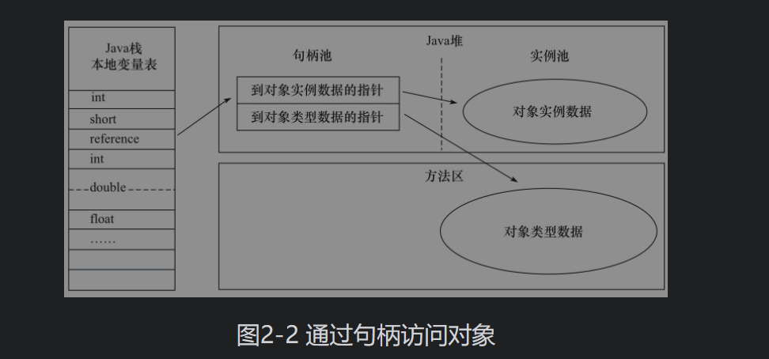
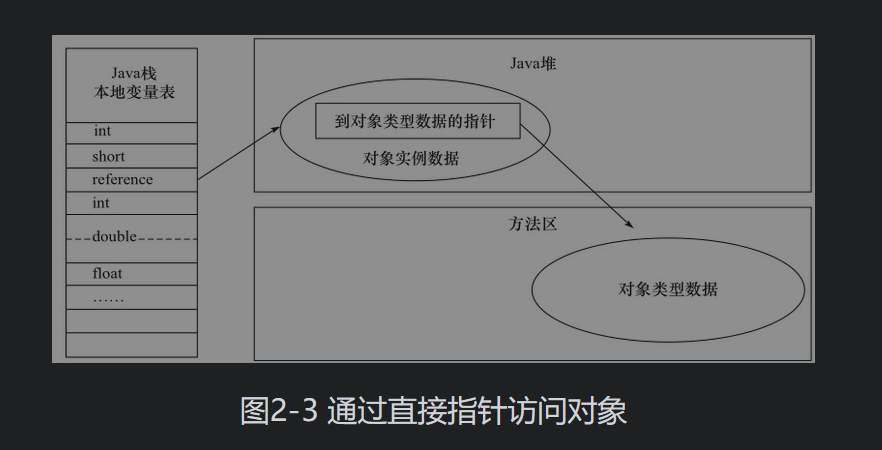
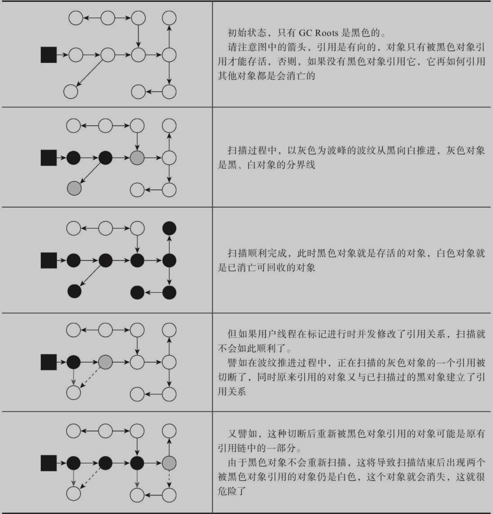
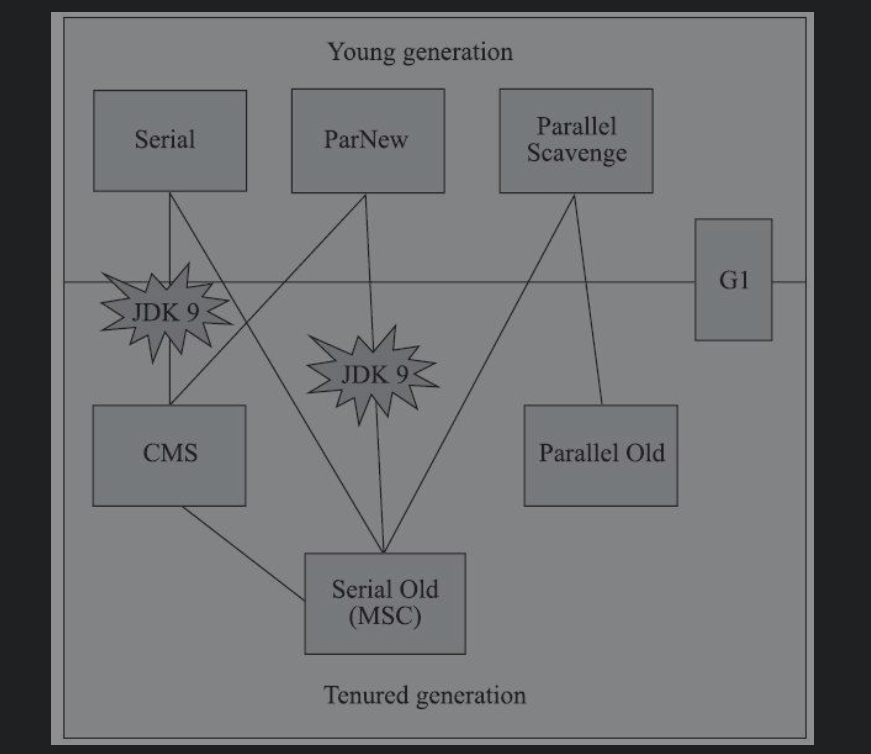
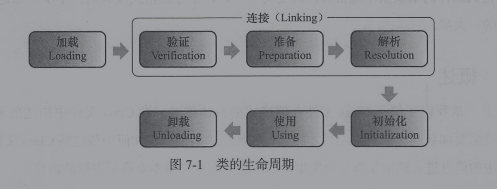
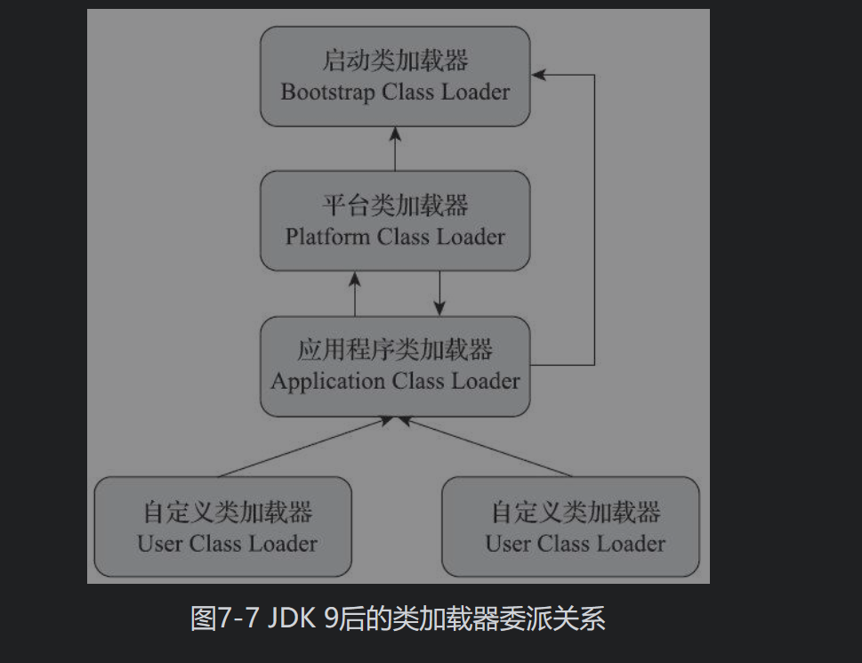

###### full gc时机 ######

- System.gc()方法的调用
  此方法的调用是建议JVM进行Full GC,虽然只是建议而非一定,但很多情况下它会触发 Full GC
- 老年代空间不足
  老年代空间只有在新生代对象转入及创建大对象、大数组时才会出现不足的现象，当执行Full GC后空间仍然不足，则抛出如下错误：java.lang.OutOfMemoryError: Java heap space 
- 方法区空间不足
  当系统中要加载的类、反射的类和调用的方法较多时，Permanet Generation可能会被占满，在未配置为采用CMS GC的情况下也会执行Full GC。如果经过Full GC仍然回收不了，那么JVM会抛出如下错误信息：java.lang.OutOfMemoryError: PermGen space 
  为避免Perm Gen占满造成Full GC现象，可采用的方法为增大Perm Gen空间或转为使用CMS GC。
- CMS GC时出现promotion failed和concurrent mode failure
  对于采用CMS进行老年代GC的程序而言，尤其要注意GC日志中是否有promotion failed和concurrent mode failure两种状况，当这两种状况出现时可能会触发Full GC。
- 堆中分配很大的对象
  所谓大对象，是指需要大量连续内存空间的java对象，例如很长的数组，此种对象会直接进入老年代，而老年代虽然有很大的剩余空间，但是无法找到足够大的连续空间来分配给当前对象，此种情况就会触发JVM进行Full GC。

###### 四种引用

- 强引用是最传统的“引用”的定义，是指在程序代码之中普遍存在的引用赋值，即类似“Object obj=new Object()”这种引用关系。无论任何情况下，只要强引用关系还存在，垃圾收集器就永远不会回收掉被引用的对象
- 软引用是用来描述一些还有用，但非必须的对象。只被软引用关联着的对象，在系统将要**发生内存溢出异常前**，会把这些对象列进回收范围之中进行第二次回收，如果这次回收还没有足够的内存，才会抛出内存溢出异常。
- 弱引用也是用来描述那些非必须对象，但是它的强度比软引用更弱一些，被弱引用关联的对象**只能生存到下一次垃圾收集发生为止。当垃圾收集器开始工作，无论当前内存是否足够，都会回收掉只被弱引用关联的对象**。
- 虚引用也称为“幽灵引用”或者“幻影引用”，它是最弱的一种引用关系。一个对象是否有虚引用的存在，完全不会对其生存时间构成影响，也无法通过虚引用来取得一个对象实例。为一个对象设置虚引用关联的唯一目的只是为了能在这个对象被收集器回收时收到一个系统通知。

###### 运行时数据区分布 ######

- program counter register（每个线程一个）：当前线程所执行的字节码的行号指示器

- java方法栈（虚拟机栈）：线程私有

  每个方法（Method）执行时，都会创建一个栈帧，用于存储局部变量表、操作数栈、动态链接、方法出口信息等

- 本地方法栈：与java方法栈类似，只不过运行的是native方法

- 堆：线程共享，对象堆

- 方法区：线程共享，存储已被虚拟机加载的类型信息、常量、静态变量、即时编译器编译后的代码缓存等数据（存放不会变化的数据）

- 直接内存：使用Native函数库直接分配堆外内存，然后通过一个存储在Java堆中的DirectByteBuffer对象作为这块内存的引用进行操作

###### 对象创建过程 ######

- 根据对应的类信息分配内存
  1. bump the pointer
  2. 空闲列表
- 保证多线程分配成功
  - cas：compare and swap
  - tlab：Thread Local Allocation Buffer，每个线程划分一个内存缓冲区域
- 将对象的内存空间置为0
- 设置对象头信息
- 执行构造函数

###### 对象内存分布 ######

- 对象头
- 实例数据
- 对齐

###### 句柄和直接指针

	

使用句柄来访问的最大好处就是reference中存储的是稳定的句柄地址，在对象被移动（垃圾收集时移动对象是非常普遍的行为）时只会改变句柄中的实例数据指针，而reference本身不需要修改。

使用直接指针访问方式的最大好处就是速度更快，它节省了一次指针定位的时间开销，

###### 不同数据区域异常分类 ######

- 堆区：heap溢出

- 栈区：单线程时（单个程序中的栈深度将内存占满），StackOverflowError|多线程时（多线程中的多方法栈将内存占满），OutOfMemoryError

- 方法区：全部都是heap溢出，但参数不同

  jdk6（全部信息都在永久代中），可使用permsize，异常说明中有PermGen space参数

  jdk7，可使用meta-spacesize（此时只有类型信息还在永久代中）

  jdk8，同属于heap溢出

##### 垃圾回收技术 #####

###### 判断对象死亡 ######

- 引用计数法：每有一个地方引用对象，计数器值就加一
  - 存在循环引用问题
- 可达性分析：判断一个对象是否从GC roots可达

###### 何时回收 ######

真正宣告一个对象死亡，至少要经历两次标记过程

###### 分代收集理论 ######

- 弱分代假说（Weak Generational Hypothesis）：绝大多数对象都是朝生夕灭的
- 强分代假说（Strong Generational Hypothesis）：熬过越多次垃圾收集过程的对象就越难以消亡。

两个假说共同奠定了多款常用的垃圾收集器的一致的设计原则：收集器应该将Java堆划分出不同的区域，然后将回收对象依据其年龄分配到不同的区域之中存储。

划分不同的区域看似简单，但不同区域的对象是有可能相互引用的，为了证明想要回收的区域内的对象没有别的区域的对象对其进行引用，还要遍历另一个区域的所有对象， 这样便失去了划分的意义

- 跨代引用假说（Intergenerational ReferenceHypothesis）：**跨代引用相对于同代引用来说仅占极少数**：跨代引用的数量比较小

有了跨代引用假说，就可以用**比较小的代价**（记录花费的存储代价以及引用更新的代价）记录哪些老年代或者新生代对象（或者专门在老年区对象中划分出一块区域）存在跨代引用，

###### 回收算法 ######

- 标记清除：如果堆中存在大量需要回收的对象，则需要进行大量清除的操作（每一个要清除的对象都要进行操作）。且清除完的内存中会有大量的碎片。

- 标记复制：，它将可用内存按容量划分为大小相等的两块，每次只使用其中的一块。当这一块的内存用完了，就将还存活着的对象复制到另外一块上面，然后再把已使用过的内存空间一次清理掉。

  坏处：不适用于老年代

  - 如果内存中多数对象都是存活的，这种算法将会产生大量的内存间复制的开销
  - 浪费一半内存

  好处：适用于新生代

  - 新生代中的对象有98%熬不过第一轮收集。因此并不需要按照1∶1的比例来划分新生代的内存空间。
  - 把新生代分为一块较大的Eden空间和两块较小的Survivor空间，每次分配内存只使用Eden和其中一块Survivor。发生垃圾搜集时，将Eden和Survivor中仍然存活的对象一次性复制到另外一块Survivor空间上，然后直接清理掉Eden和已用过的那块Survivor空间。HotSpot虚拟机默认Eden和Survivor的大小比例是8∶1，也即每次新生代中可用内存空间为整个新生代容量的90%（Eden的80%加上一个Survivor的10%）

- 标记整理：多用于老年代

###### GCroots ######

为了寻找目前程序（保存在栈中的方法）**在用的**变量，对象本身和指向对象的指针是分开的，对象本身在堆区，对象指针（大多是存在与方法中的变量）是在栈区，方法区中的类静态属性引用的对象和方法区中的常量 

找gcroots是为了gc，但实际上是找到哪些变量还在用，保留这些变量，清除其他区域，这就是gc了。最简单的寻找gcroots的方法就是一条一条扫描方法区的指令。

为了加速找到指令中哪些是对象引用，使用一组称为OopMap的数据结构来达到这个目的。一旦类加载动作完成的时候，HotSpot就会把对象内什么偏移量上是什么类型的数据计算出来，在即时编译（见第11章）过程中，也会在特定的位置记录下栈里和寄存器里哪些位置是引用。这样收集器在扫描时就可以直接得知这些信息了。

###### 安全点：我认为应该叫做效率点 ######

但每条指令都生成对应的OopMap，那将会需要大量的额外存储空间，这样垃圾收集伴随而来的空间成本就会变得无法忍受的高昂。

所以在一段能够长期运行的代码附近生成OopMap(找gcroots是为了找**还在存活**的变量，长期运行的代码才有记录的价值，运行时间短的代码生成了OopMap也很快没用了)，这些“附近”叫做**安全点**。

长时间执行”的最明显特征就是指令序列的复用，例如方法调用、循环跳转、异常跳转等都属于指令序列复用，所以只有具有这些功能的指令才会产生安全点。

如何让所有线程都到达安全点

- 抢先式中断

  抢先式中断不需要线程的执行代码主动去配合，在垃圾收集发生时，系统首先把所有用户线程全部中断，如果发现有用户线程中断的地方不在安全点上，就恢复这条线程执行，让它一会再重新中断，直到跑到安全点上。

- 主动式中断

  当垃圾收集需要中断线程的时候，不直接对线程操作，仅仅简单地设置一个标志位，各个线程执行过程时会不停地主动去轮询这个标志，一旦发现中断标志为真时就自己在最近的安全点上主动中断挂起。轮询标志的地方和安全点是重合的

###### 安全区 ######

安全区域是指能够确保在某一段代码片段之中，引用关系不会发生变化，因此，在这个区域中任意地方开始垃圾收集都是安全的。

当用户线程执行到安全区域里面的代码时，首先会标识自己已经进入了安全区域，这段时间里虚拟机就可以发起垃圾收集了。当线程要离开安全区域时，它要检查虚拟机是否已经完成了根节点枚举（或者垃圾收集过程中其他需要暂停用户线程的阶段），如果完成了，那线程就当作没事发生过，继续执行；否则它就必须一直等待，直到收到可以离开安全区域的信号为止。

###### 写屏障 ######

在进行引用赋值之前或之后插入一段操作

维护卡表，实现并发标记，都要用到写屏障

增量更新使用写后屏障（CMS），原始快照使用写前屏障（G1）

并发回收用到读屏障

###### 三色标记 ######



当且仅当以下两个条件同时满足时，会产生“对象消失”的问题，即原本应该是黑色的对象被误标为白色：

- 赋值器插入了一条或多条从黑色对象到白色对象的新引用；
- 赋值器删除了全部从灰色对象到该白色对象的直接或间接引用。

解决方法

- 增量更新：黑色对象一旦新插入了指向白色对象的引用之后，它就变回灰色对象了。

  当黑色对象插入新的指向白色对象的引用关系时，就将这个新插入的引用记录下来，等并发扫描结束之后，再将这些记录过的引用关系中的黑色对象为根，重新扫描一次

- 原始快照： 删除一个灰色到白色对象的引用时，将白色对象设为灰色，新生成的对象设为黑色                                                                                                                                                                                                                                                                                                                                                                                                                                                                                                                                                                                                                                                                                                                                                         

##### 垃圾收集器 #####



###### Serial ######

单线程，新生代收集器，标记复制算法

缺点：stop the world

优点：额外开销小（单线程没有线程交互，简单的算法不存在额外的信息需要存储），适用在数据规模比较小（分配的对象数量比较少，垃圾回收的停顿时间就可以控制在一个人不可感知的时间内）的客户端

###### ParNew ######

多线程版本的Serial

关注缩短**单次**垃圾回收时间，相应的吞吐量下降（垃圾回收的次数变多），适用于与用户进行交互

###### Parallel Scavenge ######

多线程，新生代收集器，标记复制算法

关注吞吐量，相应的**单次**垃圾回收时间变长，适用于后台程序

###### Serial Old ######

单线程，老年代收集器，标记整理算法

###### Parallel Old ######

多线程，老年代收集器，标记整理算法

###### CMS（concurrent mark sweep） ######

多线程，老年代收集器，**标记清除算法**

关注最短回收停顿时间，

CMS收集器是基于标记-清除算法实现的，整个过程分为四个步骤

1）初始标记（CMS initial mark）：标记gcroot

2）并发标记（CMS concurrent mark）：标记全部对象

3）重新标记（CMS remark）：基于增量更新标记遗漏的对象

4）并发清除（CMS concurrent sweep）可以和用户程序一起执行

\- 并发清除阶段新晋升的对象会被分配在Free List中指定的合适区域，不会被清理

\- 并发清除阶段又可能产生垃圾，这些垃圾需要等到下一次GC处理。

缺点：对处理器资源要求较高；基于标记-清除算法，会产生内存碎片；如果内存回收跟不上内存分配，将会导致stop the world

###### G1 ######

全代收集器

核心思想：把java堆划分成**多个大小相等的独立区域**，每个区域都能够充当新生代中的eden空间，survivor空间，或者老年代空间

- G1收集器的运作过程大致可划分为以下四个步骤：

  初始标记（Initial Marking）：仅仅只是标记一下GCRoots能直接关联到的对象，并且修改TAMS指针的值，让下一阶段用户线程并发运行时，能正确地在可用的Region中分配新对象。这个阶段需要停顿线程，但耗时很短，而且是借用进行Minor GC的时候同步完成的，所以G1收集器在这个阶段实际并没有额外的停顿。

  并发标记（Concurrent Marking）：从GC Root开始对堆中对象进行可达性分析，递归扫描整个堆里的对象图，找出要回收的对象，这阶段耗时较长，但可与用户程序并发执行。当对象图扫描完成以后，还要重新处理SATB（原始快照）记录下的在并发时有引用变动的对象。

  最终标记（Final Marking）：使用原始快照算法标记所有节点

  筛选回收（Live Data Counting and Evacuation）：负责更新Region的统计数据，对各个Region的回收价值和成本进行排序，根据用户所期望的停顿时间来制定回收计划，可以自由选择任意多个Region构成回收集，然后把决定回收的那一部分Region的存活对象复制到空的Region中，再清理掉整个旧Region的全部空间。这里的操作涉及存活对象的移动，是必须暂停用户线程，由多条收集器线程并行完成的。

从上述阶段的描述可以看出，G1收集器除了并发标记外，**其余阶段也是要完全暂停用户线程的**

- 回收过程中新创建对象的内存分配上，程序要继续运行就肯定会持续有新对象被创建，如何保证新对象的分配与内存回收互不干扰？

  G1为每一个Region设计了两个名为TAMS（Top at Mark Start）的指针，把Region中的一部分空间划分出来用于并发回收过程中的新对象分配，并发回收时新分配的对象地址都必须要在这两个指针位置以上。G1收集器默认在这个地址以上的对象是被隐式标记过的，即默认它们是存活的，不纳入回收范围。与CMS中的“ConcurrentMode Failure”失败会导致Full GC类似，如果内存回收的速度赶不上内存分配的速度，G1收集器也要被迫冻结用户线程执行，导致Full GC而产生长时间“Stop The World”。

- G1与CMS的比较

  G1运作期间不会产生内存空间碎片，垃圾收集完成之后能提供规整的可用内存，但CMS基于标记清除算法

  G1的老年代回收可以动态选择回收区域的大小，而CMS则是每次扫描全部的老年代

  但是G1无论是为了垃圾收集产生的内存占用（Footprint）还是程序运行时的额外执行负载（Overload）都要比CMS要高。

  就内存占用来说，虽然G1和CMS都使用卡表来处理跨代指针，但G1的卡表实现更为复杂，而且堆中每个Region，无论扮演的是新生代还是老年代角色，都必须有一份卡表，这导致G1的记忆集（和其他内存消耗）可能会占整个堆容量的20%乃至更多的内存空间；相比起来CMS的卡表就相当简单，只有唯一一份，而且只需要处理老年代到新生代的引用，反过来则不需要，由于新生代的对象具有朝生夕灭的不稳定性，引用变化频繁，能省下这个区域的维护开销是很划算的[插图]。
  
  在执行负载的角度上，同样由于两个收集器各自的细节实现特点导致了用户程序运行时的负载会有不同，譬如它们都使用到写屏障，CMS用写后屏障来更新维护卡表；而G1除了使用写后屏障来进行同样的（由于G1的卡表结构复杂，其实是**更烦琐的**）卡表维护操作外，为了实现**原始快照搜索（SATB）算法**，还**需要使用写前屏障**来跟踪并发时的指针变化情况。相比起增量更新算法，**原始快照搜索能够减少并发标记和重新标记阶段的消耗**，**避免CMS那样在最终标记阶段停顿时间过长的缺点**，但是在用户程序运行过程中确实会产生由跟踪引用变化带来的额外负担。由于G1对写屏障的复杂操作要比CMS消耗更多的运算资源，所以CMS的写屏障实现是直接的同步操作，而G1就不得不将其实现为类似于消息队列的结构，把写前屏障和写后屏障中要做的事情都放到队列里，然后再异步处理。

##### 低延迟垃圾收集器 #####

衡量垃圾收集器的三项最重要的指标是：内存占用（Footprint）、吞吐量（Throughput）和延迟（Latency）

随着计算机硬件的发展，成本逐渐降低，我们越来越能容忍收集器多占用一点点内存；性能逐渐提高，吞吐量逐渐提高；但延迟也逐渐提高（虚拟机要回收完整的1TB的堆内存，毫无疑问要比回收1GB的堆内存耗费更多时间），就不难理解为何延迟会成为垃圾收集器最被重视的性能指标了

###### Shenandoah ######

它与G1至少有三个明显的不同之处，最重要的当然是支持并发的整理算法，G1的回收阶段是可以多线程并行的，但却不能与用户线程并发

- 核心：最终的并发回收阶段

  ·并发回收（Concurrent Evacuation）：并发回收阶段是Shenandoah与之前HotSpot中其他收集器的核心差异。在这个阶段，Shenandoah要把回收集里面的**存活对象先复制一份到其他未被使用的Region之中**。复制对象这件事情如果将用户线程冻结起来再做那是相当简单的，但如果两者必须要同时并发进行的话，就变得复杂起来了。其困难点是在移动对象的同时，用户线程仍然可能不停对被移动的对象进行读写访问，移动对象是一次性的行为，但移动之后整个内存中所有指向该对象的引用都还是旧对象的地址，这是很难一瞬间全部改变过来的。并发回收阶段运行的时间长短取决于回收集的大小。

  ·初始引用更新（Initial Update Reference）：并发回收阶段复制对象结束后，还需要把堆中所有指向旧对象的引用修正到复制后的新地址，这个操作称为引用更新。引用更新的初始化阶段实际上并未做什么具体的处理，设立这个阶段只是为了建立一个线程集合点，确保所有并发回收阶段中进行的收集器线程都已完成分配给它们的对象移动任务而已。初始引用更新时间很短，会产生一个非常短暂的停顿。

  ·并发引用更新（Concurrent Update Reference）：真正开始进行引用更新操作，这个阶段是与用户线程一起并发的，时间长短取决于内存中涉及的引用数量的多少。并发引用更新与并发标记不同，它不再需要沿着对象图来搜索，只需要按照内存物理地址的顺序，线性地搜索出引用类型，把旧值改为新值即可。

  ·最终引用更新（Final Update Reference）：解决了堆中的引用更新后，还要修正存在于GC Roots中的引用。这个阶段是Shenandoah的最后一次停顿，停顿时间只与GC Roots的数量相关。

  ·并发清理（Concurrent Cleanup）：经过并发回收和引用更新之后，整个回收集中所有的Region已再无存活对象，这些Region都变成ImmediateGarbage Regions了，最后再调用一次并发清理过程来回收这些Region的内存空间，供以后新对象分配使用。

- 如何进行并发回收：使用转发指针

  每个对象多记录一个地址引用（转发指针），用来在并发回收的时候将现有的对象地址指向新的地址，而在平时的时候指向自己（缺点就是每次对象访问会带来一次额外的转向开销）

- 转发指针的带来的问题

  Brooks形式的转发指针在设计上决定了它是必然会出现多线程竞争问题的，

  如果收集器线程与用户线程发生的只是并发读取，那无论读到旧对象还是新对象上的字段，返回的结果都应该是一样的，这个场景还可以有一些“偷懒”的处理余地；

  但如果发生的是并发写入，就一定必须保证写操作只能发生在新复制的对象上，而不是写入旧对象的内存中。读者不妨设想以下三件事情并发进行时的场景：

  1）收集器线程复制了新的对象副本；2）用户线程更新对象的某个字段；3）收集器线程更新转发指针的引用值为新副本地址。

  如果不做任何保护措施，让事件2在事件1、事件3之间发生的话，将导致的结果就是用户线程对对象的变更发生在旧对象上，所以这里必须针对转发指针的访问操作采取同步措施，让收集器线程或者用户线程对转发指针的访问只有其中之一能够成功，另外一个必须等待，避免两者交替进行。实际上Shenandoah收集器是通过比较并交换（Compare And Swap，CAS）操作来保证并发时对象的访问正确性的。

其次，Shenandoah（目前）是默认不使用分代收集的，换言之，不会有专门的新生代Region或者老年代Region的存在，没有实现分代，并不是说分代对Shenandoah没有价值，这更多是出于性价比的权衡，基于工作量上的考虑而将其放到优先级较低的位置上。

最后，Shenandoah摒弃了在G1中耗费大量内存和计算资源去维护的记忆集，改用名为“连接矩阵”（Connection Matrix）的全局数据结构来记录跨Region的引用关系，降低了处理跨代指针时的记忆集维护消耗，也降低了伪共享问题（见3.4.4节）的发生概率。

连接矩阵可以简单理解为一张二维表格，如果Region N有对象指向Region M，就在表格的N行M列中打上一个标记

###### ZGC ######

基于Region内存布局的，（暂时）不设分代的，使用了读屏障、**染色指针**和内存多重映射等技术来实现可并发的标记-整理算法的，以低延迟为首要目标的一款垃圾收集器。

- 流程

  ·并发标记（Concurrent Mark）：与G1、Shenandoah一样，并发标记是遍历对象图做可达性分析的阶段，前后也要经过类似于G1、Shenandoah的初始标记、最终标记（尽管ZGC中的名字不叫这些）的短暂停顿，而且这些停顿阶段所做的事情在目标上也是相类似的。与G1、Shenandoah不同的是，ZGC的标记是在指针上而不是在对象上进行的，标记阶段会更新染色指针中的Marked 0、Marked 1标志位。

  ·并发预备重分配（Concurrent Prepare for Relocate）：这个阶段需要根据特定的查询条件统计得出本次收集过程要清理哪些Region，将这些Region组成重分配集（Relocation Set）。重分配集与G1收集器的回收集（Collection Set）还是有区别的，ZGC划分Region的目的并非为了像G1那样做收益优先的增量回收。相反，ZGC每次回收都会扫描所有的Region，用范围更大的扫描成本换取省去G1中记忆集的维护成本。因此，ZGC的重分配集只是决定了里面的存活对象会被重新复制到其他的Region中，里面的Region会被释放，而并不能说回收行为就只是针对这个集合里面的Region进行，因为标记过程是针对全堆的。此外，在JDK 12的ZGC中开始支持的类卸载以及弱引用的处理，也是在这个阶段中完成的。

  ·并发重分配（Concurrent Relocate）：重分配是ZGC执行过程中的核心阶段，这个过程要把重分配集中的存活对象复制到新的Region上，并为重分配集中的每个Region维护一个转发表（Forward Table），记录从旧对象到新对象的转向关系。得益于染色指针的支持，ZGC收集器能仅从引用上就明确得知一个对象是否处于重分配集之中，如果用户线程此时并发访问了位于重分配集中的对象，这次访问将会被预置的内存屏障所截获，然后立即根据Region上的转发表记录将访问转发到新复制的对象上，并同时修正更新该引用的值，使其直接指向新对象，ZGC将这种行为称为指针的“自愈”（Self-Healing）能力。**这样做的好处是只有第一次访问旧对象会陷入转发，也就是只慢一次，对比Shenandoah的Brooks转发指针，那是每次对象访问都必须付出的固定开销，简单地说就是每次都慢**，因此ZGC对用户程序的运行时负载要比Shenandoah来得更低一些。还有另外一个直接的好处是由于染色指针的存在，一旦重分配集中某个Region的存活对象都复制完毕后，这个Region就可以立即释放用于新对象的分配（但是转发表还得留着不能释放掉），哪怕堆中还有很多指向这个对象的未更新指针也没有关系，这些旧指针一旦被使用，它们都是可以自愈的。

  ·并发重映射（Concurrent Remap）：重映射所做的就是修正整个堆中指向重分配集中旧对象的所有引用，这一点从目标角度看是与Shenandoah并发引用更新阶段一样的，但是ZGC的并发重映射并不是一个必须要“迫切”去完成的任务，因为前面说过，即使是旧引用，它也是可以自愈的，最多只是第一次使用时多一次转发和修正操作。重映射清理这些旧引用的主要目的是为了不变慢（还有清理结束后可以释放转发表这样的附带收益），所以说这并不是很“迫切”。因此，ZGC很巧妙地把并发重映射阶段要做的工作，合并到了下一次垃圾收集循环中的并发标记阶段里去完成，反正它们都是要遍历所有对象的，这样合并就节省了一次遍历对象图[插图]的开销。一旦所有指针都被修正之后，原来记录新旧对象关系的转发表就可以释放掉了。

- 染色指针的优势

  染色指针可以使得一旦某个Region的存活对象被移走之后，这个Region立即就能够被释放和重用掉，而不必等待整个堆中所有指向该Region的引用都被修正后才能清理。这点相比起Shenandoah是一个颇大的优势，使得理论上只要还有一个空闲Region，ZGC就能完成收集，而Shenandoah需要等到引用更新阶段结束以后才能释放回收集中的Region，这意味着堆中几乎所有对象都存活的极端情况，需要1∶1复制对象到新Region的话，就必须要有一半的空闲Region来完成收集。

  染色指针可以大幅减少在垃圾收集过程中内存屏障的使用数量，设置内存屏障，尤其是写屏障的目的通常是为了记录对象引用的变动情况，如果将这些信息直接维护在指针中，显然就可以省去一些专门的记录操作。实际上，到目前为止ZGC都并未使用任何写屏障，只使用了读屏障（一部分是染色指针的功劳，一部分是ZGC现在还不支持分代收集，天然就没有跨代引用的问题）。

- 缺点

  ZGC就完全没有使用记忆集，它甚至连分代都没有，连像CMS中那样只记录新生代和老年代间引用的卡表也不需要，因而完全没有用到写屏障，所以给用户线程带来的运行负担也要小得多。可是，必定要有优有劣才会称作权衡，ZGC的这种选择也限制了它能承受的对象分配速率不会太高，可以想象以下场景来理解ZGC的这个劣势：ZGC准备要对一个很大的堆做一次完整的并发收集，假设其全过程要持续十分钟以上（请读者切勿混淆并发时间与停顿时间，ZGC立的Flag是停顿时间不超过十毫秒），在这段时间里面，由于应用的对象分配速率很高，将创造大量的新对象，这些新对象很难进入当次收集的标记范围，通常就只能全部当作存活对象来看待——尽管其中绝大部分对象都是朝生夕灭的，这就产生了大量的浮动垃圾。如果这种高速分配持续维持的话，每一次完整的并发收集周期都会很长，回收到的内存空间持续小于期间并发产生的浮动垃圾所占的空间，堆中剩余可腾挪的空间就越来越小了。目前唯一的办法就是尽可能地增加堆容量大小，获得更多喘息的时间。

##### 类加载 #####

###### 类的生命周期 ######



- 加载阶段
  - 通过一个类的全限定名来获取定义此类的二进制字节流
  - 将这个字节流所代表的静态存储结构转化为方法区的运行时数据结构
  - 在内存中生成一个代表这个类的 java.lang.Class 对象，作为方法区这个类的各种数据的访问人口
  
- 连接阶段

  - 验证是否符合规定：文件格式验证、元数据验证、字节码验证和符号引用验证;

  - 准备

    为类中的所有静态变量分配内存空间，并为其设置一个初始值（由于还没有产生对象，实例变量将不再此操作范围内）；

  - 解析

    将常量池中所有的符号引用转为直接引用

- 初始化

  直接赋值操作，静态代码块

###### 类加载器 ######

- 启动类加载器

  由C++实现，为虚拟机自身的一部分

  Bootstrap 类加载器充当所有其他 ClassLoader **实例**的父级（并没有继承关系）。

  负责将存放在＜JAVA_HOME>\lib 目录中的，rt.jar，和被－Xbootclasspath 参数所指定的路径中的，并且是名称符合规定的类库加载到虚拟机内存中。

  启动类加载器无法被 Java程序直接引用，用户在编写自定义类加载器时，如果需要把加载请求委派给引导类加载器，那直接使用 null 即可，

- 其他类加载器

  - Extention ClassLoader
  
    扩展的类加载器，加载目录%JRE_HOME%\lib\ext目录下的jar包和class文件。还可以加载-D java.ext.dirs选项指定的目录。
  
  - AppClassLoader
  
    也称为 SystemAppClass 加载当前应用的classpath的所有类。

###### 类加载机制 ######

```java
protected Class<?> loadClass(String name, boolean resolve)
    throws ClassNotFoundException
    {
        synchronized (getClassLoadingLock(name)) {
            // 第一步，检查这个类是否已经被加载
            Class<?> c = findLoadedClass(name);
            if (c == null) {
             //如果没有被加载
                long t0 = System.nanoTime();
                try {
                    //如果该类的上级加载器存在，那么用该加载器来加载这个类
                    //这里是一个循环的过程，知道上级类加载器不存在为止
                    if (parent != null) {
                        c = parent.loadClass(name, false);
                    } else {
                        //如果这个类没有上级类加载器，那么则使用BootstrapClassLoader来加载
                        c = findBootstrapClassOrNull(name);
                    }
                } catch (ClassNotFoundException e) {
                    // ClassNotFoundException thrown if class not found
                    // from the non-null parent class loader
                }

                if (c == null) {
                    // 如果仍然为空，则调用 findClass方法来寻找这个类
                    //从内存中查找是否有这个类的缓存
                    long t1 = System.nanoTime();
                    c = findClass(name);

                    // this is the defining class loader; record the stats
                    sun.misc.PerfCounter.getParentDelegationTime().addTime(t1 - t0);
                    sun.misc.PerfCounter.getFindClassTime().addElapsedTimeFrom(t1);
                    sun.misc.PerfCounter.getFindClasses().increment();
                }
            }
            if (resolve) {
                 // 解析class文件，就是将符号引用替换为直接引用的过程
                resolveClass(c);
            }
            return c;
        }
    }
```

对于任意一个类，都必须由加载它的类加载器和这个类本身一起共同确立其在Java虚拟机中的唯一性，每一个类加载器，都代表一个独立的类名称空间。

###### 双亲委派模型 ######

双亲委派模型的工作过程是：如果一个类加载器收到了类加载的请求，它首先不会自己去尝试加载这个类，而是把这个请求委派给父类加载器去完成，每一个层次的类加载器都是如此，因此所有的加载请求最终都应该传送到最顶层的启动类加载器中，只有当父加载器反馈自己无法完成这个加载请求（它的搜索范围中没有找到所需的类）时，子加载器才会尝试自己去完成加载。

使用双亲委派模型来组织类加载器之间的关系，一个显而易见的好处就是Java中的类随着它的类加载器一起具备了一种带有优先级的层次关系。例如类java.lang.Object，它存放在rt.jar之中，无论哪一个类加载器要加载这个类，最终都是委派给处于模型最顶端的启动类加载器进行加载，因此Object类在程序的各种类加载器环境中都能够保证是同一个类。反之，如果没有使用双亲委派模型，都由各个类加载器自行去加载的话，如果用户自己也编写了一个名为java.lang.Object的类，并放在程序的ClassPath中，那系统中就会出现多个不同的Object类，Java类型体系中最基础的行为也就无从保证，应用程序将会变得一片混乱。



