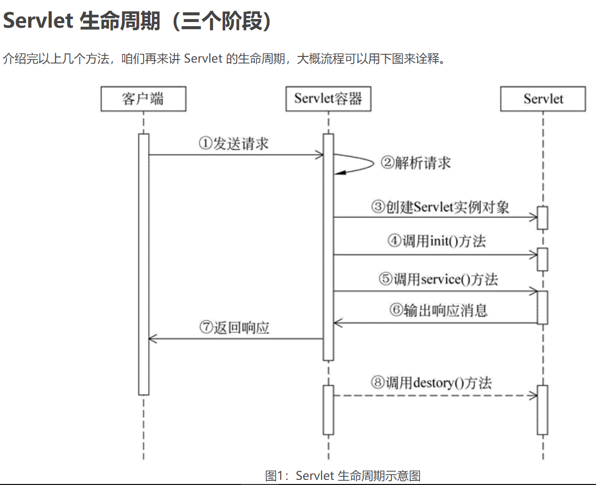

servlet是符合javaee规范的服务器所操作的单位，每一个servlet方法对应一个网址的访问

###### servlet生命周期

1. 初始化阶段

   当用户第一次向 Servlet 容器发出 HTTP 请求要求访问某个 Servlet 时，Servlet 容器会在整个容器中搜索该 Servlet 对象，发现这个 Servlet 对象没有被实例化，于是创建这个 Servlet 对象，然后调用该对象的 init() 方法完成初始化。

   当用户第二次访问这个 Servlet 时，Servlet 容器仍然在容器中搜索该 Servlet 对象，结果找到了该对象的实例，则不去创建而直接使用该对象。

   找到了对应的 Servlet 对象，随后 Servlet 进入到运行阶段。

   需要注意的是，在 Servlet 的整个生命周期内，它的 init() 方法只被调用一次。

2. 运行阶段

   这是 Servlet 生命周期中最核心的阶段。在该阶段中，Servlet 容器会为当前的请求创建一个 ServletRequest 对象和一个 ServletResponse 对象（它们分别代表 HTTP 请求和 HTTP 响应），并将这两个对象作为参数传递给 Servlet 的 service() 方法。

   service() 方法从 ServletRequest 对象中获得用户的详细请求信息并处理该请求，通过 ServletResponse 对象生成响应结果。

   需要强调的是，在 Servlet 的整个生命周期内，用户每次请求访问 Servlet 时，Servlet 容器都会调用一次 Servlet 的 service() 方法，并且创建新的 ServletRequest 和 ServletResponse 对象。

3.  销毁阶段

   当服务器停止时，Servlet 容器需要回收 Servlet 对象所占用的内存，在回收之前，会自动调用该对象的 destroy() 方法做好回收内存前的准备，辟如关闭后台线程。

   和 init() 方法类似，destroy() 方法也只会被调用一次。

   注意：Servlet 对象一旦创建就会驻留在内存中一直等待客户端的访问，直到服务器关闭或项目被移除出容器时，Servlet 对象才会被销毁。



###### 三大作用域 ######

- request：HttpServletRequest，一次请求访问的多个资源(转发)
- session：HttpSession，一次会话的多个请求间
- application：ServletContext，所有用户间共享数据

### Tomcat

```
* JavaEE：Java语言在企业级开发中使用的技术规范的总和，一共规定了13项大的规范

* java项目的目录结构：
    -- 项目的根目录
    	-- WEB-INF目录：
    		-- web.xml：web项目的核心配置文件
    		-- classes目录：放置字节码文件的目录
    		-- lib目录：放置依赖的jar包  
* WEB-INF目录下的资源不能被浏览器直接访问。

* Tomcat：web服务器软件
  1. 下载：http://tomcat.apache.org/
  2. 安装：解压压缩包即可。
     * 注意：安装目录建议不要有中文和空格
  3. 卸载：删除目录就行了
  4. 启动：
     * bin/startup.bat ,双击运行该文件即可
     * 访问：浏览器输入：http://localhost:8080 回车访问自己
       		  http://别人的ip:8080 访问别人

     * 可能遇到的问题：
       1. 黑窗口一闪而过：
          * 原因： 没有正确配置JAVA_HOME环境变量
          * 解决方案：正确配置JAVA_HOME环境变量

       2. 启动报错：
          1. 暴力：找到占用的端口号，并且找到对应的进程，杀死该进程
             * netstat -ano
          2. 温柔：修改自身的端口号
             * conf/server.xml
             * <Connector port="8888" protocol="HTTP/1.1"
                   connectionTimeout="20000"
                   redirectPort="8445" />
             * 一般会将tomcat的默认端口号修改为80。80端口号是http协议的默认端口号。
               * 好处：在访问时，就不用输入端口号
  5. 关闭：
     1. 正常关闭：
        * bin/shutdown.bat
        * ctrl+c
     2. 强制关闭：
        * 点击启动窗口的×
  6. 配置:
     * 部署项目的方式：
       1. 直接将项目放到webapps目录下即可。
          * /hello：项目的访问路径-->虚拟目录
          * 简化部署：将项目打成一个war包，再将war包放置到webapps目录下。
            * war包会自动解压缩

       2. 配置conf/server.xml文件（在tomcat安装目录下）
          在<Host>标签体中配置
          <Context docBase="项目地址" path="/虚拟地址" />
          * docBase:项目存放的路径
          * path：虚拟目录

       3. 在conf\Catalina\localhost（在tomcat安装目录下）创建任意名称的xml文件。			在文件中编写
          <Context docBase="项目地址" />
          * 虚拟地址：xml文件的名称
```

### servlet

```
* 快速入门：
  1. 创建JavaEE项目
  2. 定义一个类，实现Servlet接口
     * public class ServletDemo1 implements Servlet
  3. 实现接口中的抽象方法
  4. 配置Servlet
     在web.xml中配置：
     <!--配置Servlet -->
     <servlet>
         <servlet-name>demo1</servlet-name>
         <servlet-class>cn.itcast.web.servlet.ServletDemo1</servlet-class>
     </servlet>
     <servlet-mapping>
         <servlet-name>demo1</servlet-name>
         <url-pattern>/demo1</url-pattern>
     </servlet-mapping>

* 执行原理：
  1. 当服务器接受到客户端浏览器的请求后，会解析请求URL路径，获取访问的Servlet的资源路径
  2. 查找web.xml文件，是否有对应的<url-pattern>标签体内容。
  3. 如果有，则在找到对应的<servlet-class>全类名
  4. tomcat会将字节码文件加载进内存，并且创建其对象
  5. 调用其方法
  
* Servlet3.0：
	* 好处：
		* 支持注解配置。可以不需要web.xml了。
	* 步骤：
		1. 创建JavaEE项目，选择Servlet的版本3.0以上，可以不创建web.xml
		2. 定义一个类，实现Servlet接口
		3. 复写方法
		4. 在类上使用@WebServlet注解，进行配置
			* @WebServlet("资源路径")
						@Target({ElementType.TYPE})
			@Retention(RetentionPolicy.RUNTIME)
			@Documented
			public @interface WebServlet {
			    String name() default "";//相当于<Servlet-name>
			
			    String[] value() default {};//代表urlPatterns()属性配置
			
			    String[] urlPatterns() default {};//相当于<url-pattern>
			
			    int loadOnStartup() default -1;//相当于<load-on-startup>
			
			    WebInitParam[] initParams() default {};
			
			    boolean asyncSupported() default false;
			
			    String smallIcon() default "";
			
			    String largeIcon() default "";
			
			    String description() default "";
			
			    String displayName() default "";
			}
6. Servlet的体系结构	
	Servlet -- 接口
		|
	GenericServlet -- 抽象类
		|
	HttpServlet  -- 抽象类

	* GenericServlet：将Servlet接口中其他的方法做了默认空实现，只将service()方法作为抽象
		* 将来定义Servlet类时，可以继承GenericServlet，实现service()方法即可

	* HttpServlet：对http协议的一种封装，简化操作
		1. 定义类继承HttpServlet
		2. 复写doGet/doPost方法

7. Servlet相关配置
	1. urlpartten:Servlet访问路径
		1. 一个Servlet可以定义多个访问路径 ： @WebServlet({"/d4","/dd4","/ddd4"})
		2. 路径定义规则：
			1. /xxx：路径匹配
			2. /xxx/xxx:多层路径，目录结构
			3. *.do：扩展名匹配
```

### Http

```
概念：Hyper Text Transfer Protocol 超文本传输协议
* 特点：
  1. 基于TCP/IP的高级协议
  2. 默认端口号:80
  3. 基于请求/响应模型的:一次请求对应一次响应
  4. 无状态的：每次请求之间相互独立，不能交互数据

* 历史版本：
  * 1.0：每一次请求响应都会建立新的连接
  * 1.1：复用连接
  

```

#### 请求消息数据格式

1. 请求行

    | 请求方式 | 请求的url | 请求协议/版本 |
    | -------- | --------- | ------------- |
    | GET      |           | HTTP/1.1      |

    HTTP协议有7中请求方式，常用的有2种
    * GET：
        1. 请求参数在请求行中，在url后。
        2. 请求的url长度有限制的
        3. 不太安全
    * POST：
        1. 请求参数在请求体中
        2. 请求的url长度没有限制的
        3. 相对安全

2. 请求头：客户端浏览器告诉服务器一些信息
    请求头名称: 请求头值

    * 常见的请求头：
        1. User-Agent：浏览器告诉服务器，我访问你使用的浏览器版本信息
            * 可以在服务器端获取该头的信息，解决浏览器的兼容性问题

        2. Referer：http://localhost/login.html
            * 告诉服务器，我(当前请求)从哪里来？
                * 作用：
                    1. 防盗链：
                    2. 统计工作：

3. 请求空行
    空行，就是用于分割POST请求的请求头，和请求体的。

4. 请求体(正文)：

    * 封装POST请求消息的请求参数的

字符串格式：

```http
POST /login.html	HTTP/1.1
Host: localhost
User-Agent: Mozilla/5.0 (Windows NT 6.1; Win64; x64; rv:60.0) Gecko/20100101 Firefox/60.0
Accept: text/html,application/xhtml+xml,application/xml;q=0.9,*/*;q=0.8
Accept-Language: zh-CN,zh;q=0.8,zh-TW;q=0.7,zh-HK;q=0.5,en-US;q=0.3,en;q=0.2
Accept-Encoding: gzip, deflate
Referer: http://localhost/login.html
Connection: keep-alive
Upgrade-Insecure-Requests: 1

username=zhangsan	
```


#### 响应消息数据格式

1. 响应行：协议/版本 响应状态码 状态码描述

      响应状态码：服务器告诉客户端浏览器本次请求和响应的一个状态。

        状态码都是3位数字 

        分类：

        1. 1xx：服务器就收客户端消息，但没有接受完成，等待一段时间后，发送1xx多状态码

        2. 2xx：成功。代表：200

        3. 3xx：重定向。代表：302(重定向)，304(访问缓存)

        4. 4xx：客户端错误。

             代表：

              * 404（请求路径没有对应的资源） 
             * 405：请求方式没有对应的doXxx方法

        5. 5xx：服务器端错误。代表：500(服务器内部出现异常)

2. 响应头：格式：头名称： 值
        1. 常见的响应头：

         2. Content-Type：服务器告诉客户端本次响应体数据格式以及编码格式
        
         3. Content-disposition：服务器告诉客户端以什么格式打开响应体数据
        
             	* in-line:默认值,在当前页面内打开
             	* attachment;filename=xxx：以附件形式打开响应体。文件下载

3. 响应空行

4. 响应体:传输的数据

响应字符串格式

```http
HTTP/1.1 200 OK
Content-Type: text/html;charset=UTF-8
Content-Length: 101
Date: Wed, 06 Jun 2018 07:08:42 GMT

<html>
  <head>
    <title>$Title$</title>
  </head>
  <body>
  hello , response
  </body>
</html>
```


### Request

```
1. request对象和response对象的原理
	1. request和response对象是由服务器创建的。我们来使用它们
	2. request对象是来获取请求消息，response对象是来设置响应消息

2. request对象继承体系结构：	
	ServletRequest		--	接口
		|	继承
	HttpServletRequest	-- 接口
		|	实现
	org.apache.catalina.connector.RequestFacade 类(tomcat)

3. request功能：
	1. 获取请求消息数据
		1. 获取请求行数据
			* GET /day14/demo1?name=zhangsan HTTP/1.1
			* 方法：
				1. 获取请求方式 ：GET
					* String getMethod()  
				2. (*)获取虚拟目录：/day14
					* String getContextPath()
				3. 获取Servlet路径: /demo1
					* String getServletPath()
				4. 获取get方式请求参数：name=zhangsan
					* String getQueryString()
				5. (*)获取请求URI：/day14/demo1
					* String getRequestURI():		/day14/demo1
					* StringBuffer getRequestURL()  :http://localhost/day14/demo1

					* URL:统一资源定位符 ： http://localhost/day14/demo1	中华人民共和国
					* URI：统一资源标识符 : /day14/demo1					共和国
				
				6. 获取协议及版本：HTTP/1.1
					* String getProtocol()

				7. 获取客户机的IP地址：
					* String getRemoteAddr()
				
		2. 获取请求头数据
			* 方法：
				* (*)String getHeader(String name):通过请求头的名称获取请求头的值
				* Enumeration<String> getHeaderNames():获取所有的请求头名称
			
		3. 获取请求体数据:
			* 请求体：只有POST请求方式，才有请求体，在请求体中封装了POST请求的请求参数
			* 步骤：
				1. 获取流对象
					*  BufferedReader getReader()：获取字符输入流，只能操作字符数据
					*  ServletInputStream getInputStream()：获取字节输入流，可以操作所有类型数据
						* 在文件上传知识点后讲解

				2. 再从流对象中拿数据
				
	2. 其他功能：
		1. 获取请求参数通用方式：不论get还是post请求方式都可以使用下列方法来获取请求参数
			1. String getParameter(String name):根据参数名称获取参数值    username=zs&password=123
			2. String[] getParameterValues(String name):根据参数名称获取参数值的数组  hobby=xx&hobby=game
			3. Enumeration<String> getParameterNames():获取所有请求的参数名称
			4. Map<String,String[]> getParameterMap():获取所有参数的map集合

			* 中文乱码问题：
				* get方式：tomcat 8 已经将get方式乱码问题解决了
				* post方式：会乱码
					* 解决：在获取参数前，设置request的编码request.setCharacterEncoding("utf-8");
					
		2. 请求转发：一种在服务器内部的资源跳转方式
			1. 步骤：
				1. 通过request对象获取请求转发器对象：RequestDispatcher getRequestDispatcher(String path)
				2. 使用RequestDispatcher对象来进行转发：forward(ServletRequest request, ServletResponse response) 

			2. 特点：
				1. 浏览器地址栏路径不发生变化
				2. 只能转发到当前服务器内部资源中。
				3. 转发是一次请求
				
		3. 共享数据：
			* 域对象：一个有作用范围的对象，可以在范围内共享数据
			* request域：代表一次请求的范围，一般用于请求转发的多个资源中共享数据
			* 方法：
				1. void setAttribute(String name,Object obj):存储数据
				2. Object getAttitude(String name):通过键获取值
				3. void removeAttribute(String name):通过键移除键值对
```

### Response

```
* 功能：设置响应消息
	1. 设置响应行
		1. 格式：HTTP/1.1 200 ok
		2. 设置状态码：setStatus(int sc) 
	2. 设置响应头：setHeader(String name, String value) 
		
	3. 设置响应体：
		* 使用步骤：
			1. 获取输出流
				* 字符输出流：PrintWriter getWriter()

				* 字节输出流：ServletOutputStream getOutputStream()

			2. 使用输出流，将数据输出到客户端浏览器
```

		* 重定向的特点:redirect
			1. 地址栏发生变化（由当前的servlet返回一个网址和302重定向指令，由浏览器重新访问新的网址）
			2. 重定向可以访问其他站点(服务器)的资源
			3. 重定向是两次请求。不能使用request对象来共享数据
		* 转发的特点：forward
			1. 转发地址栏路径不变（由当前的servletA去请求当前项目下的另一个servletB，接受servletB的结果由servletA并返回）
			2. 转发只能访问当前服务器下的资源
			3. 转发是一次请求，可以使用request对象来共享数据
		* 路径写法：
			1. 路径分类
				1. 相对路径：通过相对路径不可以确定唯一资源
					* 如：./index.html
					* 不以/开头，以.开头路径
	
					* 规则：找到当前资源和目标资源之间的相对位置关系
						* ./：当前目录
						* ../:后退一级目录
				2. 绝对路径：通过绝对路径可以确定唯一资源
					* 如：http://localhost/day15/responseDemo2		/day15/responseDemo2
					* 以/开头的路径
	
					* 规则：判断定义的路径是给谁用的？判断请求将来从哪儿发出
						* 给客户端浏览器使用：需要加虚拟目录(项目的访问路径)
							* 建议虚拟目录动态获取：request.getContextPath()
							* <a> , <form> 重定向...
						* 给服务器使用：不需要加虚拟目录
							* 转发路径
### ServletContext对象

```
1. （使得当前项目下不同路径上的servlet程序可以进行数据的共享）
2. 获取：
	1. 通过request对象获取
		request.getServletContext();
	2. 通过HttpServlet获取
		this.getServletContext();
3. 功能：
	1. 获取MIME类型：
		* MIME类型:在互联网通信过程中定义的一种文件数据类型
			* 格式： 大类型/小类型   text/html		image/jpeg

		* 获取：String getMimeType(String file)  
	2. 域对象：共享数据
		1. setAttribute(String name,Object value)
		2. getAttribute(String name)
		3. removeAttribute(String name)

		* ServletContext对象范围：所有用户所有请求的数据
	3. 获取文件的真实(服务器)路径
		1. 方法：String getRealPath(String path)  
			 String b = context.getRealPath("/b.txt");//web目录下资源访问
	         System.out.println(b);
	
	        String c = context.getRealPath("/WEB-INF/c.txt");//WEB-INF目录下的资源访问
	        System.out.println(c);
	
	        String a = context.getRealPath("/WEB-INF/classes/a.txt");//src目录下的资源访问
	        System.out.println(a);
```
