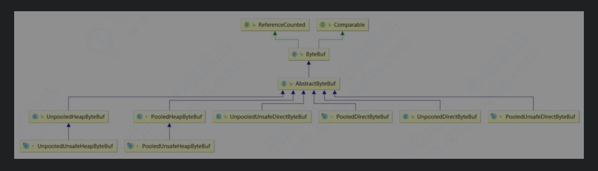

- 阻塞和非阻塞，应该描述的是一种状态，同步与异步描述的是行为方式.
- 阻塞和非阻塞说的是我能不能干不干别的活（阻塞不能干别的活，只能在那等待结果，非阻塞直接返回结果，结果可能是一个没准备好的说明，他可以去干别的事情）
- 同步是说我一定要拿到结果再向下走，异步是说不需要等拿到结果再向下走

- netty传输要使用ByteBuf（没有追加handler的情况下），nio要用ByteBuffer，不能直接写字符串
- netty默认的分隔符是系统分隔符
- netty本身支持java原生的序列化
- netty对niobug的处理：

  - 对Selector的select操作周期进行统计，每完成一次空的select操作进行一次计数，若在某个周期内连续发生N次空轮询，则触发了epoll死循环bug。
  - 重建Selector，判断是否是其他线程发起的重建请求，若不是则将原SocketChannel从旧的Selector上去除注册，重新注册到新的Selector上，并将原来的Selector关闭。

#### select,poll,epoll ####

- select：它仅仅知道了，有I/O事件发生了，却并不知道是哪那几个流（可能有一个，多个，甚至全部），我们只能无差别轮询所有流，找出能读出数据，或者写入数据的流，对他们进行操作。所以**select具有O(n)的无差别轮询复杂度**，同时处理的流越多，无差别轮询时间就越长。
- poll：本质上和select没有区别，它将用户传入的数组拷贝到内核空间，然后查询每个fd对应的设备状态， **但是它没有最大连接数的限制**，原因是它是基于链表来存储的.
- epoll可以理解为event poll，不同于忙轮询和无差别轮询，epoll会把哪个流发生了怎样的I/O事件通知我们。所以我们说epoll实际上是事件驱动（每个事件关联上fd）的，此时我们对这些流的操作都是有意义的。**（复杂度降低到了O(1)）**

- select有大小限制，用数组实现，poll没有大小限制，用链表实现，两者都是遍历以找出事件调用者

- epoll没有大小限制，用**回调的方式**直接找出事件的调用者

- 设想一下如下场景：有100万个客户端同时与一个服务器进程保持着TCP连接。而每一时刻，通常只有几百上千个TCP连接是活跃的(事实上大部分场景都是这种情况)。如何实现这样的高并发？

  在select/poll时代，服务器进程每次都把这100万个连接告诉操作系统(从用户态复制句柄数据结构到内核态)，让操作系统内核去查询这些套接字上是否有事件发生，轮询完后，再将句柄数据复制到用户态，让服务器应用程序轮询处理已发生的网络事件，这一过程资源消耗较大，因此，select/poll一般只能处理几千的并发连接。

  epoll的设计和实现与select完全不同。epoll通过在Linux内核中申请一个简易的文件系统(文件系统一般用什么数据结构实现？B+树)。把原先的select/poll调用分成了3个部分：

  1）调用epoll_create()建立一个epoll对象(在epoll文件系统中为这个句柄对象分配资源)

  2）调用epoll_ctl向epoll对象中添加这100万个连接的套接字

  3）调用epoll_wait收集发生的事件的连接

  如此一来，要实现上面说是的场景，只需要在进程启动时建立一个epoll对象，然后在需要的时候向这个epoll对象中添加或者删除连接。同时，epoll_wait的效率也非常高，因为调用epoll_wait时，并没有一股脑的向操作系统复制这100万个连接的句柄数据，内核也不需要去遍历全部的连接。

#### 三种Reactor模型 ####

#### 零拷贝 ####

- Netty接收和发送ByteBuffer采用DirectBuffer，使用堆外直接内存进行Socket读写，不需要进行字节缓冲区的二次拷贝。如果使用传统的堆存（Heap Buffer）进行Socket读写，那么JVM会将堆存拷贝一份到直接内存中，然后才写入Socket。相比于堆外直接内存，消息在发送过程中多了一次缓冲区的内存拷贝。

- Netty提供了组合Buffer对象，可以聚合多个ByteBuffer对象，用户可以像操作一个Buffer那样方便地对组合Buffer进行操作，避免了传统的通过内存拷贝的方式将几个小Buffer合并成一个大Buffer的烦琐操作。

- Netty文件传输采用了transferTo()方法，它可以直接将文件缓冲区的数据发送到目标Channel，避免了传统通过循环write()方式导致的内存拷贝问题。

  对于很多操作系统，它接收文件缓冲区的内容直接发送给目标Channel，而不需要从内核再拷贝到应用程序内存，这种更加高效的传输实现了文件传输的零

#### 高性能序列化 ####

Java自带序列化：使用非常简单，但在网络传输时很少使用，这主要是因为其性能太低，序列化后的码流太大。另外，它无法跨语言进行反序列化。

#### 内存池 ####

对于堆外直接内存的分配和回收，是一种耗时的操作。为了尽量重复利用缓冲区内存，Netty设计了一套基于内存池的缓冲区重用机制（这和JVM的垃圾回收机制非常类似）

#### 框架 ####

- channel：封装了socketchannel，自定义unsafe对象和pipeline对象扩展操作。

  unsafe实现具体的连接与读/写数据，如网络的读/写、链路关闭、发起连接等。命名为Unsafe表示不对外提供使用，并非不安全。

  Pipeline作为handler的容器

  每个Channel都会关联一个特定的EventLoop

- EventLoopGroup：封装工作单元eventloop，一个channel对应一个eventloop，eventloop又与selector相关

  我们可以简单地认为，一个NioEventLoop对象其实就是和一个特定的线程进行绑定，并且在NioEventLoop生命周期内，其绑定的线程都不会再改变。

- handler：Bootstrap的handler()方法接收一个ChannelHandler
  为了添加一个Handler到Pipeline中，必须把此Handler包装成ChannelHandlerContext

  ChannelHandlerContext允许ChannelHandler与其他的ChannelHandler进行交互。ChannelHandlerContext不会改变添加到其中的ChannelHandler，因此它是安全的。

  ChannelHandlerContext中有Inbound和Outbound两个boolean变量，分别用于标识Context所对应的Handler的类型。

  （1）Inbound为true时，表示其对应的ChannelHandler是ChannelInboundHandler的子类。

  （2）Outbound为true时，表示其对应的ChannelHandler是ChannelOutboundHandler的子类。

  Inbound类似于事件回调（响应请求的事件），而Outbound类似于主动触发（发起请求的事件）。注意，如果我们捕获了一个事件，并且想让这个事件继续传递下去，那么需要调用Context对应的传播方法fireXXX()方法。

  - Outbound事件都是请求事件（Request Event），即请求某件事情的发生，然后通过Outbound事件进行通知。Outbound事件的传播方向是从Tail到customContext再到Head。
  - Inbound事件是一个通知事件，即某件事已经发生了，然后通过Inbound事件进行通知。Inbound通常发生在Channel的状态改变或I/O事件就绪时。Inbound的特点是其传播方向从Head到customContext再到Tail。

  Head实现了ChannelInboundHandler接口，而Tail实现了ChannelOutboundHandler接口，因此可以说Head和Tail既是ChannelHandler，又是ChannelHandlerContext。
  
-  ChannelFuture，promise：Netty框架中所有的I/O操作都是异步的，因此需要ChannelFuture的addListener()注册一个ChannelFutureListener监听事件，当操作执行成功或者失败时，监听就会自动触发返回结果。

##### 启动过程 #####

###### Accept ######

Netty accept服务的启动主要分以下5步。

1. 创建两个线程组，并调用父类MultithreadEventExecutorGroup的构造方法实例化每个线程组的子线程数组，Boss线程组只设置一条线程，Worker线程组默认线程数为Netty Runtime.availableProcessors()*2。在NioEventLoop线程创建的同时多路复用器Selector被开启（每条NioEventLoop线程都会开启一个多路复用器）。
2. 在AbstractBootstrap的initAndRegister中，通过ReflectiveChannelFactory.newChannel()来反射创建NioServerSocketChannel对象。
3. 初始化NioServerSocketChannel、设置属性attr和参数option，并把Handler预添加到NioServerSocketChannel的Pipeline管道中。
4. 底层调用ServerSocketChannel的register()方法把Channel注册到Selector上，同时带上了附件，此附件为NioServerSocketChannel对象本身。
5. 执行NioServerSocketChannel的doBind()方法绑定端口；当绑定成功后，会触发active事件，为注册到Selector上的ServerSocket Channel加上监听OP_ACCEPT事件；

###### IO ######

#### bytebuf ####

ByteBuf有三个非常重要的指针，分别是readerIndex（记录读指针的开始位置）、writerIndex（记录写指针的开始位置）和capacity（缓冲区的总长度），三者的关系是readerIndex<=writerIndex<=capacity。

- 从0到readerIndex为discardablebytes，表示是无效的；

- 从readerIndex到writerIndex为readable bytes，表示可读数据区；从writerIndex到capacity为writable bytes，表示这段区间空闲，可以往里面写数据。

- 除了这三个指针，ByteBuf里面其实还有一个指针maxCapacity，它相当于ByteBuf扩容的最大阈值。maxCapacity指针可以看作是指向capactiy之后的这段区间，当Netty发现writable bytes写数据超出空间大小时，ByteBuf会提前自动扩容，扩容之后，就有了足够的空间来写数据，同时capactiy也会同步更新，maxCapacity就是扩容后capactiy的最大值。

AbstractByteBuf有众多子类，大致可以从三个维度来进行分类，分别如下。

- ● Pooled：池化内存，就是从预先分配好的内存空间中提取一段连续内存封装成一个ByteBuf，分给应用程序使用。
- ● Unsafe：是JDK底层的一个负责I/O操作的对象，可以直接获得对象的内存地址，基于内存地址进行读写操作。
- ● Direct：堆外内存，直接调用JDK的底层API进行物理内存分配，不在JVM的堆内存中，需要手动释放。

综上所述，其实ByteBuf共会有六种组合：Pooled（池化内存）和Unpooled（非池化内存）；Unsafe和非Unsafe；Heap（堆内内存）和Direct（堆外内存）。下图是ByteBuf最重要的继承关系类结构图，通过命名就能一目了然。

