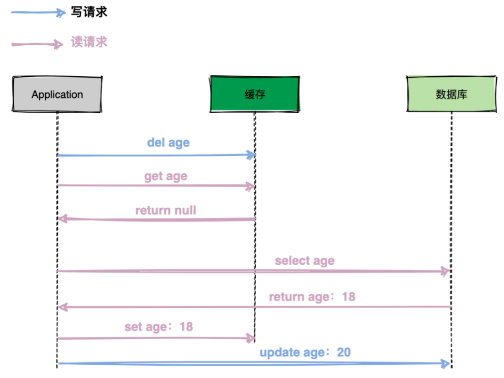
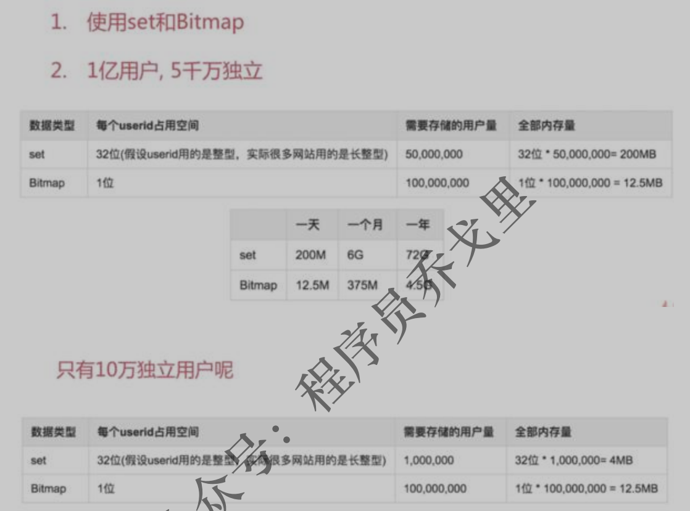

- 在redis中的命令语句中，命令是忽略大小写的，而key是不忽略大小写的。
- 单进程单线程，长命令会导致 Redis 阻塞 

###### 为什么是删除缓存 ######

正确方式：首先更新数据库，然后从缓存中删除该数据。

- 踩坑一：先更新数据库，再更新缓存

  如果同时有两个写请求需要更新数据，每个写请求都先更新数据库再更新缓存，在并发场景可能会出现数据不一致的情况。

  

- 踩坑二：先删缓存，再更新数据库

  在一个读请求和一个写请求并发场景下可能会出现数据不一致情况。

  

  如上图的执行过程：

  （1）写请求删除缓存数据；

  （2）读请求查询缓存未击中(Hit Miss)，紧接着查询数据库，将返回的数据回写到缓存中；

  （3）写请求更新数据库。

  整个流程下来发现数据库中age为20，缓存中age为18，缓存和数据库数据不一致，缓存出现了脏数据。

- 踩坑三：先更新数据库，再删除缓存

  

  如上图的执行过程：

  （1）读请求先查询缓存，缓存未击中，查询数据库返回数据；

  （2）写请求更新数据库，删除缓存；

  （3）读请求回写缓存；

  整个流程操作下来发现数据库age为20，缓存age为18，即数据库与缓存不一致，导致应用程序从缓存中读到的数据都为旧数据。

  但我们仔细想一下，上述问题发生的概率其实非常低，因为通常数据库更新操作比内存操作耗时多出几个数量级，上图中最后一步回写缓存（set age 18）速度非常快，通常会在更新数据库之前完成。

  如果这种极端场景出现了怎么办？我们得想一个兜底的办法：缓存数据设置过期时间。通常在系统中是可以允许少量的数据短时间不一致的场景出现。

###### 缓存同步机制 ######

- 缓存预加载模式 （Cache-Aside ）

  提前将数据从数据库加载到缓存，如果数据库有写更新，同步更新缓存。

- 缓存直读模式 （Read-Through ）

  应用程序只需要与`Cache Provider`交互，不用关心是从缓存取还是数据库。

  - 在 Cache-Aside 中，应用程序负责从数据源中获取数据并更新到缓存。
  - 在 Read-Through 中，此逻辑通常是由独立的缓存提供程序（Cache Provider）支持

- 缓存直写模式（Write-through）

  在数据更新时，同时写入缓存和数据库。这种模式是最稳妥的办法，但是性能会受到一定的影响。

- 缓存回写模式（Write-behind）

  在数据更新时只写入缓存。通常由一个后台队列检查缓存中数据的变化，再将据写到后端数据库。

###### 配置文件 ######


#### 数据类型 ####


##### String #####

应用：值的自增用来生成id

###### 命令 ######

- setnx：仅当不存在时赋值
- APPEND key value
- STRLEN key
- MSET key value，key value，key value，
- decr，incr
  - 当value为整数数据时，才能使用decr，incr操作数值的增减。
  - 数值递增都是原子操作

##### Hash #####


hash架构就是标准的hashtab的结构，通过挂链解决冲突问题。

应用：存储一个对象（拥有内部属性）

###### 命令 ######

- HGETALL key
- HDEL key field，field，field，
- HKEYS key
- HVALS key

##### List #####

底层是双向链表

应用：按照时间顺序查看的一些信息

###### 命令 ######

- LRANGE key start stop：查看列表元素

##### Set #####

Redis 的 Set 是 **String 类型的无序集合**。集合成员是唯一的，这就意味着集合中不能出现 重复的数据。 Redis 中集合是通过哈希表实现的，所以添加，删除，查找的复杂度都是 O(1)。

###### 命令 ######

- SADD key member，member，member，
- SREM key member，member，member，

##### Sorted set #####

Redis 有序集合和集合一样也是 string 类型元素的集合,且不允许重复的成员。不同的是每个元素都会关联一个 double 类型的分数。redis 正是通过分数来为集合中的成员进行从小到大 的排序。有序集合的成员是唯一的,但分数(score)却可以重复

应用：销量排行，热度

##### 高级数据结构 #####

###### BitMap ######

（String 的一些其他命令）：拥有各种位操作命令）

- setbit key offset value ：给位图指定索引设置值
- getbit key offset ：获取位图指定索引的值

应用：独立用户统计，使用位图去记录用户 uid，但重复用户数量较多应使用set



###### **GEO**  ######

地理位置信息

#### 事务 ####

- Redis的事务是通过MULTI，EXEC，DISCARD和WATCH这四个命令来完成的。
- Redis的单个命令都是原子性的，所以这里确保事务性的对象是命令集合。
- Redis不支持回滚操作
- 事务失败处理
  - 语法错误，全部撤销
  - 类型错误，部分执行（没出错的部分执行）

##### multi #####

用于标记事务块的开始。

Redis会将后续的命令逐个**放入队列**中，然后使用EXEC命令原子化地执行这个命令序列。

##### discard #####

清除所有先前在一个事务中放入队列的命令，然后恢复正常的连接状态。

##### watch #####

在事务开启前 watch 了某个 key，在事务提交时会检查 key 的值与 watch 的时候其值是否发生变化，如果发生变化，那么事务的命令队列不会被执行。 

使用该命令可以实现redis的乐观锁。

##### unwatch #####

清除所有先前为一个事务监控的键。

##### 锁 #####

- 互斥性：在任意时刻，只有一个客户端能持有锁
- 同一性：加锁和解锁必须是同一个客户端，客户端自己不能把别人加的锁给解了。
- 可重入性：即使有一个客户端在持有锁的期间崩溃而没有主动解锁，也能保证后续其他客户端能加锁。

###### 获取锁 ######

- 使用set命令

  

  ```java
  	 * 使用redis的set命令实现获取分布式锁
  	 * @param lockKey   	就是key，使用key来当锁
  	 * @param requestId		请求ID，保证同一性
  	 * @param expireTime	过期时间，避免死锁
  	 * @return
  	 */
  	public static boolean getLock(String lockKey,String requestId,int expireTime) {
  		//NX:保证互斥性
  		String result = jedis.set(lockKey, requestId, "NX", "EX", expireTime);
  		if("OK".equals(result)) {
  			return true;
  		}
  		return false;
  	}
  ```

- 使用setnx命令，操作不具有原子性

  ```java
  public static boolean getLock(String lockKey,String requestId,int expireTime) {
  		Long result = jedis.setnx(lockKey, requestId);
  		if(result == 1) {
  			jedis.expire(lockKey, expireTime);
  			return true;
  		}
  		return false;
  	}
  ```

###### 释放锁 ######

- del命令实现，不是原子操作

  ```java
  
  /**
  	 * 释放分布式锁
  	 * @param lockKey
  	 * @param requestId
  	 */
  	public static void releaseLock(String lockKey,String requestId) {
  	    if (requestId.equals(jedis.get(lockKey))) {
  	        jedis.del(lockKey);
  	    }
  	}
  ```

- redis+lua脚本实现

  ```java
  	public static boolean releaseLock(String lockKey, String requestId) {
  		String script = "if redis.call('get', KEYS[1]) == ARGV[1] then return redis.call('del', KEYS[1]) else return 0 end";
  		Object result = jedis.eval(script, Collections.singletonList(lockKey), Collections.singletonList(requestId));
  
  		if (result.equals(1L)) {
  			return true;
  		}
  		return false;
  	}
  ```

#### 持久化 ####

##### RDB(默认) #####

RDB方式是通过快照（snapshotting）完成的，当符合一定条件时Redis会自动将内存中的数据进行快照并持久化到硬盘。

Redis会在指定的情况下触发快照

- 符合自定义配置的快照规则

  在redis.conf中设置自定义快照规则
  格式：save <seconds> <changes>

  seconds是多少秒内，changes是多少键被更改

  可以配置多个条件（每行配置一个条件），每个条件之间是“或”的关系。

- 执行save或者bgsave命令

- 执行flushall命令

- 执行主从复制操作

###### 原理 ######

1. redis使用fork函数复制一份当前进程的副本(子进程)
2. 父进程继续接收并处理客户端发来的命令，而子进程开始将内存中的数据写入硬盘中的临时文件。
3. 当子进程写入完所有数据后会用该临时文件替换旧的RDB文件，至此，一次快照操作完成。 

redis在进行快照的过程中不会修改RDB文件，只有快照结束后才会将旧的文件替换成新的，也就是说任何时候RDB文件都是完整的。 

###### 优缺点 ######

- 缺点：使用RDB方式实现持久化，一旦Redis异常退出，就会丢失最后一次快照以后更改的所有数据。

  复制的是数据，比较耗时

- 优点：RDB可以最大化Redis的性能：父进程在保存RDB文件时唯一要做的就是fork出一个子进程，然后这个子进程就会处理接下来的所有保存工作，父进程无序执行任何磁盘I/O操作。同时这个也是一个缺点，如果数据集比较大的时候，fork可以能比较耗时，造成服务器在一段时间内停止处理客户端的请求；

##### AOF #####

开启AOF持久化后每执行一条会更改Redis中的数据的命令，Redis就会将该命令写入硬盘中的AOF文件，但是实际上由于操作系统的缓存机制，数据并没有实时写入到硬盘，而是进入硬盘缓存。再通过硬盘缓存机制去刷新到保存到文件。这一过程显然会降低Redis的性能，但大部分情况下这个影响是能够接受的，另外使用较快的硬盘可以提高AOF的性能。

```
* appendfsync always  每次执行写入都会进行同步  ， 这个是最安全但是是效率比较低的方式
* appendfsync everysec   每一秒执行
* appendfsync no  不主动进行同步操作，由操作系统去执行，这个是最快但是最不安全的方式
```

###### aop重写 ######

Redis 可以在 AOF 文件体积变得过大时，自动地在后台对 AOF 进行重写重写后的新 AOF 文件包含了恢复当前数据集所需的最小命令集合。 

整个重写操作是绝对安全的，因为 Redis 在创建新 AOF 文件的过程中，会继续将命令追加到现有的 AOF 文件里面，即使重写过程中发生停机，现有的 AOF 文件也不会丢失。 而一旦新 AOF 文件创建完毕，Redis 就会从旧 AOF 文件切换到新 AOF 文件，并开始对新 AOF 文件进行追加操作。

AOF 文件有序地保存了对数据库执行的所有写入操作， 这些写入操作以 Redis 协议的格式保存， 因此 AOF 文件的内容非常容易被人读懂， 对文件进行分析（parse）也很轻松

###### AOF文件损坏 ######

服务器可能在程序正在对 AOF 文件进行写入时停机， 如果停机造成了 AOF 文件出错（corrupt）， 那么 Redis 在重启时会拒绝载入这个 AOF 文件， 从而确保数据的一致性不会被破坏。

当发生这种情况时， 可以用以下方法来修复出错的 AOF 文件：

1.为现有的 AOF 文件创建一个备份。

2.使用 Redis 附带的 redis-check-aof 程序，对原来的 AOF 文件进行修复。

redis-check-aof --fix readonly.aof

3.重启 Redis 服务器，等待服务器载入修复后的 AOF 文件，并进行数据恢复。

##### 对比 #####

RDB 恢复数据集的速度也要比 AOF 恢复的速度要快 ，但AOF存储比较快

如果同时使用的话， 那么Redis重启时，会优先使用AOF文件来还原数据

#### 主从复制 ####

- 一个主redis，可以有多个从redis。

- slave 是不能写的，是只读的；只有 master 可以写。

- Redis 不支持主主复制。

- 主从复制不会阻塞master，在同步数据时，master 可以继续处理client 请求

- 如果有多个 slave 节点并发发送 SYNC 命令给 master，企图建立主从关系，只要第二个 slave 的 SYNC 命令发生在 master 完成 BGSAVE 之前，第二个 slave 将受到和第一个 slave 相同的快照和后续 backlog；否则，第二个 slave 的 SYNC 将触发 master 的第二次 BGSAVE。

- 一个redis可以即是主又是从，如下图：

  

##### 文件配置 #####

- 主redis配置，无需特殊配置。

- 从redis配置：改从服务器上的redis.conf文件

  ```
  # slaveof <masterip> <masterport>
  slaveof 192.168.101.3 6379
  ```

##### 原理 #####

* Redis的主从同步，分为全量同步和增量同步。
* 只有从机第一次连接上主机是全量同步
* 断线重连有可能触发全量同步也有可能是增量同步（master判断runid是否一致）
* 除此之外的情况都是增量同步


##### 全量同步 #####

- 同步快照阶段：Master创建并发送快照给Slave（master 开启一个后台进程，将数据库快照保存到文件中（bgsave），同时 master 主进程会开始收集新的写命令并缓存到 backlog 队列），Slave载入并解析快照。
- 同步写缓冲阶段：Master向Slave同步存储在缓冲区的写操作命令。
- 同步增量阶段：Master向Slave同步写操作命令。

##### 增量同步 #####

通常情况下，Master每执行一个写命令就会向Slave发送相同的写命令，然后Slave接收并执行。

#### 哨兵机制(sentinel) ####

Redis主从复制的缺点：没有办法对master进行动态选举，需要使用Sentinel机制完成动态选举

Sentinel(哨兵)进程是用于监控redis集群中Master主服务器工作的状态。在Master主服务器发生故障的时候，可以实现Master和Slave服务器的切换，保证系统的高可用（HA）。已经被集成在redis2.6+的版本中，Redis的哨兵模式到了2.8版本之后就稳定了下来。

##### 作用 #####

- 监控(Monitoring): 哨兵(sentinel) 会不断地检查你的Master和Slave是否运作正常。
- 提醒(Notification)： 当被监控的某个Redis节点出现问题时, 哨兵(sentinel) 可以通过 API 向管理员或者其他应用程序发送通知。
- 自动故障迁移(Automatic failover)：当一个Master不能正常工作时，哨兵(sentinel) 会开始一次自动故障迁移操作。
  - 它会将失效Master的其中一个Slave升级为新的Master, 并让失效Master的其他Slave改为复制新的Master；
  - 当客户端试图连接失效的Master时，集群也会向客户端返回新Master的地址，使得集群可以使用现在的Master替换失效Master。
  - Master和Slave服务器切换后，Master的redis.conf、Slave的redis.conf和sentinel.conf的配置文件的内容都会发生相应的改变，即，Master主服务器的redis.conf配置文件中会多一行slaveof的配置，sentinel.conf的监控目标会随之调换。

##### 工作方式 #####

自动发现

1. sentinel 集群通过给定的配置文件发现 master，启动时会监控 master。通过向 master 发 送 info 信息获得该服务器下面的所有从服务器。 
2. sentinel 集群通过命令连接向被监视的主从服务器发送 hello 信息(每秒一次)，该信息包括 sentinel 本身的 ip、端口、id 等内容，以此来向其他 sentinel 宣告自己的存在。 
3. sentinel 集群通过订阅连接接收其他 sentinel 发送的 hello 信息，以此来发现监视同一个主服务器的其他 sentinel；集群之间会互相创建命令连接用于通信，因为已经有主从服务器作为发送和接收 hello 信息的中介，sentinel 之间不会创建订阅连接

1.每个Sentinel（哨兵）进程以每秒钟一次的频率向整个集群中的Master主服务器，Slave从服务器以及其他Sentinel（哨兵）进程发送一个 PING 命令。

2.如果一个实例（instance）距离最后一次有效回复 PING 命令的时间超过 down-after-milliseconds 选项所指定的值， 则这个实例会被 Sentinel（哨兵）进程标记为主观下线（SDOWN）。

3.如果一个Master主服务器被标记为主观下线（SDOWN），则正在监视这个Master主服务器的所有 Sentinel（哨兵）进程要以每秒一次的频率确认Master主服务器的确进入了主观下线状态。

4.当有足够数量的 Sentinel（哨兵）进程（大于等于配置文件指定的值）在指定的时间范围内确认Master主服务器进入了主观下线状态（SDOWN）， 则Master主服务器会被标记为客观下线（ODOWN）。

- 在一般情况下， 每个 Sentinel（哨兵）进程会以每 10 秒一次的频率向集群中的所有Master主服务器、Slave从服务器发送 INFO 命令。
- 若没有足够数量的 Sentinel（哨兵）进程同意 Master主服务器下线， Master主服务器的客观下线状态就会被移除。若 Master主服务器重新向 Sentinel（哨兵）进程发送 PING 命令返回有效回复，Master主服务器的主观下线状态就会被移除。

#### Cluster集群 ####

redis3.0以后推出的redis cluster 集群方案，redis cluster集群保证了高可用、高性能、高可扩展性。

客户端与redis节点直连,不需要中间proxy层.客户端不需要连接集群所有节点,连接集群中任何一个可用节点即可，节点会自动重定向不在此节点操作


##### 数据分片 #####

###### 哈希槽 ######

Redis 集群中内置了 16384 个哈希槽，当需要在 Redis 集群中放置一个 key-value 时，redis 先对 key 使用 crc16 算法算出一个结果，然后把结果对 16384 求余数，这样每个 key 都会对应一个编号在 0-16383 之间的哈希槽，redis 会根据节点数量大致均等的将哈希槽映射到不同的节点。然后经过 gossip 协议，周期性的和集群中的其他节点交换信息，最终整个集群都会知道 key 在哪一个槽上。

Master 节点维护着一个 16384/8 字节的位序列，Master 节点用 bit 来标识对于某个 槽自己是否拥有。

###### 范围映射 ######

范围映射通常选择 key 本身而非 key 的函数计算值来作为数据分布的条件，且每个数据节点存放的 key 的值域是连续的一段范围。

key 的值域是业务层决定的，业务层需要清楚每个区间的范围和 Redis 实例数量，才能完整地描述数据分布。这使业务层的 key 值域与系统层的实例数量耦合，数据分片无法在纯系统 层实现。

###### 一致性 hash ######

这种方式的优势是节点新增或退出时，涉及的数据迁移量小——变更的节点上涉及的数据只需和相邻节点发生迁移关系。

##### 数据迁移 #####

###### pre-sharing ######

由于一个 Redis 实例的资源消耗非常小，所以一开始就可以部署比较多的 Redis 实例，比如 128 个实例 

在前期业务量比较低的时候，N 可以比较少，M 比较多，而且主机的配置（CPU+内存）可以较低 

在后期业务量较大的时候，N 可以较多，M 变小 

总之，通过这种方法，在容量增长过程可以始终保持 Redis 实例数(T)不变，所以避免了重新 Sharding 的问题 

实际就是在同一台机器上部署多个 Redis 实例的方式，当容量不够时将多个实例拆分到不同 的机器上，这样实际就达到了扩容的效果。Pre-Sharding 方法是将每一个台物理机上，运行多个不同端口的 Redis 实例，假如有三个物理机，每个物理机运行三个 Redis 实例，那么我们的分片列表中实际有 9 个 Redis 实例，当我们需要扩容时，增加一台物理机来代替 9 个中的一个 redis，有人说，这样不还是 9 个么，是的，但是以前服务器上面有三个 redis，压力很大的，这样做，相当于单独分离出来并且将数据一起 copy 给新的服务器。值得注意的是， 还需要修改客户端被代替的 redis 的 IP 和端口为现在新的服务器，只要顺序不变，不会影响一致性哈希分片。

##### gossip协议 #####

Gossip 协议由 MEET、PING、PONG 三种消息实现，这三种消息的正文都由两个clusterMsgDataGossip 结构组成。

共享以下关键信息：

1）数据分片和节点的对应关系 

2）集群中每个节点可用状态 

3）集群结构发生变更时，通过一定的协议对配置信息达成一致。数据分片的迁移、故障发 生时的主备切换决策、单点 master 的发现和其发生主备关系的变更等场景均会导致集群结 构变化。 

4）pub/sub 功能在 cluster 的内部实现所需要交互的信息

##### 主从选举 #####

- Redis Cluster 重用了 Sentinel 的代码逻辑，不需要单独启动一个 Sentinel 集群，Redis Cluster 本身就能自动进行 Master 选举和 Failover 切换
- 集群中的每个节点都会定期地向集群中的其他节点发送 PING 消息，以此交换各个节点状态信息，检测各个节点状态：在线状态、疑似下线状态 PFAIL、已下线状态 FAIL。 
- 选新的master的过程基于 Raft 协议选举方式来实现的。

##### 集群不可用 #####

- 如果集群任意master挂掉,且当前master没有slave，则集群进入fail状态。也可以理解成集群的[0-16383]slot**映射不完全**时进入fail状态。
- 如果集群超过半数以上master挂掉，无论是否有slave，集群进入fail状态。

##### 功能限制 #####

Redis 集群相对单机在功能上有一定限制。 

1. key 批量操作支持有限。如：MSET``MGET，目前只支持具有相同 slot 值的 key 执行批 量操作。 
2. key 事务操作支持有限。支持多 key 在同一节点上的事务操作，不支持分布在多个节点 的事务功能
3. key 作为数据分区的最小粒度，因此不能将一个大的键值对象映射到不同的节点。如： hash、list。 
4. 不支持多数据库空间。单机下 Redis 支持 16 个数据库，集群模式下只能使用一个数据 库空间，即 db 0。 
5.  复制结构只支持一层，不支持嵌套树状复制结构。

#### 过期策略 ####

##### 定期删除 #####

在设置 key 的过期时间的同时，为该 key 创建一个定时器，让定时器在 key 的过期时 间来临时，对 key 进行删除

- 优点：保证内存被尽快释放 

- 缺点： 若过期 key 很多，删除这些 key 会占用很多的 CPU 时间

  若为每一个设置过期时间的 key 创建一个定时器（将会有大量的定时器 产生），性能影响严重

##### 惰性删除 #####

key 过期的时候不删除，每次从数据库获取 key 的时候去检查是否过期，若过期，则删除，返回 null。 

- 优点：删除操作只发生在从数据库取出 key 的时候发生，而且只删除当前 key，所以对 CPU 时间的占用是比较少的，而且此时的删除是已经到了非做不可的地步（如果此时还不删除的 话，我们就会获取到了已经过期的 key 了） 
- 缺点：若大量的 key 在超出超时时间后，很久一段时间内，都没有被获取过，那么可能发生内存泄露（无用的垃圾占用了大量的内存）

##### 定期删除 #####

通过限制删除操作的时长和频率，来减少删除操作对 CPU 时间的占用

#### 缓存淘汰策略 ####

- 在 redis 中，允许用户设置最大使用内存大小maxmemory，默认为0，没有指定最大缓存，如果有新的数据添加，超过最大内存，则会使redis崩溃，所以一定要设置。
- redis 内存数据集大小上升到一定大小的时候，就会实行数据淘汰策略。
- redis淘汰策略配置maxmemory-policy voltile-lru，支持热配置

##### 淘汰策略 #####

1.volatile-ttl：从已设置过期时间的数据集（server.db[i].expires）中挑选将要过期的数据淘汰

2.voltile-lru：从已设置过期时间的数据集（server.db[i].expires）中挑选最近最少使用的数据淘汰

3.volatile-random：从已设置过期时间的数据集（server.db[i].expires）中任意选择数据淘汰

4.allkeys-lru：从数据集（server.db[i].dict）中挑选最近最少使用的数据淘汰

5.allkeys-random：从数据集（server.db[i].dict）中任意选择数据淘汰

6.no-enviction（驱逐）：当内存不足以容纳新写入数据时，新写入操作会报错。

#### 与 DB 保持一致 ####

1、订阅数据库的 binlog，比如阿里的 canal 

2、更新数据库后，异步更新缓存 

3、时间敏感数据可以设置很短的过期时间

#### 突发情况 ####

缓存系统，都是按照key去缓存查询，如果不存在对应的value，就应该去数据库查找

##### 缓存穿透 #####

造成缓存穿透的主要原因就是：查询某个Key对应的数据，Redis缓存中没有相应的数据，则直接到数据库中查询。数据库中也不存在要查询的数据，则数据库会返回空，而Redis也不会缓存这个空结果。这就造成每次通过这样的Key去查询数据都会直接到数据库中查询，Redis不会缓存空结果。这就造成了缓存穿透的问题。

###### 解决 ######

- 把空对象缓存起来。当第一次从数据库中查询出来的结果为空时，我们就将这个空对象加载到缓存，并设置合理的过期时间，或者该key对应的数据insert了之后清理缓存。

- 布隆表达式：类似一个hashset，用来判断某个元素（key）是否在某个集合中。

  算法：
  1. 首先需要k个hash函数，每个函数可以把key散列成为1个整数
  2. 初始化时，需要一个长度为n比特的数组，每个比特位初始化为0
  3. 某个key加入集合时，用k个hash函数计算出k个散列值，并把数组中对应的比特位置为1
  4. 判断某个key是否在集合时，用k个hash函数计算出k个散列值，并查询数组中对应的比特位，如果所有的比特位都是1，认为在集合中。

  缺点：

  - 算法判断key在集合中时，有一定的概率key其实不在集合中
  - 无法删除

##### 缓存雪崩 #####

缓存服务器重启或者大量缓存集中在某一个时间段失效，这样在失效的时候，也会给后端系统(比如DB)带来很大压力。

###### 解决 ######

- 不同的key，设置不同的过期时间，让缓存失效的时间点尽量均匀
- 保证Redis的高可用，将Redis缓存部署成高可用集群（必要时候做成异地多活），可以有效的防止缓存雪崩问题的发生。
- 在缓存失效后，通过加锁或者使用队列来控制读数据库写缓存的线程数量。具体点就是设置某些Key只允许一个线程查询数据和写缓存，其他线程等待。则能够有效的缓解大并发流量对数据库打来的巨大冲击。

##### 缓存击穿 #####

对于一些设置了过期时间的key，如果这些key可能会在某些时间点被超高并发地访问，恰好在这个时间点缓存过期，这些请求发现缓存过期一般都会从后端DB加载数据并回设到缓存，这个时候大并发的请求可能会瞬间把后端DB压垮。

这个和缓存雪崩的区别在于这里针对某一key缓存，前者则是很多key。

###### 解决 ######

- 对于比较热点的数据，我们可以在缓存中设置这些数据永不过期；
- 也可以在访问数据的时候，在缓存中更新这些数据的过期时间；
- 使用分布式锁，保证对于每个Key同时只有一个线程去查询后端的服务，某个线程在查询后端服务的同时，其他线程没有获得分布式锁的权限，需要进行等待。不过在高并发场景下，这种解决方案对于分布式锁的访问压力比较大。

#### 消息队列 ####

publish [channel] message 

subscribe [channel] 一个或者多个 

unsubscribe [channel] 一个或者多个

