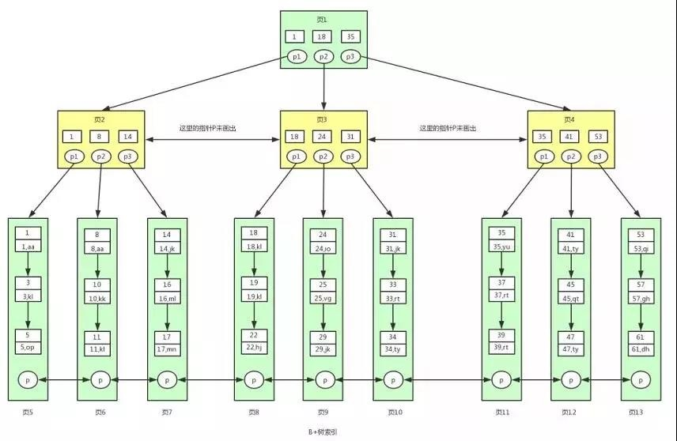

- 分库

  一个库里面的表拆分存储到多个库上，通常是将表按照功能模块、关系密切程度划分出来，部署到不同库上。

- 分表
  - 水平拆分（横向拆分）：就是把一个表的数据给弄到多个库的多个表里去，**每个库的表结构都一样**。

    水平拆分的意义，就是将数据均匀放更多的库里，然后用多个库来扛更高的并发，还有就是用多个库的存储容量来进行扩容。

  - 垂直拆分：是**把一个有很多字段的表给拆分成多个表**，**或者是多个库上去**。每个库表的结构都不一样，每个库表都包含部分字段。一般来说，会**将较少的访问频率很高的字段放到一个表里去**，然后**将较多的访问频率很低的字段放到另外一个表里去**。因为数据库是有缓存的，你访问频率高的行字段越少，就可以在缓存里缓存更多的行，性能就越好。这个一般在表层面做的较多一些。

- 一种是按照 range 来分，就是每个库一段连续的数据，这个一般是按比如**时间范围**来的，但是这种一般较少用，因为很容易产生热点问题，大量的流量都打在最新的数据上了。

- 是按照某个字段 hash 一下均匀分散，这个较为常用。

  - range 来分，好处在于说，扩容的时候很简单，因为你只要预备好，给每个月都准备一个库就可以了，到了一个新的月份的时候，自然而然，就会写新的库了；缺点，但是大部分的请求，都是访问最新的数据。实际生产用 range，要看场景。

    hash 分发，好处在于说，可以平均分配每个库的数据量和请求压力；坏处在于说扩容起来比较麻烦，会有一个数据迁移的过程，之前的数据需要重新计算 hash 值重新分配到不同的库或表。

- 索引为什么不是越多越好：
  - 更新数据需要更新索引，会有额外的操作时间
  - 需要更多的空间，
  - 不经常引用的列不要建立索引，因为不常用，即使建立了索引也没有多大意义。对经常用于查询的字段应该创建索引。
  - 数据重复且分布平均的字段，因此他建立索引就没有太大的效果（例如性别字段，是否上架等等，不适合建立索引）
  
- 为什么 redo log 具有 crash-safe 的能力，而 binlog 没有？

  然 binlog 拥有全量的日志，但没有一个标志让 innoDB 判断哪些数据已经刷盘，哪些数据还没有。

###### 创建索引

CREATE <索引名> ON <表名> (<列名> [<长度>] [ ASC | DESC])

语法说明如下：

- `<索引名>`：指定索引名。一个表可以创建多个索引，但每个索引在该表中的名称是唯一的。
- `<表名>`：指定要创建索引的表名。
- `<列名>`：指定要创建索引的列名。通常可以考虑将查询语句中在 JOIN 子句和 WHERE 子句里经常出现的列作为索引列。
- `<长度>`：可选项。指定使用列前的 length 个字符来创建索引。使用列的一部分创建索引有利于减小索引文件的大小，节省索引列所占的空间。在某些情况下，只能对列的前缀进行索引。索引列的长度有一个最大上限 255 个字节（MyISAM 和 InnoDB 表的最大上限为 1000 个字节），如果索引列的长度超过了这个上限，就只能用列的前缀进行索引。另外，BLOB 或 TEXT 类型的列也必须使用前缀索引。
- `ASC|DESC`：可选项。`ASC`指定索引按照升序来排列，`DESC`指定索引按照降序来排列，默认为`ASC`。

###### 索引设计原则 ######

- 为常作为查询条件的字段建立索引

- 为经常需要排序、分组，范围查找的字段建立索引

  经常需要 ORDER BY、GROUP BY、DISTINCT 和 UNION 等操作的字段，排序操作会浪费很多时间。如果为其建立索引，可以有效地避免排序操作。

- 使用区分度高的列建立索引（唯一性索引）。更新十分频繁、数据区分度不高的列不宜建立索引

- 尽量使用数据量少的索引

  如果索引的值很长，那么查询的速度会受到影响。例如，对一个 CHAR(100) 类型的字段进行全文检索需要的时间肯定要比对 CHAR(10) 类型的字段需要的时间要多。

- 联合索引最左前缀原则

  如果在(a,b,c)三个字段上建立联合索引，那么他会自动建立 a| (a,b) | (a,b,c)组索引。

  1. 建立联合索引的时候，区分度最高的字段在最左边
  2. 存在非等号和等号混合判断条件时，在建立索引时，把等号条件的列前置。如 where a>? and b=?，那么即使a 的区分度更高，也必须把 b 放在索引的最前列。
  3. 最左前缀查询时，并不是指SQL语句的where顺序要和联合索引一致。

- 索引失效

  - 不能使用索引中范围条件右边的列(范围列可以用到索引)，范围列之后列的索引全失效

    范围条件有：<、<=、>、>=、between，like等。

  - like语句的前导模糊查询不能使用索引

    ```sql
    select * from doc where title like '%XX'；   --不能使用索引 
    select * from doc where title like 'XX%'；   --非前导模糊查询，可以使用索引 
    ```

  - 不要在索引列上面做任何操作(计算、函数)，否则会导致索引失效而转向全表扫描

  - 索引不会包含有NULL值的列

  - is null, is not null无法使用索引

  - 负向条件查询不能使用索引：负向条件有：!=、<>、not in、not exists、not like 等。

##### 慢查优化 #####

- LIMIT 3，5：从第三个开始取，取5个

  分页limit优化：核心思想就是获取offset的id

  先获取到offset的id后，再直接使用limit size来获取数据（id列要建立索引，一般使用主键覆盖索引，id的增长应与分页数对应）

  ```
  select * from tb_a limit 1000000, 100;
  select * from tb_a where id >= (select id from tb_a Order By id limit 100000, 1) limit 100;
  ```

- 重复查询相同的数据：使用缓存

- 分解关联查询，对每一个表进行一次单表查询（很大概率上可以利用上缓存）

- 增加中间表

  ​    对于需要经常联合查询的表，可以建立中间表以提高查询效率。通过建立中间表，把需要经常联合查询的数据插入到中间表中，然后将原来的联合查询改为对中间表的查询，以此来提高查询效率。

- 将字段很多的表分解成多个表 

  ​    对于字段比较多的表，如果有些字段的使用频率很低，可以将这些字段分离出来形成新表。因为当一个表的数据量很大时，会由于使用频率低的字段的存在而变慢。

##### 慢查询日志 #####

- SET GLOBAL slow_query_log =ON

- SET GLOBAL long_query_time=n;

  “n”参数是设定的时间值，该值的单位是秒。如果不设置 long_query_time 选项，默认时间为 10 秒。

- SHOW VARIABLES LIKE 'slow_query_log';  ：慢查询开启状态
- SHOW VARIABLES LIKE 'long_query_time'; ：查询超过多少秒才记录

##### 数据库索引 #####

索引是对数据库表中一列或多列的值进行排序的一种结构

###### B树和B+树 ######

- B树（又称B-树）

  

- B+树

  

B树与B+树的区别

- B+树非叶子节点上是不存储数据的，仅存储键值（那么 B+内部结点相对 B 树更小，如果把 所有同一内部结点的关键字存放在同一盘块中，那么盘块所能容纳的关键字数量也越多），而B树非叶子节点中不仅存储键值，也会存储数据。

- 并且B+树叶子节点的数据是数据库中的全部数据，通过链表顺序连接，这就使得B+ 树使得**范围查找，排序查找，分组查找以及去重查找**变得异常简单。而 B 树因为数据分散在各个节点，要实现这一点是很不容易的。

- B+树：所有关键字的查找速度基本一致 

  B 树：依赖于查找关键字所在结点的层次

###### Hash和 B*树 ######

Hash与B+树的区别

- Hash索引不支持顺序和范围查询（索引经过hash之后无序化）
- Hash索引只包含哈希值和行指针，而不存储字段值，所以不能使用索引中的值来避免读（无法使用覆盖索引）
- Hash索引不支持部分索引列匹配查找。比如建立复合哈希索引(A,B)，无法仅使用 A 使用Hash索引去查询取行
- B+树索引的关键字检索效率比较平均，在有大量重复键值情况下，哈希索引的效率是极低的，因为存在所谓的哈希碰撞问题

B*与 B+树的区别： 

- 定义了非叶子结点键值个数至少为(2/3)*m，即块的最低使用率为 2/3 （代替 B+树的 1/2）； 
- 为非叶结点也增加链表指针 
- B*树分配新结点的概率比B+树要低，空间使用率更高
  - `B+树的分裂：当一个结点满时，分配一个新的结点，并将原结点中1/2的数据复制到新结点，最后在父结点中增加新结点的指针；B+树的分裂只影响原结点和父结点，而不会影响兄弟结点，所以它不需要指向兄弟的指针；`
  - `B*树的分裂：当一个结点满时，如果它的下一个兄弟结点未满，那么将一部分数据移到兄弟结点中，再在原结点插入关键字，最后修改父结点中兄弟结点的关键字（因为兄弟结点的关键字范围改变了）；如果兄弟也满了，则在原结点与兄弟结点之间增加新结点，并各复制1/3的数据到新结点，最后在父结点增加新结点的指针；所以，B*树分配新结点的概率比B+树要低，空间使用率更高；`

###### 聚簇索引和非聚簇索引 ######

聚簇索引：主键索引和数据放在一起

非聚簇索引：只保存索引的键值与主键值（主键值用于定位行数据）

- 每张表都有且只有一个聚簇索引（主键只有一个）。聚簇索引又称为**一级索引**，聚簇索引以外的所有索引都称为二级索引
- 聚簇索引一般是主键；没有主键，就是第一个唯一键；没有唯一键，就是隐藏 ID。 

聚簇索引的优点： 

- 可以将相关数据保存在一个磁盘块中，只需一次 IO 就可以取出相邻的数据 
- 数据访问更快，因为索引和数据保存在同一个 B+树中 
- 使用覆盖索引扫描的查询可以直接使用叶节点中的主键值

缺点：

- 插入速度严重依赖于插入顺序。按照主键的顺序插入是加载数据到 InnoDB 表中速度最快的方式。
- 更新聚簇索引列的代价很高，因为会将每个被更新的行移动到新的位置 
- 插入新行或者更新主键导致需要移动行的时候，可能面临页分裂的问题。当行的主键值要求必须将这一行插入到某个已满的页中时，存储引擎会将该页分裂成两个页面来容纳该行， 这就是一次页分裂操作。页分裂会导致表占用更多的磁盘空间，可能导致全表扫描变慢，尤其是行比较稀疏，或者由于页分裂导致数据存储不连续的时候

非聚簇索引的优缺点

- 二级索引（非聚簇索引）占用的额外空间更大， 因为在二级索引的叶子节点包含了引用行的主键值。但这样的策略减少了当出现行移动或者页分裂时二级索引的维护工作。

- 二级索引访问需要两次 B 树索引查找。因为二级索引中叶子节点保存的是行的主键值，要找到数据行，还需要拿主键值到聚簇索引中进行一次查找。

##### 视图 #####

###### 为什么使用视图  ######

- 重用 sql 语句 
- 使用表的组成部分而不是整个表。 
- 保护数据。可以给用户授予表的特定部分的访问权限而不是整个表的访问权限。 
- 更改数据格式和表示。视图可返回与底层表的表示和格式不同的数据。

###### 视图的规则和限制  ######

- 与表一样，视图必须唯一命名，视图还可以和表一起使用； 
- 视图可以嵌套，可以利用从其他视图中检索数据的查询来构造一个视图。 
- Order by 可以在视图中使用，但如果从该视图检索数据 select 中也是含有 order by， 那么该视图的 order by 将被覆盖。 
- 视图不能索引，也不能有关联的触发器或默认值 

##### 约束 #####

概念： 对表中的数据进行限定，保证数据的正确性、有效性和完整性。	

分类：

1. 主键约束：primary key
2. 非空约束：not null
3. 唯一约束：unique
4. 外键约束：foreign key

###### 非空约束：not null，值不能为null ######

```mysql
1. 创建表时添加约束
   CREATE TABLE stu(
   	id INT,
   	NAME VARCHAR(20) NOT NULL -- name为非空
   );
2. 创建表完后，添加非空约束
   ALTER TABLE stu MODIFY NAME VARCHAR(20) NOT NULL;

3. 删除name的非空约束
   ALTER TABLE stu MODIFY NAME VARCHAR(20);
```

###### 唯一约束：unique，值不能重复 ######

```sql
1. 创建表时，添加唯一约束
   CREATE TABLE stu(
   	id INT,
   	phone_number VARCHAR(20) UNIQUE -- 添加了唯一约束

   );

   * 注意mysql中，唯一约束限定的列的值可以有多个null

2. 删除唯一约束
   ALTER TABLE stu DROP INDEX phone_number;

3. 在创建表后，添加唯一约束
   ALTER TABLE stu MODIFY phone_number VARCHAR(20) UNIQUE;
```

###### 主键约束：primary key ######

```sql
1. 注意：
   1. 含义：非空且唯一
   2. 一张表只能有一个字段为主键
   3. 主键就是表中记录的唯一标识

2. 在创建表时，添加主键约束
   create table stu(
   	id int primary key,-- 给id添加主键约束
   	name varchar(20)
   );

3. 删除主键
   ALTER TABLE stu DROP PRIMARY KEY;

4. 创建完表后，添加主键
   ALTER TABLE stu MODIFY id INT PRIMARY KEY;

5. 自动增长：
   1.  概念：如果某一列是数值类型的，使用 auto_increment 可以来完成值的自动增长
   2.  在创建表时，添加主键约束，并且完成主键自增长
       create table stu(
       id int primary key auto_increment,-- 给id添加主键约束
       name varchar(20)
       );
    3. 删除自动增长(不会删除主键约束)
    ALTER TABLE stu MODIFY id INT;
    4. 添加自动增长(不会影响主键约束)
    ALTER TABLE stu MODIFY id INT AUTO_INCREMENT;       
```

###### 外键约束：foreign key ######

```mysql
外键可以为null，但不可以为不存在的外键值
1. 在创建表时，可以添加外键
   * 语法：
     create table 表名(
     	....
     	外键列,
     	constraint 外键名称 foreign key (外键列名称) references 主表名称(主表列名称)
     );

2. 删除外键
   ALTER TABLE 表名 DROP FOREIGN KEY 外键名称;

3. 创建表之后，添加外键
   ALTER TABLE 表名 ADD CONSTRAINT 外键名称 FOREIGN KEY (外键字段名称) REFERENCES 主表名称(主表列名称);
   
4. 级联操作
	1. 添加级联操作
		语法：ALTER TABLE 表名 ADD CONSTRAINT 外键名称 
				FOREIGN KEY (外键字段名称) REFERENCES 主表名称(主表列名称) ON UPDATE CASCADE ON DELETE CASCADE  ;
	2. 分类：
		1. 级联更新：ON UPDATE CASCADE 
		2. 级联删除：ON DELETE CASCADE 
```

##### 数据库设计的范式 #####

###### 第一范式 ######

每一列都是不可分割的原子数据项

###### 第二范式 ######

在1NF的基础上，非码属性必须完全依赖于码（在1NF基础上消除非主属性对主码的部分函数依赖）

* 几个概念：
  1. 函数依赖：A-->B,如果通过A属性(属性组)的值，可以确定唯一B属性的值。则称B依赖于A
  2. 完全函数依赖：A-->B， 如果A是一个属性组，则B属性值得确定需要依赖于A属性组中所有的属性值。
  3. 部分函数依赖：A-->B， 如果A是一个属性组，则B属性值得确定只需要依赖于A属性组中某一些值即可。
  4. 传递函数依赖：A-->B, B -- >C . 如果通过A属性(属性组)的值，可以确定唯一B属性的值，在通过B属性（属性组）的值可以确定唯一C属性的值，则称 C 传递函数依赖于A
     例如：学号-->系名，系名-->系主任
  5. 码：如果在一张表中，一个属性或属性组，被其他所有属性所完全依赖，则称这个属性(属性组)为该表的码
     例如：该表中码为：（学号，课程名称）
     * 主属性：码属性组中的所有属性
     * 非主属性：除过码属性组的属性

###### 第三范式 ######

在2NF基础上，任何非主属性不依赖于其它非主属性（在2NF基础上消除传递依赖）

##### 事务的基本介绍 #####

###### 概念 ######

*  是用户定义的一个数据库操作序列，这些操作要么全做，要么全不做，是一个不可分割的工作单位。

###### 操作 ######

1. 开启事务： start transaction;（不进行commit不会真正更改数据：虽然查询时数据会更改，但此数据属于临时数据）
2. 回滚：rollback;
3. 提交：commit;

###### 四大特征(ACID) ######

1. 原子性：是不可分割的最小操作单位，要么同时成功，要么同时失败。
2. 持久性：也称永久性，指一个事务一旦提交，它对数据库中数据的改变 就应该是永久性的
3. 隔离性：多个事务之间，相互独立。
4. 一致性：事务必须使数据库从一个一致性状态变成另一个一致性状态

#### 基本操作 ####

##### 数据库操作 #####

###### C(Create):创建 ######

* 创建数据库：
  * create database 数据库名称;
* 创建数据库，判断不存在，再创建：
  * create database if not exists 数据库名称;
* 创建数据库，并指定字符集
  * create database 数据库名称 character set 字符集名;

* 练习： 创建db4数据库，判断是否存在，并制定字符集为gbk
  * create database if not exists db4 character set gbk;

###### R(Retrieve)：查询 ######

* 查询所有数据库的名称:
  * show databases;
* 查询某个数据库的字符集:查询某个数据库的创建语句
  * show create database 数据库名称;

###### U(Update):修改 ######

* 修改数据库的字符集
  * alter database 数据库名称 character set 字符集名称;

###### D(Delete):删除 ######

* 删除数据库
  * drop database 数据库名称;
* 判断数据库存在，存在再删除
  * drop database if exists 数据库名称;

###### 使用数据库 ######

  * 查询当前正在使用的数据库名称
       * select database();
  * 使用数据库
       * use 数据库名称;

##### 表操作 #####

###### C(Create):创建 ######

- 语法：
  create table 表名(
  	列名1 数据类型1,
  	列名2 数据类型2,
  	....
  	列名n 数据类型n
  );

  同样可以使用 if not exists 和character set

- 注意：最后一列，不需要加逗号（,）

- 数据库类型：

  1. int：整数类型
     * age int,
  2. double:小数类型
     * score double(5,2)
  3. date:日期，只包含年月日，yyyy-MM-dd
  4. datetime:日期，包含年月日时分秒	 yyyy-MM-dd HH:mm:ss
  5. timestamp:时间戳类型	包含年月日时分秒	 yyyy-MM-dd HH:mm:ss	
     * 如果将来不给这个字段赋值，或赋值为null，则默认使用当前的系统时间，来自动赋值

  6. varchar：字符串
     * name varchar(20):姓名最大20个字符
     * zhangsan是8个字符长度  张三是2个字符长度


###### 复制表： ######

* create table 表名 like 被复制的表名;	  

###### R(Retrieve)：查询 ######

* 查询某个数据库中所有的表名称
  show tables;

* 查询建表语句

  show create table 表名；

* 查询表结构

  desc 表名;

###### U(Update):修改 ######

1. 修改表名
   alter table 表名 rename to 新的表名;
2. 修改表的字符集
   alter table 表名 character set 字符集名称;
3. 添加一列
   alter table 表名 add 列名 数据类型;
4. 修改列名称 类型
   alter table 表名 change 列名 新列名 新数据类型;
   alter table 表名 modify 列名 新数据类型;
5. 删除列
   alter table 表名 drop 列名;

###### D(Delete):删除 ######

* drop table 表名;
* drop table  if exists 表名 ;

##### 数据操作 #####

###### 添加数据： ######

* 语法：
  * insert into 表名(列名1,列名2,...列名n) values(值1,值2,...值n);
* 注意：
  1. 列名和值要一一对应。
  2. 如果表名后，不定义列名，则默认给所有列添加值
     insert into 表名 values(值1,值2,...值n);
  3. 除了数字类型，其他类型需要使用引号(单双都可以)引起来

###### 删除数据： ######

* 语法：
  * delete from 表名 [where 条件]
* 注意：
  1. 如果不加条件，则删除表中所有记录。
  2. 如果要删除所有记录
     1. delete from 表名; -- 不推荐使用。有多少条记录就会执行多少次删除操作
     2. TRUNCATE TABLE 表名; -- 推荐使用，效率更高 先删除表，然后再创建一张一样的表。

###### 修改数据： ######

* 语法：
  * update 表名 set 列名1 = 值1, 列名2 = 值2,... [where 条件];

* 注意：
  1. 如果不加任何条件，则会将表中所有记录全部修改。

##### 多表查询 #####

###### 内连接查询 ######

```mysql
1. 隐式内连接：使用where条件消除无用数据

   * 例子：
     -- 查询所有员工信息和对应的部门信息

   SELECT * FROM emp,dept WHERE emp.`dept_id` = dept.`id`;

2. 显式内连接：

   * 语法： select 字段列表 from 表名1 [inner] join 表名2 on 条件
   * 例如：
     * SELECT * FROM emp INNER JOIN dept ON emp.`dept_id` = dept.`id`;	
     * SELECT * FROM emp JOIN dept ON emp.`dept_id` = dept.`id`;	
```

###### 外链接查询 ######

```mysql
1. 左外连接：
   * 语法：select 字段列表 from 表1 left [outer] join 表2 on 条件；
   * 查询的是左表所有数据以及其交集部分。
   * 例子：
     -- 查询所有员工信息，如果员工有部门，则查询部门名称，没有部门，则不显示部门名称
     SELECT t1.*,t2.`name` FROM emp t1 LEFT JOIN dept t2 ON t1.`dept_id` = t2.`id`;
2. 右外连接：
   * 语法：select 字段列表 from 表1 right [outer] join 表2 on 条件；
   * 查询的是右表所有数据以及其交集部分。
```

##### 数据查询 #####

###### 基础查询 ######

1. 多个字段的查询
   select 字段名1，字段名2... from 表名；
   * 注意：
     * 如果查询所有字段，则可以使用*来替代字段列表。
2. 去除重复：
   * distinct
3. 计算列
   * 可以使用四则运算计算一些列的值。（一般只会进行数值型的计算，null参与的运算，计算结果都为null）
   * ifnull(表达式1,表达式2)
     * 表达式1：哪个字段需要判断是否为null
     * 如果该字段为null后的替换值。
4. 起别名：
   * as：as也可以省略


###### 条件查询 ######

1. where子句后跟条件

2. 运算符

   * `> 、< 、<= 、>= 、= 、<>、 !`
   * BETWEEN...AND  
   * and  或 &&
   * IN( 集合) 
   * or  或 || 
   * LIKE：模糊查询
     * 占位符：
       * _:单个任意字符
       * %：多个任意字符
   * IS NULL  | IS NOT NULL

   ```mysql
   -- 查询年龄大于20岁
   
   SELECT * FROM student WHERE age > 20;
   
   SELECT * FROM student WHERE age >= 20;
   
   -- 查询年龄等于20岁
   SELECT * FROM student WHERE age = 20;
   
   -- 查询年龄不等于20岁
   SELECT * FROM student WHERE age != 20;
   SELECT * FROM student WHERE age <> 20;
   
   -- 查询年龄大于等于20 小于等于30
   
   SELECT * FROM student WHERE age >= 20 &&  age <=30;
   SELECT * FROM student WHERE age >= 20 AND  age <=30;
   SELECT * FROM student WHERE age BETWEEN 20 AND 30;
   
   -- 查询年龄22岁，18岁，25岁的信息
   SELECT * FROM student WHERE age = 22 OR age = 18 OR age = 25
   SELECT * FROM student WHERE age IN (22,18,25);
   
   -- 查询英语成绩为null
   SELECT * FROM student WHERE english = NULL; -- 不对的。null值不能使用 = （!=） 判断
   
   SELECT * FROM student WHERE english IS NULL;
   
   -- 查询英语成绩不为null
   SELECT * FROM student WHERE english  IS NOT NULL;
   
   -- 查询姓马的有哪些？ like
   SELECT * FROM student WHERE NAME LIKE '马%';
   
   -- 查询姓名第二个字是化的人
   SELECT * FROM student WHERE NAME LIKE "_化%";
   
   -- 查询姓名是3个字的人
   SELECT * FROM student WHERE NAME LIKE '___';
   
   -- 查询姓名中包含德的人
   SELECT * FROM student WHERE NAME LIKE '%德%';
   ```

###### 排序查询 ######

* 语法：order by 子句
  * order by 排序字段1 排序方式1 ，  排序字段2 排序方式2...

* 排序方式：
  * ASC：升序，默认的。
  * DESC：降序。


###### 聚合函数 ######

将一列数据作为一个整体，进行纵向的计算。

聚合函数排除null

```mysql
select count（english） from student；
```

1. count：计算个数
   1. 一般选择非空的列：主键
   2. count(*) （不推荐）
   3. IFNULL函数
2. max：计算最大值
3. min：计算最小值
4. sum：计算和
5. avg：计算平均值

###### 分组查询 ######

1. 语法：group by 分组字段；

2. 注意：

   1. 分组之后每个组看成一个整体，查询的时候只能看整体所具有的属性（整体所有的属性就剩下分组字段和聚合函数）
   2. where 和 having 的区别？
      1. where 在分组之前进行限定，如果不满足条件，则不参与分组。having在分组之后进行限定，如果不满足结果，则不会被查询出来
      2. where 后不可以跟聚合函数，having可以进行聚合函数的判断。

   ```mysql
   -- 按照性别分组。分别查询男、女同学的平均分
   
   SELECT sex , AVG(math) FROM student GROUP BY sex;
   
   -- 按照性别分组。分别查询男、女同学的平均分,人数
   
   SELECT sex , AVG(math),COUNT(id) FROM student GROUP BY sex;
   
   --  按照性别分组。分别查询男、女同学的平均分,人数 要求：分数低于70分的人，不参与分组
   SELECT sex , AVG(math),COUNT(id) FROM student WHERE math > 70 GROUP BY sex;
   
   --  按照性别分组。分别查询男、女同学的平均分,人数 要求：分数低于70分的人，不参与分组,分组之后。人数要大于2个人
   SELECT sex , AVG(math),COUNT(id) FROM student WHERE math > 70 GROUP BY sex HAVING COUNT(id) > 2;
   
   SELECT sex , AVG(math),COUNT(id) 人数 FROM student WHERE math > 70 GROUP BY sex HAVING 人数 > 2;
   ```

###### 子查询 ######

* 概念：查询中嵌套查询，称嵌套查询为子查询。

  ```mysql
  -- 查询工资最高的员工信息
  -- 1 查询最高的工资是多少 9000
  SELECT MAX(salary) FROM emp;
  
  -- 2 查询员工信息，并且工资等于9000的
  SELECT * FROM emp WHERE emp.`salary` = 9000;
  
  -- 一条sql就完成这个操作。子查询
  SELECT * FROM emp WHERE emp.`salary` = (SELECT MAX(salary) FROM emp);
  ```

* 子查询不同情况

  ```mysql
  1. 子查询的结果是单行单列的：
  
     * 子查询可以作为条件，使用运算符去判断。 运算符： > >= < <= =
     * -- 查询员工工资小于平均工资的人
       SELECT * FROM emp WHERE emp.salary < (SELECT AVG(salary) FROM emp);
  
  2. 子查询的结果是多行单列的：
  
     * 子查询可以作为条件，使用运算符in来判断
       -- 查询'财务部'和'市场部'所有的员工信息
       SELECT id FROM dept WHERE NAME = '财务部' OR NAME = '市场部';
       SELECT * FROM emp WHERE dept_id = 3 OR dept_id = 2;
       -- 子查询
       SELECT * FROM emp WHERE dept_id IN (SELECT id FROM dept WHERE NAME = '财务部' OR NAME = '市场部');
  
  3. 子查询的结果是多行多列的：
  
     * 子查询可以作为一张虚拟表参与查询
       -- 查询员工入职日期是2011-11-11日之后的员工信息和部门信息
       -- 子查询
       SELECT * FROM dept t1 ,(SELECT * FROM emp WHERE emp.`join_date` > '2011-11-11') t2
       WHERE t1.id = t2.dept_id;
  
     -- 普通内连接
     SELECT * FROM emp t1,dept t2 WHERE t1.`dept_id` = t2.`id` AND t1.`join_date` >  '2011-11-11'
  ```

#### 并发控制 ####

###### 事务隔离级别 ######

MySQL的事务隔离级别一共有四个，分别是读未提交、读已提交、可重复读以及串行化。

		1. read uncommitted：读未提交
			* 产生的问题：脏读、不可重复读、幻读
		2. read committed：读已提交 （Oracle）
			* 产生的问题：不可重复读、幻读
		3. repeatable read：可重复读 （MySQL默认）
			* 产生的问题：幻读
		4. serializable：串行化
			* 可以解决所有的问题

###### 并发问题 ######

- 读-读：不存在任何问题，也不需要并发控制

- 读-写：有线程安全问题，可能会造成事务隔离性问题，可能遇到脏读，幻读，不可重复读

  - 脏读：一个事务，读取到另一个事务中没有提交的数据（数据撤销了）
  - 不可重复读(虚读)：在同一个事务中，两次读取到的数据不一样。
    事务T1读取某一数据后，事务T2对其做了修改，当事务1再次读该数据时，得到与前一次不同的值。
  - 幻读：在同一个事务中，第二次读取到的数据比第一次有增加或者减少。

- 写-写：（**一定需要加锁控制**）有线程安全问题，可能会存在更新丢失问题，修改数据库都存在写-写问题。

  脏写

###### 当前读和快照读

- 当前读：它读取的数据库记录，都是当前最新的版本，会对当前读取的数据进行加锁，防止其他事务修改数据。是悲观锁的一种操作。

  如下操作都是当前读：

  - select lock in share mode (共享锁)
  - select for update (排他锁)
  - update (排他锁)
  - insert (排他锁)
  - delete (排他锁)
  - 串行化事务隔离级别

- 快照读：快照读的实现是基于多版本并发控制，即MVCC，既然是多版本，那么快照读读到的数据不一定是当前最新的数据，有可能是之前历史版本的数据。

  如下操作是快照读：

  不加锁的select操作（注：事务级别不是串行化）

##### 解决方案 #####

- 排它锁又称写锁（eXclusive lock,简记为X锁），对 A 加了排它锁之后，其他事务不能对 A 加 任何类型的锁（排斥读和写） 
- 共享锁又称读锁（Share lock,简记为S锁），对 A 加了共享锁之后，其他事务只能对 A 加 S 锁，不能加 X 锁（只排斥写）

##### 封锁协议

- 一级：事务 T 在修改数据 R 之前，必须先对其加 X 锁，**直到事务结束（commit/rollback）才释放**。

  解决脏写

- 二级：在一级封锁协议的基础（写要加 X 锁，事务结束释放）上，增加事务 T 在读入数据 R 之前必须先对其加 S 锁，**读完后即可释放 S 锁**。

  二级封锁协议除了可以防止脏写，还可以防止脏读（一个数据如果在没有修改完之前因为有X锁是不会被别的事务获取到S锁的）。由于读完数据即释放 S 锁，不能保证不可重复读和幻读

- 三级：在一级封锁协议基础上增加事务 T 在读取数据 R 之前必须先对其加 S 锁，**直到事务结束后释放**。 

  三级封锁协议除了可以防止丢失修改和读脏数据外，还防止了不可重复读和幻读
  
- 串行化

##### MVCC

Multi-Version Concurrent Control，多版本并发控制

解决问题并发**读-写**问题：可以做到读操作不阻塞写操作，同时写操作也不会阻塞读操作。解决脏读、幻读、不可重复读（**这个读是指的快照读，而不是当前读**）等事务隔离问题，但不能解决上面的**写-写**更新丢失问题（写-写一定用锁，当前读也用锁）。

###### 解决方案

- 为事务分配单向增长的时间戳（事务id）

- 为数据库中的每行数据添加db_trx_id（事务id）、db_roll_pointer（回滚指针，配合undo日志，指向这条记录的上一个版本，存储于rollback segment里），还有一个删除flag隐藏字段, 记录被更新或删除并不代表真的删除，而是删除flag变了

- 对数据库记录进行改动，都会记录一条undo日志，每条undo日志也都有一个roll_pointer属性（INSERT操作对应的undo日志没有该属性，因为该记录并没有更早的版本），可以将这些undo日志都连起来，串成一个链表

  

- 事务进行快照读操作的时候产生一个读视图（Read View）

  Read View几个属性

  1. **creator_trx_id**: 当前事务的 id；
  2. **m_ids**: 当前系统中所有的活跃事务的 id，活跃事务指的是当前系统中开启了事务，但是还没有提交的事务；
  3. **min_trx_id**: 当前系统中，**所有活跃事务**中事务 id 最小的那个事务，也就是 m_id 数组中最小的事务 id；
  4. **max_trx_id**: **当前系统中事务**的 id 值最大的那个事务 id 值再加 1，也就是系统中下一个要生成的事务 id。

- 当一个事务读取某条数据时，就会按照如下规则来决定当前事务能读取到什么数据：

  1. 如果当前数据的 row_trx_id 小于 min_trx_id，或者row_trx_id=creator_trx_id，那么表示这条数据是在当前事务开启之前，其他的事务就已经将该条数据修改了并提交了事务(事务的 id 值是递增的)，所以当前事务能读取到。

  2. 如果当前数据的 row_trx_id **大于等于 max_trx_id**，那么表示在当前事务开启以后，过了一段时间，系统中有新的事务开启了，并且新的事务修改了这行数据的值并提交了事务，所以当前事务肯定是不能读取到的，因此这是后面的事务修改提交的数据。

  3. 如果当前数据的 row_trx_id 处于 min_trx_id 和 max_trx_id 的范围之间，又需要分两种情况：

     （a）row_trx_id 在 m_ids 数组中，那么当前事务不能读取到。为什么呢？row_trx_id 在 m_ids 数组中表示的是和当前事务在同一时刻开启的事务，修改了数据的值，并提交了事务，所以不能让当前事务读取到；

     （b) row_trx_id 不在 m_ids 数组中，那么当前事务能读取到。row_trx_id 不在 m_ids 数组中表示的是在当前事务开启之前，其他事务将数据修改后就已经提交了事务，所以当前事务能读取到。

     **注意：如果 row_trx_id 等于当前事务的 id，那表示这条数据就是当前事务修改的，那当前事务肯定能读取到啊。**

- **ReadView 机制以及在读提交隔离级别下，每次查询都会为事务重新创建 ReadView 视图。**

- **可重复读隔离级别下，对于读事务，只会在事务查询的第一次创建 ReadView，后面的查询不会再重新创建**，所以在第一次创建之后提交的事务是不会被看到的（解决了快照读下面的可重复读，虚读问题）

- 当前读使用next-key锁(相当于行锁+gap锁)，需要命中索引，未命中索引退化成表锁

  - 行锁，单一查询，锁住当前行（需要有唯一索引）
  - 间隙锁：锁住行的上下两个间隙

#### 存储引擎 ####

- MyISAM存储引擎：不支持事务、也不支持外键，优势是访问速度快，对事务完整性没有要求或者以select，insert为主的应用基本上可以用这个引擎来创建表

- InnoDB存储引擎的特点：支持事务，支持外键约束，InnoDB对比MyISAM引擎，写的处理效率会差一些

- MyISAM和InnoDB都是b+树索引，但MyISAM的叶子节点不存储数据（数据单独存放），并且所有索引表的所有节点上都有键值和指向数据的指针（无需二次查表）。InnoDB是聚集索引，聚簇索引上的叶子节点上存放数据文件，非聚簇索引上的叶子节点是主键值（需要二次查表）。

- **InnoDB支持表、行(默认)级锁，而MyISAM支持表级锁**

  ​    InnoDB的行锁是实现在索引上的，而不是锁在物理行记录上。潜台词是，如果访问没有命中索引，也无法使用行锁，将要退化为表锁。


##### InnoDB #####

当我们提交一个事务时，InnoDB会先去把要修改的数据写入日志，然后再去修改缓冲池里面的真正数据页。（写日志是追加的顺序操作，修改数据页是随机的搜索）

InnoDB的修改数据的基本流程：当我们想要修改DB上某一行数据的时候，InnoDB是把数据页（通常是缓存一张表）从磁盘读取到内存的缓冲池上进行修改。这个时候数据在内存中被修改，与磁盘中相比就存在了差异，我们称这种有差异的数据为**脏页**。既然脏页与磁盘中的数据存在差异，那么如果在这期间DB出现故障就会造成数据的丢失。

#### 日志 ####

- 逻辑日志：可以简单理解为记录的就是sql语句。
- 物理日志：因为mysql数据最终是保存在数据页中的，物理日志记录的就是数据页变更。

##### binlog #####

逻辑日志

- binlog用于记录数据库执行的写入性操作(不包括查询)信息，以二进制的形式保存在磁盘中
- binlog是通过追加的方式进行写入的，可以通过max_binlog_size参数设置每个binlog文件的大小，当文件大小达到给定值之后，会生成新的文件来保存日志

###### 作用 ######

- 主从复制：在Master端开启binlog，然后将binlog发送到各个Slave端，Slave端重放binlog从而达到主从数据一致。
- 数据恢复：通过使用mysqlbinlog工具来恢复数据。

###### binlog刷盘时机 ######

InnoDB存储引擎只有在事务提交时才会记录binlog，此时记录还在内存中

mysql通过sync_binlog参数控制biglog的刷盘时机，取值范围是0-N：

- 0：不去强制要求，由系统自行判断何时写入磁盘；
- 1：每次commit的时候都要将binlog写入磁盘；
- N：每N个事务，才会将binlog写入磁盘。

###### binlog日志格式 ######

binlog日志有三种格式，分别为STATMENT、ROW和MIXED。

> 在 MySQL 5.7.7之前，默认的格式是STATEMENT，MySQL 5.7.7之后，默认值是ROW。日志格式通过binlog-format指定。

- STATMENT

  基于SQL语句的复制(statement-based replication, SBR)，每一条会修改数据的sql语句会记录到binlog中。

  优点：不需要记录每一行的变化，减少了binlog日志量，节约了IO, 从而提高了性能；

  缺点：在某些情况下会导致主从数据不一致，比如执行sysdate()（返回当前日期）。

- ROW

  基于行的复制(row-based replication, RBR)，不记录每条sql语句的上下文信息，仅需记录哪条数据被修改了。

  优点：不会出现某些特定情况下的存储过程、或function、或trigger的调用和触发无法被正确复制的问题；

  缺点：会产生大量的日志，尤其是alter table的时候会让日志暴涨

- MIXED

  基于STATMENT和ROW两种模式的混合复制(mixed-based replication, MBR)，一般的复制使用STATEMENT模式保存binlog，对于STATEMENT模式无法复制的操作使用ROW模式保存binlog

##### redo log #####

物理日志：记录的是 **数据页** 的物理修改（因为数据库引擎可能一次拿很多表缓存到内存中进行修改，到一定时间再刷盘，如果此时冗机，这些修改会丢失，所以用redo log先把这些修改记录下来）

- redo log包括两部分：一个是内存中的日志缓冲(redo log buffer)，另一个是磁盘上的日志文件(redo log file)。mysql每执行一个DML语句，先刷新到redo log buffer上，然后由下面的机制刷到磁盘上

- mysql支持三种将redo log buffer写入redo log file的时机，可以通过innodb_flush_log_at_trx_commit参数配置，各参数值含义如下：

  
  
  参数2表示在每次事务提交的时候会把log buffer刷到文件系统中去，但并不会立即刷写到磁盘。如果只是MySQL数据库挂掉了，由于文件系统没有问题，那么对应的事务数据并没有丢失。只有在数据库所在的主机操作系统损坏或者突然掉电的情况下，数据库的事务数据可能丢失1秒之类的事务数据。

###### 作用 ######

解决脏页可能丢失的问题

###### 记录形式 ######

redo log实现上采用了大小固定，循环写入的方式，当写到结尾时，会回到开头循环写日志。


write pos表示redo log当前记录的LSN(逻辑序列号)位置，check point表示数据页更改记录刷盘后对应redo log所处的LSN(逻辑序列号)位置。

write pos到check point之间的部分是redo log空着的部分，用于记录新的记录；check point到write pos之间是redo log待落盘的数据页更改记录。当write pos追上check point时，会先推动check point向前移动，空出位置再记录新的日志。

重启innodb时，首先会检查磁盘中数据页的LSN，如果数据页的LSN小于日志中的LSN，则会从checkpoint开始恢复。

##### 区别 #####


##### 两阶段

当我们更新数据时，两阶段提交的具体流程：

- 更新操作先写入redolog，这时候这条log的状态是prepared状态
- 再将逻辑日志写入binlog
- 最后在binlog写好之后，把redolog里的这条日志的状态改为commit

当数据库 crash 后，如何恢复未刷盘的数据到内存中？根据 redo log 和 binlog 的两阶段提交，未持久化的数据分为几种情况：

- change buffer 写入，redo log 虽然做了 fsync 但未 commit，binlog 未 fsync 到磁盘，这部分数据丢失。
- change buffer 写入，redo log fsync 未 commit，binlog 已经 fsync 到磁盘，先从 binlog 恢复 redo log，再从 redo log 恢复 change buffer。
- change buffer 写入，redo log 和 binlog 都已经 fsync，直接从 redo log 里恢复。
  

#### 主从复制

主从复制、读写分离一般是一起使用的。目的很简单，就是**为了提高数据库的并发性能**。假设是单机，读写都在一台MySQL上面完成，性能肯定不高。如果有三台MySQL，一台mater**只负责写操作**，两台salve**只负责读操作**，性能不就能大大提高了吗？

所以**主从复制、读写分离就是为了数据库能支持更大的并发**。

##### 原理

- 当Master节点进行insert、update、delete操作时，会按顺序写入到binlog中。
- salve从库连接master主库，Master有多少个slave就会创建多少个**binlog dump**线程。
- 当Master节点的binlog发生变化时，binlog dump 线程会通知所有的salve节点，并将相应的binlog内容推送给slave节点。
- I/O线程接收到 binlog 内容后，将内容写入到本地的 relay-log。
- SQL线程读取I/O线程写入的relay-log，并且根据 relay-log 的内容对从数据库做对应的操作。

