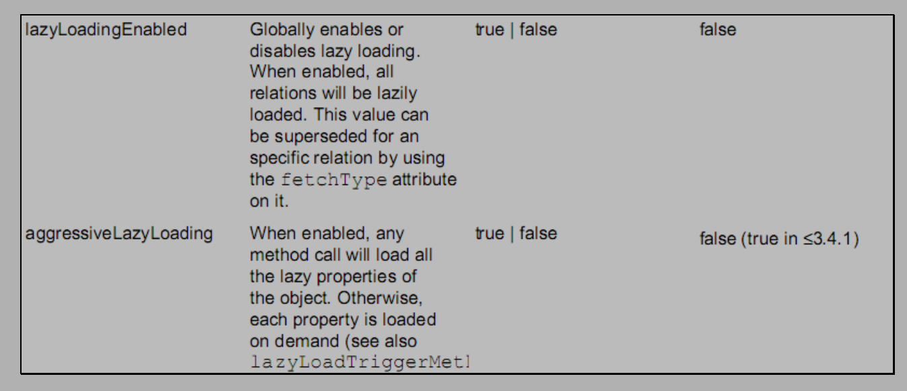

每个SqlSession中都持有Excutor，根据调用的持久层接口和对应的映射文件进行动态代理，生成真正查询的对象

###### Hibernate与MyBatis ######

MyBatis 入门简单，程序容易上手开发，同时 MyBatis 使得程序员可以只关注 SQL 语句本身，不需要关注太多的业务，对SQL的优化修改比较容易，是一个半自动的ORM框架，适合开发需求变更频繁的系统。

Hibernate 是一个标准的全自动ORM框架，不需要写SQL语句，面向对象开发，如果要进行数据库迁移的话，修改较少。但是也正是有与Hibernate面向对象开发，因此不能开发比较复杂的业务，适用于中小型项目。Hibernate 自动生成 SQL 语句，生成 SQL 语句比较复杂，出了错比较麻烦。

#### 框架 ####

1. 编写 SqlMapConfig.xml 配置文件

2. 编写持久层接口和对应的映射文件 xxxDao.xml

   映射文件要求：

   - 创建位置：必须和持久层接口在相同的包中。
   - 名称：必须以持久层接口名称命名文件名，扩展名是.xml

3. 示例

##### 示例 #####

```java
public class MybatisTest {
	public static void main(String[] args)throws Exception 
	{
        //1.读取配置文件
        InputStream in = Resources.getResourceAsStream("SqlMapConfig.xml");
        //2.创建 SqlSessionFactory 的构建者对象
        SqlSessionFactoryBuilder builder = new SqlSessionFactoryBuilder();
        //3.使用构建者创建工厂对象 SqlSessionFactory
        SqlSessionFactory factory = builder.build(in);
        //4.使用 SqlSessionFactory 生产 SqlSession 对象
        SqlSession session = factory.openSession();
        //5.使用 SqlSession 创建 dao 接口的代理对象
        IUserDao userDao = session.getMapper(IUserDao.class);
        //6.使用代理对象执行查询所有方法
        List<User> users = userDao.findAll();
        for(User user : users) 
        {
        	System.out.println(user);
        }
        //7.提交事务,释放资源
        session.commit();
        session.close();
        in.close();
    } 
}
```

#### 配置文件 ####

SqlMapConfig.xml 中配置的内容和顺序

```
-properties（属性）
	--property
-settings（全局配置参数）
	--setting
-typeAliases（类型别名）
	--typeAliase
	--package
-typeHandlers（类型处理器）
-objectFactory（对象工厂）
-plugins（插件）
-environments（环境集合属性对象）
    --environment（环境子属性对象）
        ---transactionManager（事务管理）
        ---dataSource（数据源）
-mappers（映射器）
    --mapper
    --package
```

##### properties #####

- key-value形式

  ```xml
  <properties> 
      <property name="jdbc.driver" value="com.mysql.jdbc.Driver"/>
      <property name="jdbc.url" value="jdbc:mysql://localhost:3306/eesy"/>
      <property name="jdbc.username" value="root"/>
      <property name="jdbc.password" value="1234"/>
  </properties>
  ```

- 引用url配置文件形式

  ```xml
  <properties url=>
  </properties>
  ```

此时dataSource 标签就可以引用上面的配置

```xml
<!-- value中的引用为key-value形式中的key或者配置文件中的key -->
<dataSource type="POOLED"> 
    <property name="driver" value="${jdbc.driver}"/>
    <property name="url" value="${jdbc.url}"/>
    <property name="username" value="${jdbc.username}"/>
    <property name="password" value="${jdbc.password}"/>
</dataSource>
```

##### settings #####

###### 二级缓存 ######

```xml
<settings>
<!-- 开启二级缓存的支持 --> 
<setting name="cacheEnabled" value="true"/>
</settings>
因为 cacheEnabled 的取值默认就为 true，所以这一步可以省略不配置。为 true 代表开启二级缓存；为
false 代表不开启二级缓存。
```

###### 延迟加载 ######



```xml
<!-- 开启延迟加载的支持 -->
<settings> 
<setting name="lazyLoadingEnabled" value="true"/>
<setting name="aggressiveLazyLoading" value="false"/>
</settings>
```

##### typeAliases #####

类型别名

mybaits 在加载时已经把常用的数据类型注册了别名，从而我们在parameterType和resultType中可以不写包名，我们自己写的类也可以注册别名，否则就要使用全限定类名。

```xml
<typeAliases>
	<!-- 单个别名定义 --> 
	<typeAlias alias="user" type="com.itheima.domain.User"/>
	<!-- 批量别名定义，扫描整个包下的类，自动设置别名为类名（首字母大写或小写都可以） --> 
	<package name="com.itheima.domain"/>
</typeAliases>
```

##### dataSource #####

MyBatis 在初始化时，根据dataSource的 type 属性来创建相应类型的的数据源 DataSource，即：

type=”POOLED”：MyBatis 会创建 PooledDataSource 实例，使用连接池的数据源

type=”UNPOOLED” ： MyBatis 会创建 UnpooledDataSource 实例，不使用连接池的数据源（随用随创建，用完就关闭）

type=”JNDI”：MyBatis 会从 JNDI 服务上查找 DataSource 实例，然后返回使用

#### 映射文件 ####

##### 框架 #####

```xml
<mapper namespace="">
    <!-- 配置操作标签 --> 
    <操作标签 id="" parameterType="" resultType="">
    	select * from user
    </操作标签>
</mapper>
```

- namespace：要配置的全限定类名（接口名）

- id：我要配置的是接口中的哪个方法

- parameterType：传入的参数是什么类型，没有可以不写

- resultType：返回值是什么类型(用于自动封装)，没有可以不写

  自动封装有一个要求，实体类中的属性名称必须和查询语句中的列名保持一致，否则无法实现自动封装。

  如果不一致

  - 使用别名与实体类中的属性名称对应

    ```xml
    <select id="findAll" resultType="com.itheima.domain.User">
    	select id as userId,username as userName from user
    </select>
    别名要与实体类中的属性名称对应
    ```

  - 定义 resultMap，建立数据库表和实体类属性的对应关系

    然后把resultType改成resultMap

    ```xml
    type 属性：指定实体类的全限定类名
    id 属性：给定一个唯一标识，是给查询 select 标签引用用的。
    <resultMap type="com.itheima.domain.User" id="userMap"> 
        <id column="id" property="userId"/>
        <result column="username" property="userName"/>
        <result column="sex" property="userSex"/>
    </resultMap>
    id 标签：用于指定主键字段
    result 标签：用于指定非主键字段
    column 属性：用于指定数据库列名
    property 属性：用于指定实体类属性名称
    <!-- 查询所有 -->
    <select id="findAll" resultMap="userMap">
        select * from user
    </select>
    ```

##### 操作标签 #####

```xml
<mapper namespace="持久层接口的全限定类名">
    
    <!-- 查询所有 --> 
    <select id="持久层接口中的方法名" parameterType="int" resultType="">
        select * from user where id = #{uid}
    </select>
    
    <!-- 根据名称模糊查询 --> 
    <select id="findByName" parameterType="String" resultType="com.itheima.domain.User">
     	select * from user where username like #{username}
    </select>
    <select id="findByName" parameterType="string" resultType="com.itheima.domain.User">
     	select * from user where username like '%${value}%'
    </select>
    
    <!-- 查询总记录条数 --> 
    <select id="findTotal" resultType="int">
		select count(*) from user;
    </select>
    
    <!-- 插入用户 --> 
    <insert id="saveUser" parameterType="com.itheima.domain.User">
        <!-- 配置保存时获取插入的 id -->
        <selectKey keyColumn="id" keyProperty="id" resultType="int">
            select last_insert_id();
        </selectKey>
    	insert into user(username,birthday,sex,address) values(#{username},#{birthday},#{sex},#{address})
    </insert>
    
    <!-- 更新用户 --> 
    <update id="updateUser" parameterType="com.itheima.domain.User">
        update user set username=#{username},birthday=#{birthday},sex=#{sex},address=#{address} where id=#{id}
    </update>
    
    <!-- 删除用户 --> 
    <delete id="deleteUser" parameterType="java.lang.Integer">
    	delete from user where id = #{uid}
    </delete>
    
</mapper>
```

- sql 语句中使用#{}字符： 它代表占位符，相当于原来 jdbc 部分所学的?，使用的是PreparedStatement

  #{}中内容的写法：

  - 数据类型**如果是基本类型**，名称可以随意写。
  - 方法的参数**如果是bean对象**，此处要写bean对象中的属性名称。它用的是 ognl 表达式。

  ognl 表达式：

  它是 apache 提供的一种表达式语言，全称是：

  Object Graphic Navigation Language 对象图导航语言

  语法格式就是使用 #{对象.对象.对象...}的方式

  而parameterType或者resultType中已经指定了类名，所以不用写类名了

- sql 语句中使用${}字符：将 parameterType 传入的内容拼接在 sql 中且不进行 jdbc 类型转换，使用的是Statement对象，不能防止注入

  ${}中内容的写法：

  - 数据类型是基本类型，名称只能写 value。
  - 方法的参数是bean对象，

##### 抽取重复语句 #####

sql标签和include标签

```xml
<!-- 抽取重复的语句代码片段 --> 
<sql id="defaultSql">
    select * from user
</sql>
<!-- 引用重复的语句代码片段 --> 
<select id="findAll" resultType="user"> 
	<include refid="defaultSql"></include>
</select>
```

#### 动态sql ####

根据实体类属性的不同取值，使用不同的 SQL 语句来进行查询。例如在 id 如果不为空时可以根据 id 查询，如果 username 不同空时还要加入用户名作为条件

```xml
<select id="findByUser" resultType="user" parameterType="user">
    select * from user where 1=1
    <if test="username!=null and username != '' ">
    	and username like #{username}
    </if> 
    <if test="address != null">
    	and address like #{address}
    </if>
</select>
```

```xml
<!-- 用where取代1=1 --> 
<select id="findByUser" resultType="user" parameterType="user"> 
	select * from user 
    <where> 
        <if test="username!=null and username != '' ">
            and username like #{username}
        </if> 
        <if test="address != null">
            and address like #{address}
        </if>
    </where>
</select>
```

##### in：foreach标签 #####

在进行范围查询时，将一个集合中的值，作为参数动态添加进来。

```xml
<select id="" resultType="" parameterType="">
	<!-- select * from user where id in (1,2,3,4,5); --> 
	select * from user where id in (?)
    <where> 
        <if test="ids != null and ids.size() > 0"> 
            <foreach collection="ids" open="id in ( " close=")" item="uid" separator=",">
            	#{uid}
            </foreach>
        </if>
    </where>
</select>
<foreach>标签用于遍历集合，它的属性：
collection:代表要遍历的集合元素，与parameter中对应的属性名一致，注意编写时不要写#{}
open:代表语句的开始部分，固定写法
close:代表结束部分，固定写法
item:代表遍历集合的每个元素，生成变量名，要和下面的#{变量名}保持一致
sperator:代表分隔符
```

#### 表关系 ####

##### 一对一 #####

###### 方法一 ######

新建bean类让其中的属性和查询语句返回的属性值相匹配

###### 方法二 ######

在原有的bean类中添加其他类对象成员，并定义 resultMap 中的association用于将查询到的结果映射到类成员上。

```xml
<mapper namespace="com.itheima.dao.IAccountDao">
    <!-- 建立对应关系 --> 
    <resultMap type="account" id="当前映射的唯一标识"> 
        <id column="aid" property="id"/>
        <result column="uid" property="uid"/>
        <!-- 类成员属性映射 --> 
        <association property="user" javaType="user"> 
            <id column="id" property="id"/>
            <result column="username" property="username"/>
        </association>
    </resultMap> 
    <select id="findAll" resultMap="accountMap">
    	select u.*,a.id as aid,a.uid from account a,user u where a.uid =u.id;
    </select>
</mapper>
property="user"：关联查询的结果集存储在 Account 对象的上哪个属性。
javaType="user"：指定user对象的类型
```

##### 一对多 #####

在原有的bean类中添加其他类对象的List，并定义 resultMap 中的collection用于将查询到的结果映射到List类成员上。

```xml
<collection property="accounts" ofType="account"> 
    <id column="aid" property="id"/>
    <result column="uid" property="uid"/>
    <result column="money" property="money"/>
</collection>
ofType="account"：
指定结果集中的对象类型即List中的对象类型。
```

##### 多对多 #####

两个一对多

##### 延迟加载 #####

- 在配置文件中开启延迟加载
- 配置association或collection标签的select属性和column属性

```xml
<association select="com.itheima.dao.IUserDao.findById" property="user" javaType="user"
column="uid">
</association>
select： 填写我们要调用的 select 标签的 id 
column ： 填写我们要传递给 select 标签的参数
```

#### 缓存 ####

##### 一级缓存 #####

一级缓存自动存在，同一个 `SqlSession` 对象， 在参数和 SQL 完全一样的情况先， 只执行一次 SQL 语句（如果缓存没有过期）

- 一级缓存是 SqlSession 级别的缓存，只要 SqlSession 没有 flush，clearCache()或 close，它就存在。
- 当调用 SqlSession 的修改，添加，删除，commit()，close()等方法时，就会清空一级缓存。

##### 二级缓存 #####

二级缓存是 mapper标签映射级别的缓存，二级缓存是跨 SqlSession 的

二级缓存需要配置才能开启

在 mybatis 中， 二级缓存有全局开关和分开关，。全局开关， 在 **mybatis-config.xml** 中配置。分开关就是说在 ***Mapper.xml** 中开启或关闭二级缓存， 默认是不开启的。

- 第一步：在 SqlMapConfig.xml 文件开启二级缓存

- 在mapper标签中加入cache标签

  ```xml
  <cache>标签表示当前这个 mapper 映射将使用二级缓存
  <mapper namespace="com.itheima.dao.IUserDao">
      <!-- 开启二级缓存的支持 -->
      <cache></cache>
  </mapper>
  ```

- 在映射文件中的操作标签（select，insert等等）中配置useCache属性

  ```xml
  <!-- 根据 id 查询 --> 
  <select useCache="true" id="findById" resultType="user" parameterType="int">
      select * from user where id = #{uid}
  </select>
  useCache为true代表开启二级缓存
  ```

  