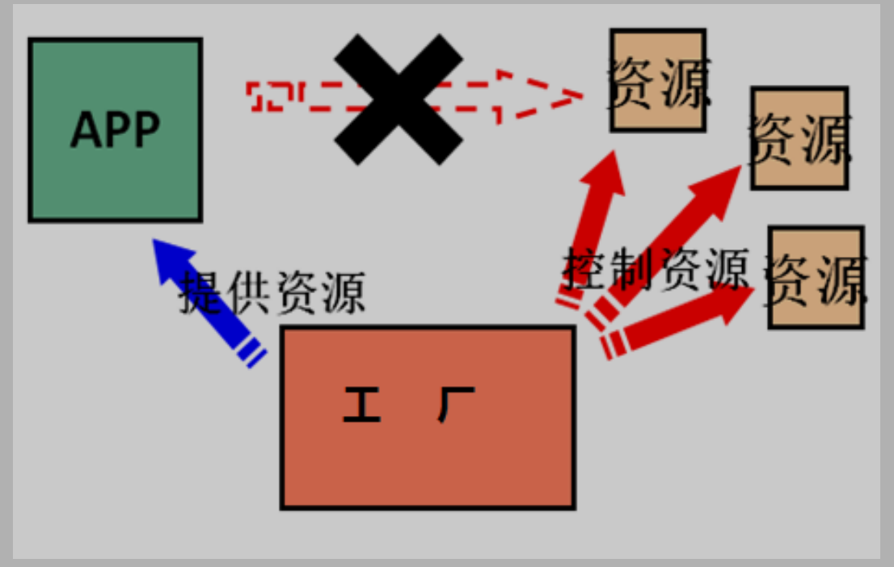

- BeanFactory 才是 Spring 容器中的顶层接口。ApplicationContext 是它的子接口。
- BeanFactory 和 ApplicationContext 的区别：创建对象的时间点不一样。
  - ApplicationContext：只要一读取配置文件，默认情况下就会创建对象，但可以通过配置属性进行改变
  - BeanFactory：什么使用什么时候创建对象，不能通过配置属性进行
- JDK动态代理是面向接口的。CGLib动态代理是通过继承

#### IOC（控制反转） ####

###### IOC对象 ######

Sping中的三种IOC对象

- ClassPathXmlApplicationContext：
  它是从类的根路径下加载配置文件 推荐使用这种
- FileSystemXmlApplicationContext：
  它是从磁盘路径上加载配置文件，配置文件可以在磁盘的任意位置。
- AnnotationConfigApplicationContext:
  当我们使用注解配置容器对象时，需要使用此类来创建 spring 容器。它用来读取注解。

###### IOC对象作用 ######

用于管理bean对象的创建以及存取，实现编译期不依赖，运行时才依赖，

- 使用反射创建对象，而不是使用new关键字
- 通过读取配置文件读取类名，使用容器（工厂）存储创建的bean对象



###### bean对象属性 ######

- id：给对象在容器中提供一个唯一标识。用于获取对象。
- class：指定类的全限定类名。用于反射创建对象。默认情况下调用无参构造函数。
- scope：指定对象的作用范围
- init-method：指定类中的初始化方法名称。
- destroy-method：指定类中销毁方法名称。

###### scope属性取值 ######

- singleton :默认值，单例的.
  - 生命周期：
    - 对象出生：当应用加载，创建容器对象时，bean对象就被创建了。
    - 对象活着：只要容器对象在，bean对象一直活着。
    - 对象死亡：当应用卸载，销毁容器对象时，bean对象就被销毁了。
- prototype :多例的.
  - 生命周期：
    - 对象出生：当使用对象时，创建新的对象实例。
    - 对象活着：只要对象在使用中，就一直活着。
    - 对象死亡：当对象长时间不用时，被 java 的垃圾回收器回收了。
- request :WEB 项目中,Spring 创建一个 Bean 的对象,将对象存入到 request 域中.
- session :WEB 项目中,Spring 创建一个 Bean 的对象,将对象存入到 session 域中.
- global session :WEB 项目中,应用在 Portlet 环境.如果没有 Portlet 环境那么globalSession 相当于 session.

###### 创建bean对象 ######

- ```xml
  使用默认无参构造函数
  <!--在默认情况下：
  它会根据默认无参构造函数来创建类对象。如果bean对象类中没有默认无参构造函数，将会创建失败。
  --> 
  <bean id="accountService" class="com.itheima.service.impl.AccountServiceImpl"/>
  ```

- ```xml
  使用静态工厂的方法创建对象
  <!-- 此种方式是:
  使用类中的静态方法创建对象，并存入 spring 容器
  id 属性：指定 bean 对象的 id，用于从容器中获取
  class 属性：指定静态工厂的全限定类名
  factory-method 属性：指定生产对象的静态方法
  --> 
  <bean id="accountService" class="com.itheima.factory.StaticFactory" factory-method="createAccountService"></bean>
  ```

- ```xml
  使用实例工厂的方法创建对象
  <!-- 此种方式需要先有一个实例工厂的对象
  factory-bean 属性：用于指定实例工厂对象的 id。
  factory-method 属性：用于指定实例工厂中创建对象的方法。
  --> 
  <bean id="instancFactory" class="com.itheima.factory.InstanceFactory"></bean> 
  <bean id="accountService" factory-bean="instancFactory" factory-method="createAccountService"></bean>
  ```

#### 依赖注入 ####

依赖：一个类中拥有的成员变量是**另一个类的对象**称为这个类存在对另外一个类的依赖

依赖注入：给成员变量赋值。

依赖注入的类型：基本数据类型，引用类型（使用bean对象的方式），集合类型

#####  构造函数注入 #####

```xml
<!-- 
要求：
	类中需要提供一个对应参数列表的构造函数。
涉及的标签：
	constructor-arg
属性：
    index:指定参数在构造函数参数列表的索引位置
    type:指定参数在构造函数中的数据类型
    name:指定参数在构造函数中的名称 用这个找给谁赋值
    =======上面三个都是找给谁赋值，下面两个指的是赋什么值的==============
    value:它能赋的值是基本数据类型和 String 类型
    ref:它能赋的值是其他bean对象，也就是说，必须得是在配置文件中配置过的 bean
--> 
<bean id="accountService" class="com.itheima.service.impl.AccountServiceImpl"> 
	<constructor-arg name="name" value="张三"></constructor-arg> 
	<constructor-arg name="age" value="18"></constructor-arg> 
	<constructor-arg name="birthday" ref="now"></constructor-arg> 
</bean> 
<bean id="now" class="java.util.Date"></bean>
```

##### set 方法注入 #####

```xml
<!--
要求：
	类中拥有相应的set方法，且方法名格式必须为set+大写名字（property对应的name为小写）
涉及的标签：
	property
属性：
    name：找的是类中 set 方法后面的部分
    ref：给属性赋值是其他 bean 类型的
    value：给属性赋值是基本数据类型和 string 类型的
实际开发中，此种方式用的较多。
--> 
<bean id="accountService" class="com.itheima.service.impl.AccountServiceImpl"> 
    <property name="name" value="test"></property> 
    <property name="age" value="21"></property> 
    <property name="birthday" ref="now"></property>
</bean> 
<bean id="now" class="java.util.Date"></bean>
```

#####  p 名称空间注入 #####

此种方式是通过在 xml 中导入 p 名称空间，使用 p:propertyName 来注入数据，它的本质仍然是调用类中的set 方法实现注入功能。

```xml
<beans 
 xmlns="http://www.springframework.org/schema/beans"
 xmlns:p="http://www.springframework.org/schema/p"
 xmlns:xsi="http://www.w3.org/2001/XMLSchema-instance"
 xsi:schemaLocation=" http://www.springframework.org/schema/beans 
                     http://www.springframework.org/schema/beans/spring-beans.xsd">
 
    <bean id="accountService" 
         class="com.itheima.service.impl.AccountServiceImpl4"
         p:name="test" p:age="21" p:birthday-ref="now"/>
</beans>
```

##### 注入集合属性 #####

```xml
<!-- 
给类中的集合成员传值，它用的也是set方法注入的方式，只不过变量的数据类型都是集合。
集合数据
    List 结构的：
        array,list,set
    Map 结构的：
        map,entry,props,prop
--> 
<!-- 在注入集合数据时，只要结构相同，标签可以互换 -->
<bean id="accountService" class="com.itheima.service.impl.AccountServiceImpl">
<!-- 给集合注入数据 --> 
    <property name="myStrs"> 
        <set>
            <value>AAA</value> 
            <bean>全限定类名</bean>
		</set>
	</property>
<!-- 注入 数组 集合数据 --> 
    <property name="myList"> 
        <array> 
            <value>AAA</value> 
            <bean>全限定类名</bean>
		</array>
	</property>
<!-- 注入 list 集合数据 --> 
    <property name="mySet"> 
        <list>
            <value>AAA</value> 
            <bean>全限定类名</bean>
		</list>
	</property>

<!-- 注入 properties 数据 -->
    <property name="myMap"> 
        <props> 
            <prop key="testA">aaa</prop> 
            <prop key="testB">bbb</prop>
		</props>
	</property>
<!-- 注入 Map 数据 --> 
    <property name="myProps"> 
        <map>
            <entry key="testA" value="aaa"></entry> 
            <entry key="testB"> 
                <value>bbb</value>
    		</entry>
    	</map>
    </property>
</bean>
```

#### 注解IOC和依赖注入 ####

```xml
<!-- 告知 spring 创建容器时要扫描的包 --> 
<context:component-scan base-package="com.itheima"></context:component-scan>
```

当我们使用注解注入数据时，**set 方法和构造函数不用写**

细节：如果注解中有且只有一个属性要赋值时，且名称是 value，value 在赋值是可以不写。

##### 用于创建对象 #####

- @Component

  属性：value：指定 bean 的 id。如果不指定 value 属性，默认 bean 的 id 是当前类的类名。首字母小写。

- @Controller @Service @Repository

  三个注解和@Component的作用一样

  @Controller：一般用于表现层的注解。
  @Service：一般用于业务层的注解。
  @Repository：一般用于持久层的注解。

##### 改变作用范围 #####

- @Scope

  作用：
  指定 bean 的作用范围。
  属性：
  value：指定范围的值。
   取值：singleton prototype request session globalsession

##### 生命周期相关 #####

- @PostConstruct

  作用：
  用于指定初始化方法。

- @PreDestroy

  作用：
  用于指定销毁方法。

##### 用于注入数据 #####

集合类型数据无法用注解进行注入

###### 注入基本数据类型和String ######

@Value

作用：注入基本数据类型和 String 类型数据

属性：value：用于指定值

###### 注入bean数据 ######

- @Autowired

  作用：

  当有多个类型（继承同一个类）匹配时，使用要注入的对象变量名称作为 bean 的 id，在 spring 容器查找，找到了也可以注入成功。找不到就报错

- @Qualifier

  作用：
  在自动按照类型注入的基础之上，再按照 Bean 的 id 注入。它在给字段注入时不能独立使用，必须和@Autowire 一起使用；但是给方法参数注入时，可以独立使用。
  属性：
  value：指定 bean 的 id。

- @Resource

  作用：
  直接按照 Bean 的 id 注入
  属性：
  name：指定 bean 的 id。

##### 纯注解配置 #####

###### @Configuration ######

用于指定当前类是一个 spring 配置类，声明当前类是一个配置类，指示当前类会声明一个或多个@Bean方法，并且可以由Spring容器处理，**Spring Boot** 推荐使用 **java** 配置完全代替 **XML** 配置

###### @ComponentScan ######

用于指定 spring 在初始化容器时要扫描的包。作用和在 spring 的 xml 配置文件中的：<context:component-scan base-package="com.itheima"/>是一样的。

属性：basePackages：用于指定要扫描的包。和该注解中的 value 属性作用一样。

```java
@Configuration
@ComponentScan("com.itheima")
public class SpringConfiguration {
}
```

###### @Bean ######

该注解只能写在方法上，表明使用此方法创建一个对象，并且需要放入 spring 容器。

属性：name：给当前@Bean 注解方法创建的对象指定一个名称(即 bean 的 id）。

```java
public class JdbcConfig {
/**
* 创建一个数据源，并存入 spring 容器中
* @return
*/
@Bean(name="dataSource")
public DataSource createDataSource() 
{
    try 
    {
    ComboPooledDataSource ds = new ComboPooledDataSource();
    return ds;
    } 
    catch (Exception e) 
    {
    throw new RuntimeException(e);
    } 
}
```

###### @PropertySource ######

用于加载.properties 文件中的配置。例如我们配置数据源时，可以把连接数据库的信息写到properties 配置文件中，就可以使用此注解指定 properties 配置文件的位置。

属性：value[]：用于指定 properties 文件位置。如果是在类路径下，需要写上 classpath:

```java
@PropertySource("classpath:jdbc.properties")
public class JdbcConfig 
{
    @Value("${jdbc.driver}")
    private String driver;
    @Value("${jdbc.url}")
    private String url;
｝
jdbc.properties 文件：
jdbc.driver=com.mysql.jdbc.Driver
jdbc.url=jdbc:mysql://localhost:3306/test
```

###### @Import ######

用于导入其他配置类，在引入其他配置类时，可以不用再写@Configuration 注解。当然，写上也没问题。

属性：value[]：用于指定其他配置类的字节码。

#### AOP ####

##### 基于 XML 的 AOP 配置 #####

导入AOP的约束

```xml
此处要导入 aop 的约束
<?xml version="1.0" encoding="UTF-8"?>
<beans xmlns="http://www.springframework.org/schema/beans"
       xmlns:xsi="http://www.w3.org/2001/XMLSchema-instance"
       xmlns:aop="http://www.springframework.org/schema/aop"
       xsi:schemaLocation="http://www.springframework.org/schema/beans 
             http://www.springframework.org/schema/beans/spring-beans.xsd
             http://www.springframework.org/schema/aop 
             http://www.springframework.org/schema/aop/spring-aop.xsd">
</beans>
```

###### 框架 ######

```xml
<aop:config>
    <!--切入点-->
    <aop:pointcut id="切入点id" expression="execution()"/>
    <!--切面-->
    <aop:aspect id="切面id" ref="通知类id">
    	<aop:切入类型 method="通知类中的某个方法" pointcut-ref="切入点id"/>
    </aop:aspect>
</aop:config>
```

###### 切入点 ######

```xml
aop:pointcut
    作用：
        用于配置切入点表达式。指定对哪些类的哪些方法进行增强。
    属性：
	   id：用于给切入点表达式提供一个唯一标识
       expression：用于定义切入点表达式。
<aop:pointcut id="pt1" expression="execution(public void com.itheima.service.impl.AccountServiceImpl.transfer(java.lang.String, java.lang.String, java.lang.Float) )"/>
```

```
表达式语法：execution([修饰符] 返回值类型 包名.类名.方法名(参数))

访问修饰符可以省略

返回值可以使用*号，表示任意返回值

包名可以使用*号，表示任意包，但是有几级包，需要写几个*
..来表示当前包，及其子包

类名可以使用*号，表示任意类
方法名可以使用*号，表示任意方法

参数列表可以使用*，表示参数可以是任意数据类型，但是必须有参数
参数列表可以使用..表示有无参数均可，有参数可以是任意类型

全通配方式：
* *..*.*(..)
```

###### 切面 ######

四种切入类型

- before
- after-returning：切入点方法执行之后
- after-throwing：相当于catch中的部分
- after：相当于finally中的部分

```xml
aop:aspect
    作用：
        用于配置切面。
    属性：
        id：给切面提供一个唯一标识。
        ref：引用配置好的通知类 bean 的 id。
<aop:aspect id="切面id" ref="通知类id">
	<!--配置通知的类型要写在此处-->
    <aop:切入类型 method="通知类中的某个方法" pointcut-ref="切入点id"/>
</aop:aspect>
```

###### 环绕通知：around ######

spring 框架为我们提供了一个接口：ProceedingJoinPoint，相当于被代理的切入点方法，它可以作为环绕通知方法的方法参数。

在环绕通知执行时，spring 框架会为我们提供该接口的实现类对象，我们直接使用就行。

```
public Object 环绕通知方法(ProceedingJoinPoint pjp) 
{
    //定义返回值
    Object rtValue = null;
    try {
        //获取方法执行所需的参数
        Object[] args = pjp.getArgs();
        //前置通知：开启事务
        beginTransaction();
        //执行方法
        rtValue = pjp.proceed(args);
        //后置通知：提交事务
        commit();
    }catch(Throwable e) 
    {
        //异常通知：回滚事务
        rollback();
        e.printStackTrace();
    }finally 
    {
        //最终通知：释放资源
        release();
    }
    return rtValue; 
}
```

##### 注解AOP #####

###### @Pointcut ######

作用：指定切入点表达式

属性：value：指定表达式的内容

```java
@Pointcut("execution()")
private void pt1() {}  //充当id属性，在通知类内定义
```

###### @Aspect ######

作用：把当前类声明为切面类（通知类）。

###### @Before ######

作用：把当前方法看成是前置通知。

属性：value：用于指定切入点表达式，还可以指定切入点表达式的引用。

下面全部同理

###### @AfterReturning ######

###### @AfterThrowing ######

###### @After ######

###### @Around ######

#### 事务控制 ####

Spring中事务控制的接口：PlatformTransactionManager

真正管理事务的对象

- org.springframework.jdbc.datasource.DataSourceTransactionManager 使用 SpringJDBC 或 iBatis 进行持久化数据时使用
- org.springframework.orm.hibernate5.HibernateTransactionManager 使用Hibernate 版本进行持久化数据时使用

##### XML配置 #####

- ```xml
  <!-- 配置一个事务管理器 --> 
  <bean id="transactionManager" class="org.springframework.jdbc.datasource.DataSourceTransactionManager">
      <!-- 注入 DataSource --> 
      <property name="dataSource" ref="dataSource"></property>
  </bean>
  ```

- ```xml
  <!-- 事务的配置 --> 
  <tx:advice id="txAdvice" transaction-manager="transactionManager">
      <tx:attributes>
          <!--
          read-only：是否是只读事务。默认 false，不只读。
          isolation：指定事务的隔离级别。默认值是使用数据库的默认隔离级别。
          propagation：指定事务的传播行为。
          timeout：指定超时时间。默认值为：-1。永不超时。
          rollback-for：用于指定一个异常，当执行产生该异常时，事务回滚。产生其他异常，事务不回滚。
          没有默认值，任何异常都回滚。
          no-rollback-for：用于指定一个异常，当产生该异常时，事务不回滚，产生其他异常时，事务回
          滚。没有默认值，任何异常都回滚。
          --> 
          <tx:method name="*" read-only="false" propagation="REQUIRED"/>
          <tx:method name="find*" read-only="true" propagation="SUPPORTS"/>
      </tx:attributes>
  </tx:advice>
  ```

- ```xml
  <!-- 配置 aop --> 
  <aop:config>
      <!-- 配置切入点表达式 --> 
      <aop:pointcut id="pt1" expression="execution(* com.itheima.service.impl.*.*(..))"/>
      <!-- 在 aop:config 标签内部：建立事务的通知和切入点表达式的关系 --> 
      <aop:advisor advice-ref="txAdvice" pointcut-ref="pt1"/>
  </aop:config>
  ```

##### 注解配置 #####

- ```xml
  <!-- 配置一个事务管理器 --> 
  <bean id="transactionManager" class="org.springframework.jdbc.datasource.DataSourceTransactionManager">
      <!-- 注入 DataSource --> 
      <property name="dataSource" ref="dataSource"></property>
  </bean>
  ```

- ```xml
  <!--
  在切入点类，接口或方法上使用@Transactional注解 
  出现接口上，表示该接口的所有实现类都有事务支持。
  出现在类上，表示类中所有方法有事务支持
  出现在方法上，表示方法有事务支持。
  以上三个位置的优先级：方法>类>接口
  --> 
  @Transactional(readOnly=true,propagation=Propagation.SUPPORTS)
  ```

- ```xml
  <!-- 在配置文件中开启 spring 对注解事务的支持 --> 
  <tx:annotation-driven transaction-manager="transactionManager"/>
  ```


#### 事务传播

方法A调用方法B

```java

@Transactional(propagation = )
public void methodA() {
doSomeThingA();
methodB();
doSomeThingB();
// do something else
}
 
@Transactional(propagation = )
public void methodB() {
    // do something
}
```

- REQUIRED:如果当前没有事务，就新建一个事务，如果已经存在一个事务中，加入到这个事务中（默认值）

  单独调用methodB方法时，因为当前上下文不存在事务，所以会开启一个新的事务。 
  调用methodA方法时，因为当前上下文不存在事务，所以会开启一个新的事务。当执行到methodB时，methodB发现当前上下文有事务，因此就加入到当前事务中来。

- REQUIRES_NEW: 新建事务，如果当前在事务中，把当前事务挂起。

  A与B是两个独立的事务，互不相干。B是否成功并不依赖于A。如果methodA方法在调用完methodB方法之后失败了，methodB方法所做的结果依然被提交，除了 methodB之外的其它代码导致的结果会被回滚

  ```java
  {
          TransactionManager tm = null;
          try
          {
              //获得一个JTA事务管理器
              tm = getTransactionManager();
              tm.begin();//开启一个新的事务
              Transaction ts1 = tm.getTransaction();
              doSomeThing();
              tm.suspend();//挂起当前事务
              try
              {
                  tm.begin();//重新开启第二个事务
                  Transaction ts2 = tm.getTransaction();
                  methodB();
                  ts2.commit();//提交第二个事务
              } Catch(RunTimeException ex) {
              ts2.rollback();//回滚第二个事务
          } finally{
              //释放资源
          }
              //methodB执行完后，恢复第一个事务
              tm.resume(ts1);
              doSomeThingB();
              ts1.commit();//提交第一个事务
          } catch (RunTimeException ex)
          {
              ts1.rollback();//回滚第一个事务
          } finally
          {
              //释放资源
          }
      }
  ```

- SUPPORTS:使用当前事务，如果当前没有事务，就以非事务方式执行（没有事务）

  单纯的调用methodB时，methodB方法是非事务的执行的。当调用methdA时,methodB则加入了methodA的事务中,事务地执行。

- MANDATORY：使用当前的事务，如果当前没有事务，就抛出异常

  当单独调用methodB时，因为当前没有一个活动的事务，则会抛出异常throw new IllegalTransactionStateException(“Transaction propagation ‘mandatory’ but no existing transaction found”);当调用methodA时，methodB则加入到methodA的事务中，事务地执行。

- NOT_SUPPORTED:以非事务方式执行操作，如果当前存在事务，就把当前事务挂起

- NEVER:以非事务方式运行，如果当前存在事务，抛出异常

- NESTED:如果当前存在事务，则在嵌套事务内执行。如果当前没有事务，则新建一个事务

  内层事务B依赖于外层事务A。外层事务失败时，会回滚内层事务所做的动作。而内层事务操作失败并不会引起外层事务的回滚。

  ```java
  {
          Connection con = null;
          Savepoint savepoint = null;
          try
          {
              con = getConnection();
              con.setAutoCommit(false);
              doSomeThingA();
              savepoint = con2.setSavepoint();//保存当前状态
              try
              {
                  methodB();  //B仍在事务中
              } catch (RuntimeException ex)
              {
                  con.rollback(savepoint); //B失败会回滚到保存点
              } finally
              {
                  //释放资源
              }
              doSomeThingB();
              con.commit();
          } catch (RuntimeException ex)
          {
              con.rollback();
          } finally
          {
              //释放资源
          }
      }
  ```

