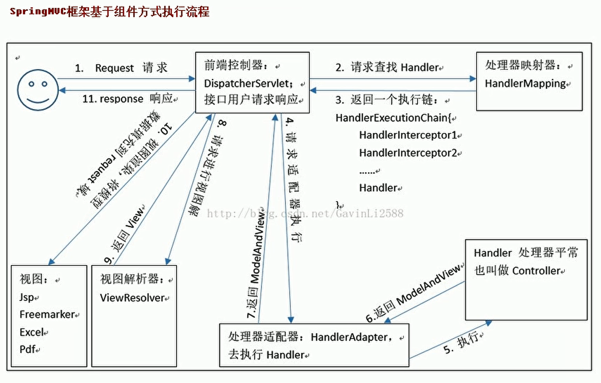

- 表单提交的任何数据类型全部都是字符串类型

- 解决中文乱码的问题：在web.xml中配置Spring提供的过滤器类

  ```xml
  <!-- 配置过滤器，解决中文乱码的问题 --> 
  <filter> 
  	<filter-name>characterEncodingFilter</filter-name> 
      <filter-class>org.springframework.web.filter.CharacterEncodingFilter</filter-class> 
  	<!-- 指定字符集 --> 
  	<init-param> 
          <param-name>encoding</param-name> 
      	<param-value>UTF-8</param-value> 
      </init-param> 
  </filter> 
  <filter-mapping>
          <filter-name>characterEncodingFilter</filter-name> 
          <url-pattern>/*</url-pattern> 
  </filter-mapping>
  ```

#### 框架 ####

- DispatcherServlet对象：前端控制器

  用户请求到达前端控制器，它就相当于 mvc 模式中的 c，dispatcherServlet 是整个流程控制的中心，由它调用其它组件处理用户的请求，dispatcherServlet 的存在降低了组件之间的耦合性。

- HandlerMapping：处理器映射器

  处理器映射器（handlerMapping）查找处理器（handler）及与之相关的拦截器（interceptor），组成handlerExecutionChain。SpringMVC 提供了不同的映射器实现不同的映射方式，例如：配置文件方式，实现接口方式，注解方式等。

- Handler：处理器

  开发中要编写的具体业务控制器。由 DispatcherServlet 把用户请求转发到 Handler。由 Handler 对具体的用户请求进行处理。

- HandlAdapter：处理器适配器

  通过 HandlerAdapter 

- View Resolver：视图解析器

  View Resolver 负责将处理结果生成 View 视图，View Resolver 首先根据逻辑视图名解析成物理视图名即具体的页面地址，再生成 View 视图对象，最后对 View 进行渲染将处理结果通过页面展示给用户。

- View：视图

  SpringMVC 框架提供了很多的 View 视图类型的支持，包括：jstlView、freemarkerView、pdfView 等。我们最常用的视图就是 jsp。 一般情况下需要通过页面标签或页面模版技术将模型数据通过页面展示给用户，需要由程序员根据业务需求开发具体的页面。



- 配置web.xml

  ```xml
  <servlet> 
      <servlet-name>dispatcherServlet</servlet-name> 
      <!-- 配置SpringMVC的核心控制器对象 --> 
      <servlet-class>org.springframework.web.servlet.DispatcherServlet</servlet-class> 
      <!-- 配置Servlet的初始化参数，读取springmvc的配置文件--> 
      <init-param>
          <param-name>contextConfigLocation</param-name> 
          <param-value>classpath:springmvc.xml</param-value> 
      </init-param> 
      <!-- 配置servlet启动时加载配置文件 --> 
      <load-on-startup>1</load-on-startup> 
  </servlet> 
  <servlet-mapping> 
      <servlet-name>dispatcherServlet</servlet-name> 
      <!-- 配置全局路径都要经过核心控制器 --> 
      <url-pattern>/</url-pattern> 
  </servlet-mapping>
  ```

- 配置springmvc.xml

  ```xml
  <?xml version="1.0" encoding="UTF-8"?> 
  <beans 约束>
      <!-- 配置spring创建对象时要扫描的包 --> 
      <context:component-scan base-package="com.itheima"></context:component-scan> 
      <!-- 配置视图解析器 --> 
      <bean id="viewResolver" class="org.springframework.web.servlet.view.InternalResourceViewResolver"> 
          <property name="prefix" value="/WEB-INF/pages/"></property> 
          <property name="suffix" value=".jsp"></property> 
      </bean> 
      <!-- 
  	<mvc:annotation-driven> 自动加载 
    	RequestMappingHandlerMapping （处理映射器） 
      和RequestMappingHandlerAdapter （ 处 理 适 配 器 ） 
      -->
      <mvc:annotation-driven></mvc:annotation-driven>
  </beans>
  ```
  
  
  

#### 注解 ####

##### RequestMapping #####

RequestMapping：建立请求URL和处理方法之间的对应关系

RequestMapping注解可以作用在方法和类上
1. 作用在类上：第一级的访问目录
2. 作用在方法上：第二级的访问目录

###### RequestMapping的属性 ######

1. path 指定请求路径的url
2. value value属性和path属性是一样的
3. method 指定该方法的请求方式
4. params 指定限制请求参数的条件
5. headers 发送的请求中必须包含的请求头

#### 请求参数的绑定 ####

参数绑定是把表单提交的请求参数，与对应的控制器中方法中的参数进行绑定

1. 表单提交的数据都是k=v格式的 username=haha&password=123
2. 要求：提交表单的key和参数的名称是相同的
3. 基本类型和字符串类型直接转换赋值，如果类中包含其他的引用类型，那么表单的key属性需要编写成：其他引用类型.属性，给集合类型赋值的jsp页面写法： JSP页面编写方式：list[0].属性

##### 自定义类型转换器 #####

1. 表单提交的任何数据类型全部都是字符串类型，但是后台定义Integer类型，数据也可以封装上，说明
Spring框架内部会默认进行数据类型转换。
2. 如果想自定义数据类型转换，可以实现Converter的接口

1. 自定义类型转换器

   ```java
   public class StringToDateConverter implements Converter<String, Date>
   { 
       /*** 进行类型转换的方法 */ 
       public Date convert(String source) 
       { // 判断 
           if(source == null) 
           { 
               throw new RuntimeException("参数不能为空"); 
           }
           try 
           {
               DateFormat df = new SimpleDateFormat("yyyy-MM-dd"); 
               // 解析字符串 
               Date date = df.parse(source); return date; 
           } catch (Exception e) 
           { 
               throw new RuntimeException("类型转换错误"); 
           } 
       } 
   }
   ```

2. 注册类型转换器

   ```xml
   <!-- 注册自定义类型转换器 --> 
   <bean id="conversionService" class="org.springframework.context.support.ConversionServiceFactoryBean"> 
       <property name="converters"> 
           <set><bean class="cn.itcast.utils.StringToDateConverter"/> </set> 
       </property> 
   </bean> 
   <!-- 开启Spring对MVC注解的支持 --> 
   <mvc:annotation-driven conversion-service="conversionService"/>
   ```

#### 响应页面的绑定 ####

