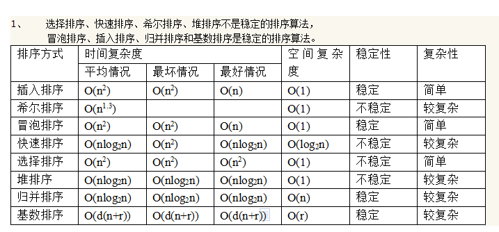

###### 待解决 ######

- 树的三种遍历和非递归遍历

- 各种排序算法特点

  n为数字个数，d为数字位数，r为数字大小范围

  

- 求10w个数中最小的十个数

  如果求前10个最小的数，则先拿前10个数建一个大顶堆，然后遍历剩下的数，只要比堆顶数字大就舍弃，比堆顶数字小，就移除堆顶数字，替换为比它小的这个数字，然后重新调整堆为大顶堆；遍历完成后，大顶堆中的10个数就是100万中最小的10个数
  如果求前10个最大的数，则先拿前10个数建一个小顶堆，同样遍历剩下的数，比堆顶小的舍弃，比堆顶大的，则移除堆顶，替换为比它大的这个元素，然后重新调整堆为小顶堆；遍历完成后，小顶堆中的10个数就是100万中最大的10个数

###### 二分查找算法

```

```

###### 冒泡排序

冒泡排序就是把小的元素往前调或者把大的元素往后调。


###### 堆排序

大顶堆：最大值在最上面

堆的存储：一般用数组来表示堆，一个节点其左右子结点分别为 (2i + 1)、(2i + 2)

```java
import java.util.Arrays;

public class HeapSort
{
    /**
     * 堆排序的主要入口方法，共两步。
     */
    public void sort()
    {
        /*
         *  第一步：将数组堆化
         *  beginIndex = 第一个非叶子节点。
         *  从第一个非叶子节点开始即可。无需从最后一个叶子节点开始。
         *  叶子节点可以看作已符合堆要求的节点，根节点就是它自己且自己以下值为最大。
         */
        int len = arr.length - 1;
        int beginIndex = arr.length/2-1;
        for (int i = beginIndex; i >= 0; i--) {
            maxHeapify(i, len);
        }
        /*
         * 第二步：对堆化数据排序
         * 每次都是移出最顶层的根节点A[0]，与最尾部节点位置调换，同时遍历长度 - 1。
         * 然后从新整理被换到根节点的末尾元素，使其符合堆的特性。
         * 直至未排序的堆长度为 0。
         */
        for (int i = len; i > 0; i--) 
        {
            swap(0, i);
            maxHeapify(0, i - 1);
        }
    }

    /**
     * 调整索引为 index 处的数据，使其符合堆的特性。
     *
     * @param index 需要堆化处理的数据的索引
     * @param len   未排序的堆（数组）的长度
     */
    private void maxHeapify(int index, int len)
    {
        int li = index*2 + 1; // 左子节点索引
        int ri = index*2 + 2; // 右子节点索引
        int cMax = li;        // 子节点值最大索引，默认左子节点。

        if (li > len) 
        {
            return;       // 左子节点索引超出计算范围，直接返回。
        }
        if (ri <= len && arr[ri] > arr[li]) // 先判断左右子节点，哪个较大。
        {
            cMax = ri;
        }
        if (arr[cMax] > arr[index]) 
        {
            swap(cMax, index);      // 如果父节点被子节点调换，
            maxHeapify(cMax, len);  // 则需要继续判断换下后的父节点是否符合堆的特性。
        }
    }
    
        private void swap(int i, int j)
    {
        int temp = arr[i];
        arr[i] = arr[j];
        arr[j] = temp;
    }
}
```

###### 快速排序

```java
private void quickSort(int[] nums,int beg,int end)
    {
           if (beg>=end)
           {
                return ;
           }
           int temp=nums[beg];
           int i=beg;
           int j=end;
           while (i<j)
           {
               while (nums[j] >= temp && i < j)
               {
                   j--;
               }
               nums[i] = nums[j];
               while (nums[i] <= temp && i < j)
               {
                   i++;
               }
               nums[j] = nums[i];
           }
           nums[i]=temp;
           quickSort(nums,beg,i-1);
           quickSort(nums,i+1,end);
    }
```

###### 归并排序

- 先分组
- 两个组之间合并


```java
public class MergeSortTest
{
    public static void mergeSort(int[] data)
    {
        sort(data, 0, data.length - 1);
    }
    public static void sort(int[] data, int left, int right)
    {
        if (left >= right)
        {
            return;
        }
        // 找出中间索引
        int center = (left + right) / 2;
        // 对左边数组进行递归
        sort(data, left, center);
        // 对右边数组进行递归
        sort(data, center + 1, right);
        // 合并
        merge(data, left, center, right);
    }

    /**
     * 将两个数组进行归并，归并前面2个数组已有序，归并后依然有序
     *
     * @param data   数组对象
     * @param left   左数组的第一个元素的索引
     * @param center 左数组的最后一个元素的索引，center+1是右数组第一个元素的索引
     * @param right  右数组最后一个元素的索引
     */
    public static void merge(int[] data, int left, int center, int right)
    {
        // 临时数组
        int[] tmpArr = new int[data.length];
        // 右数组第一个元素索引
        int mid = center + 1;
        // third 记录临时数组的索引
        int third = left;
        // 缓存原数组第一个元素的索引
        int tmp = left;
        while (left <= center && mid <= right)
        {
            // 从两个数组中取出最小的放入临时数组
            if (data[left] <= data[mid])
            {
                tmpArr[third++] = data[left++];
            }
            else
            {
                tmpArr[third++] = data[mid++];
            }
        }
        // 剩余部分依次放入临时数组（实际上两个while只会执行其中一个）
        while (mid <= right)
        {
            tmpArr[third++] = data[mid++];
        }
        while (left <= center)
        {
            tmpArr[third++] = data[left++];
        }
        // 将临时数组中的内容拷贝回原数组中
        // （原left-right范围的内容被复制回原数组）
        while (tmp <= right)
        {
            data[tmp] = tmpArr[tmp++];
        }
    }
}
```

###### 基数排序

每一位用计数排序

