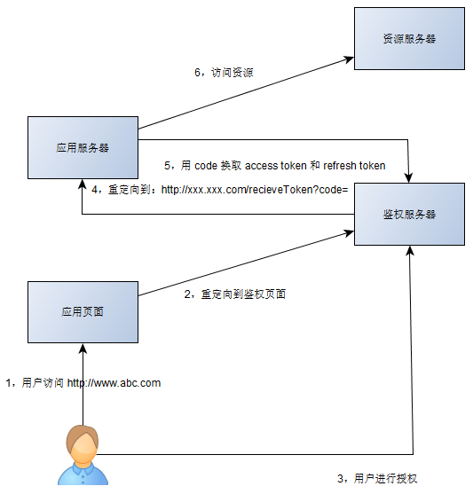

#### 干了啥 ####

做了用户的登陆验证，添加拦截器检测用户登陆状态，提问问题，首页问题列表，用户个人提问问题列表，问题的编辑，问题的评论，问题搜索

#### 坑 ####

- 拦截器：

  - 实现HandlerInterceptor接口，

  - @enablewebmvc注解，实现webmvcconfigurer接口，配置拦截器，

    ```java
    @Configuration
    @EnableWebMvc
    public class Webconfig implements WebMvcConfigurer {
    
        @Autowired
        SessionInterceptor sessionInterceptor;
    
        @Override
        public void addInterceptors(InterceptorRegistry registry) {
            registry.addInterceptor(sessionInterceptor).addPathPatterns("/**");
        }
    }
    ```

- 访问不存在的问题页：

  - 用error.html替代白页
  - 使用@ControllerAdvice注解（在类上）接受全局的消息，使用@ExceptionHandler注解（在方法上）自定义异常处理方法

- springboot自动配置原理，去加载spring.factories文件中的自动配置类

- user表设置token（使用uuid方法）：response.addcookie。

  今天在写代码被session值给郁闷了很久，一直想让adminid这个值在jsp页面全程都可以用，但由于我一直用request.setAttribute()，所以一直没有解决，害得我为了得到这个值费了好大的劲，后来看了书才发现原来用request.getSession().setAttribute()，就可以让adminid这个值全程传递，真的是失算啊。这里介绍一下两者的区别，希望大家对大家有帮助，request.getSession().setAttribute("adminid",adminForm.getAdminid())把adminForm.getAdminid())返回值保存到session当前会话中，名称为adminid，只要当前会话不过期， 任何地方都可以访问到 ;

  request.setAttribute("adminid",adminForm.getAdminid())把adminForm.getAdminid())的返回值保存到request当前请求中，名称为adminid，只在当前请求中访问到，其他请求中无法访问

  request.setAttribute这个的生命周期就是request级别的
  request.getSession().setAttribute这个的生命周期是session级别的

- 退出登录，删除登录状态，删除cookie：新建同名的cookie，然后setMaxAge为0

- cookie可能会是null

- 使用@Transactional事务标签对评论和评论数加一两个事件进行控制（Spring Boot中，当我们使用了spring-boot-starter-jdbc或spring-boot-starter-data-jpa依赖的时候，框架会自动默认分别注入DataSourceTransactionManager或JpaTransactionManager）

- 把资源直接拖到idea中去，有可能不识别，可以在target中查看编译后的static资源是否被编译进去。如果没有被编译进去可以clean然后重新编译

- springboot访问不到static

  - 在application.properties文件中添加如下配置，意思就是把static下的文件访问都映射到locations指定的文件目录下

    ```xml
    #以什么样的路径访问静态资源
    spring.mvc.static-path-pattern=/static/**
    #在何处查找静态资源
    spring.resources.static-locations=classpath:/templates/,classpath:/META-INF/resources/,classpath:/resources/,classpath:/static/,classpath:/public/
    ```

  - 用代码重写springMVC的资源处理器。

    @enablewebmvc注解，实现webmvcconfigurer接口，重写addResourceHandlers方法

    ```java
    public class WebMvcConfig implements WebMvcConfigurer{
    	Logger logger = LoggerFactory.getLogger(this.getClass());
    	@Autowired
    	UserArgumentResolver userArgumentResolver;
    	public void addArgumentResolvers(List<HandlerMethodArgumentResolver> resolvers) {
    		resolvers.add(userArgumentResolver);
    	}
    	public void addResourceHandlers(ResourceHandlerRegistry registry) {
    		logger.info("addResourceHandlers");
    		//将所有/static/**访问都映射到classpath:/static/目录下
    		registry.addResourceHandler("/static/**")
    				.addResourceLocations("classpath:/static/");
    	}
    }
    ```

- github官方api的变动：从直接传token到将access_token通过作为Authorization HTTP header中的参数传输，而不是作为url中的参数(query parameter)明文传输。

- 分页参数管理

  - 第一次要传入默认参数
  - 有无前后页，显示前后跳转标签
  - 第一页或最后一页不在当前页面中显示跳转到最前或最后标签
  - 保证出现的总页面数
  - 页码超过正常页码

- 搜索使用mybatis中的动态sql和正则表达式regexp进行匹配（等价于 参数 like '%参数中的任意一个%'，要求参数使用 | 进行分割）

  ```xml
  <if test="ids !='' and ids != null">
  	and a.tree_names REGEXP #{ids}
  </if>
  参数ids:"ni|hao|wo|shi|ni|ge",等价于 a.tree_names like '%参数中的任意一个%'
  ```

#### lucene分词

从数据库里拿到数据，创建Document文档对象，Document文档中添加Field域对象，指定索引库对象，分词并创建索引文件

关键的是Document文档对象中的Field域对象类型（类型决定了是否对数据进行分词，索引，存储），对标题进行分词索引和存储TextField(FieldName,FieldValue,Store.YES)，对内容进行分词索引不存储(FieldName,FieldValue,Store.YES)，对id只进行存储（StoredField(FieldName,FieldValue)）

拿到索引库对象，搜索器和查询对象

#### OAuth ####

使用第三方做用户的登录验证和访问权限管理（如果直接使用用户名和密码则暴露的信息太多）

##### 流程 #####



前提：A向提供登录验证的B公司申请一个验证服务的账号和密码

1. A使用B公司的登录验证服务为自己的用户进行验证（需要提供第一步申请的账号）
2. 重定向
3. 用户确定授权
4. B公司向A公司返回一个code用于A公司申请token
5. A公司使用code申请token，B公司返回token（token中包含有 哪个用户 在什么时候 授权给哪个app 去做什么事情）
6. A公司使用token申请用户信息

##### 为什么需要code #####

如果将页面重定向回应用的 domain 并带上用户的 Access Token。

- 客户端请求token时发送的client_id很容易被截获
- 重定向回应用的 domain 并将 Access Token 发往 Client 时，Access Token 很容易在 User Agent 处被攻击者截获。

如果使用code，获取token的环节是A网站在后台实现的（所以可以通过AB约定在后台额外添加验证信息，如client_secret）

- 即使攻击者能够窃取到 code，但是由于他无法获得应用保存在服务器的 client_secret，也无法通过 code 换取 token。
- 攻击者也不知道获取token的服务器地址，无法进行拦截
- 其次，这个请求通常要求是 https 的实现。即使能窃听到数据包也无法解析出内容。
- 并且access token 是有有效期的。如果 access token 被窃取，也不能一直用。

##### code和token #####

- authorization code是一次性的，失效快，通常几分钟就过期。

  并且是明文（附带在get请求中的）， 只用来换access token

- access token有效期较长，可以是几小时。


#### 保存登录状态 ####

cookie和session